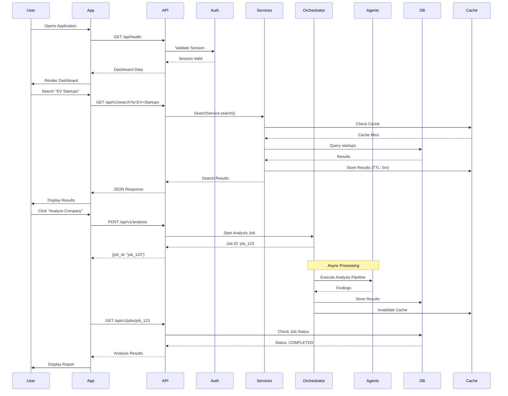
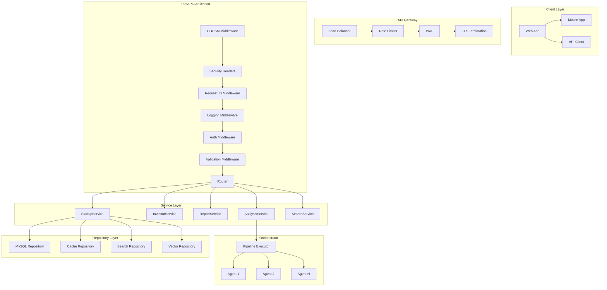
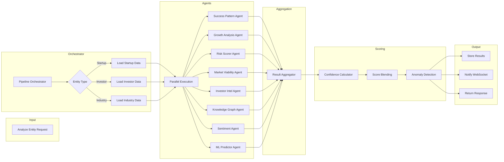
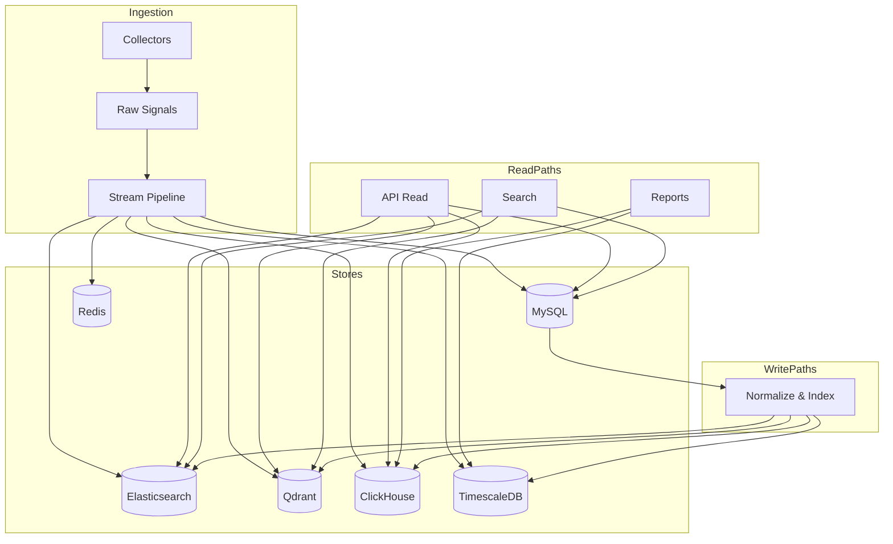
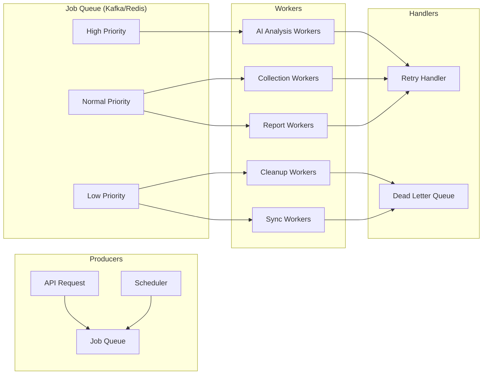
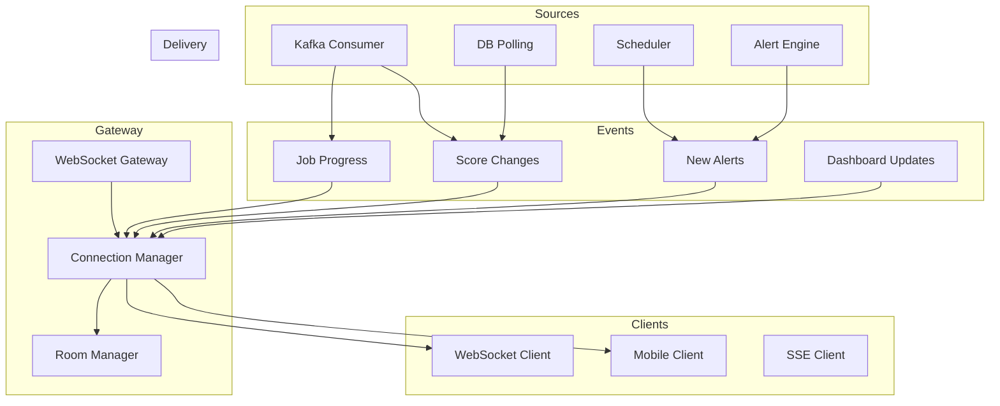
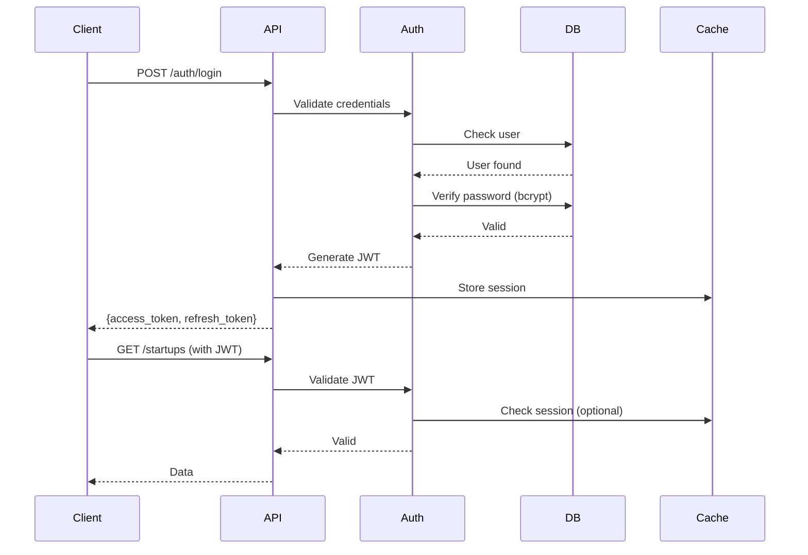
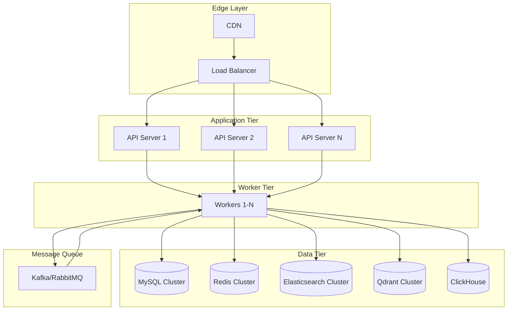
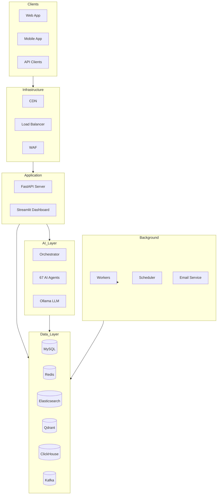
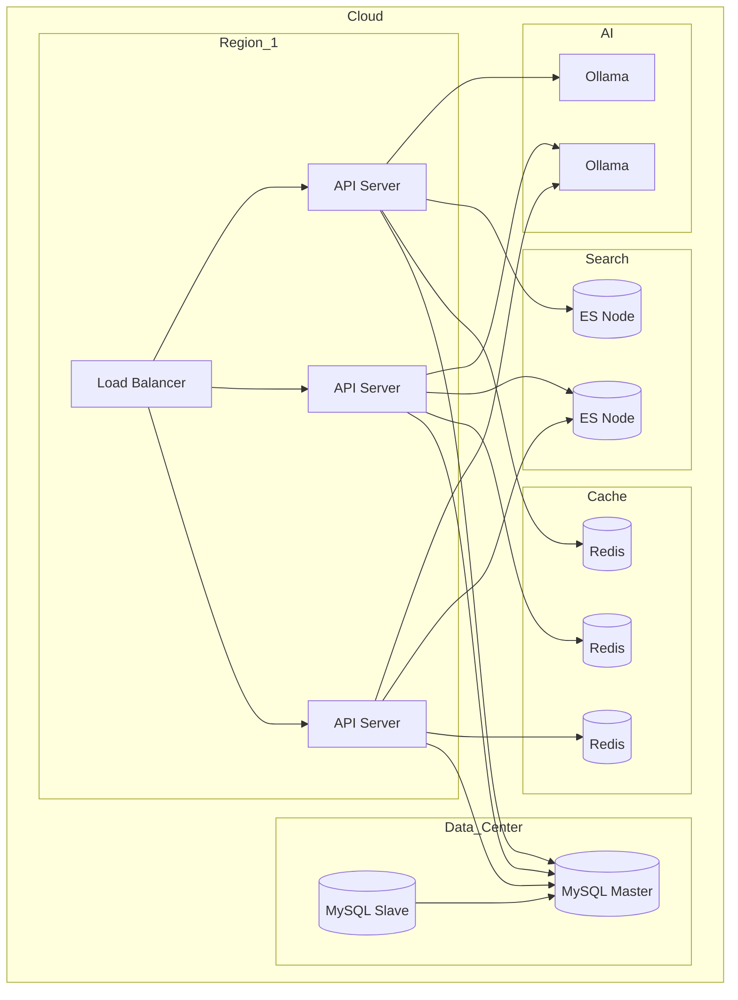

# Opportunity Intelligence Platform - Production API Architecture

> Version: 1.0 | Status: Design Document | Target: Production Engineering Team

---

## Table of Contents

1. [High-Level User Flow](#1-high-level-user-flow)
2. [API Design](#2-api-design)
3. [Request Pipeline](#3-request-pipeline)
4. [AI Orchestration Pipeline](#4-ai-orchestration-pipeline)
5. [Database Flow](#5-database-flow)
6. [Background Jobs](#6-background-jobs)
7. [Real-Time Architecture](#7-real-time-architecture)
8. [Error Handling](#8-error-handling)
9. [Security](#9-security)
10. [Scalability](#10-scalability)
11. [API Versioning](#11-api-versioning)
12. [Folder Structure](#12-folder-structure)
13. [Architecture Diagrams](#13-architecture-diagrams)
14. [Best Practices](#14-best-practices)

---

## 1. High-Level User Flow



### Complete User Lifecycle

| Step | Action | System Response |
|------|--------|-----------------|
| 1 | Open App | Load cached dashboard, verify auth |
| 2 | View Dashboard | Fetch stats, recent alerts, watchlist summary |
| 3 | Search Startups | Full-text + semantic search with filters |
| 4 | View Company | Load details, knowledge graph, scores |
| 5 | Run AI Analysis | Submit async job, poll for completion |
| 6 | Track Progress | WebSocket updates, real-time notifications |
| 7 | Receive Alerts | Email/push for score changes, new opportunities |
| 8 | Export Reports | Generate CSV/PDF, download or email |

---

## 2. API Design

### 2.1 Authentication Endpoints

```yaml
Auth:
  - POST   /api/v1/auth/register     # User registration
  - POST   /api/v1/auth/login        # JWT login
  - POST   /api/v1/auth/logout       # Invalidate token
  - POST   /api/v1/auth/refresh      # Refresh access token
  - POST   /api/v1/auth/forgot       # Password reset request
  - POST   /api/v1/auth/reset       # Password reset confirm
  - GET    /api/v1/auth/me          # Current user profile
```

### 2.2 Users Endpoints

```yaml
Users:
  - GET    /api/v1/users             # List users (admin)
  - POST   /api/v1/users             # Create user (admin)
  - GET    /api/v1/users/{id}       # Get user
  - PUT    /api/v1/users/{id}       # Update user
  - DELETE /api/v1/users/{id}       # Delete user (admin)
  - GET    /api/v1/users/{id}/API-keys    # List API keys
  - POST   /api/v1/users/{id}/API-keys    # Create API key
  - DELETE /api/v1/users/{id}/API-keys/{kid}  # Revoke API key
```

### 2.3 Startups Endpoints

```yaml
Startups:
  - GET     /api/v1/startups              # List startups
  - POST    /api/v1/startups              # Create startup
  - GET     /api/v1/startups/{id}         # Get startup details
  - PUT     /api/v1/startups/{id}         # Update startup
  - DELETE  /api/v1/startups/{id}         # Delete startup
  - GET     /api/v1/startups/{id}/scores  # Get risk/opportunity scores
  - GET     /api/v1/startups/{id}/signals # Get signals
  - GET     /api/v1/startups/{id}/graph   # Get knowledge graph connections
  - POST    /api/v1/startups/{id}/analyze # Trigger AI analysis
```

### 2.4 Investors Endpoints

```yaml
Investors:
  - GET    /api/v1/investors            # List investors
  - POST   /api/v1/investors            # Create investor
  - GET    /api/v1/investors/{id}       # Get investor details
  - PUT    /api/v1/investors/{id}      # Update investor
  - GET    /api/v1/investors/{id}/portfolio   # Portfolio companies
  - GET    /api/v1/investors/{id}/deals        # Investment history
```

### 2.5 Funding Rounds Endpoints

```yaml
Funding Rounds:
  - GET    /api/v1/funding-rounds       # List funding rounds
  - POST   /api/v1/funding-rounds       # Create funding round
  - GET    /api/v1/funding-rounds/{id}  # Get funding round
  - PUT    /api/v1/funding-rounds/{id}  # Update funding round
```

### 2.6 Watchlists Endpoints

```yaml
Watchlists:
  - GET    /api/v1/watchlists           # List user watchlists
  - POST   /api/v1/watchlists           # Create watchlist
  - GET    /api/v1/watchlists/{id}     # Get watchlist with items
  - PUT    /api/v1/watchlists/{id}      # Update watchlist
  - DELETE /api/v1/watchlists/{id}     # Delete watchlist
  - GET    /api/v1/watchlists/{id}/items         # List items
  - POST   /api/v1/watchlists/{id}/items         # Add item
  - DELETE /api/v1/watchlists/{id}/items/{iid}   # Remove item
  - PUT    /api/v1/watchlists/{id}/alerts         # Configure alerts
  - GET    /api/v1/watchlists/{id}/alert-history  # Alert history
```

### 2.7 Alerts Endpoints

```yaml
Alerts:
  - GET    /api/v1/alerts               # List user's alerts
  - POST   /api/v1/alerts               # Create alert rule
  - GET    /api/v1/alerts/{id}          # Get alert details
  - PUT    /api/v1/alerts/{id}          # Update alert
  - DELETE /api/v1/alerts/{id}          # Delete alert
  - PUT    /api/v1/alerts/preferences   # Update notification prefs
  - GET    /api/v1/alerts/history       # Alert delivery history
```

### 2.8 Reports Endpoints

```yaml
Reports:
  - GET    /api/v1/reports              # List reports
  - POST   /api/v1/reports              # Generate new report
  - GET    /api/v1/reports/{id}         # Get report
  - DELETE /api/v1/reports/{id}         # Delete report
  - GET    /api/v1/reports/{id}/download    # Download PDF
  - POST   /api/v1/reports/scheduled         # Schedule recurring report
```

### 2.9 AI Analysis Endpoints

```yaml
AI Analysis:
  - POST   /api/v1/analysis             # Submit analysis job
  - GET    /api/v1/analysis/{job_id}    # Get job status/results
  - GET    /api/v1/analysis/{job_id}/stream  # SSE for progress
  - GET    /api/v1/analysis/history     # Past analyses
  - POST   /api/v1/chat                 # Natural language query
```

### 2.10 Jobs Endpoints

```yaml
Jobs:
  - GET    /api/v1/jobs                 # List jobs
  - GET    /api/v1/jobs/{id}           # Get job details
  - POST   /api/v1/jobs/{id}/cancel    # Cancel job
  - POST   /api/v1/jobs/{id}/retry     # Retry failed job
```

### 2.11 Search Endpoints

```yaml
Search:
  - GET    /api/v1/search              # Unified search
  - GET    /api/v1/search/suggestions   # Autocomplete
  - POST   /api/v1/search/filters      # Saved filter combinations
```

### 2.12 Feedback Endpoints

```yaml
Feedback:
  - POST   /api/v2/feedback/score       # Rate score quality
  - POST   /api/v2/feedback/feature    # Submit feature request
  - GET    /api/v2/feedback/features   # List feature requests
  - GET    /api/v2/feedback/dashboard  # Admin feedback view
```

### 2.13 Webhooks Endpoints

```yaml
Webhooks:
  - GET    /api/v2/webhooks            # List webhooks
  - POST   /api/v2/webhooks            # Create webhook
  - GET    /api/v2/webhooks/{id}       # Get webhook
  - PUT    /api/v2/webhooks/{id}       # Update webhook
  - DELETE /api/v2/webhooks/{id}       # Delete webhook
  - POST   /api/v2/webhooks/{id}/test  # Test dispatch
  - GET    /api/v2/webhooks/zapier     # Zapier-friendly endpoint
```

### 2.14 Export Endpoints

```yaml
Export:
  - GET    /api/v2/export/csv           # Export as CSV
  - GET    /api/v2/export/json         # Export as JSON
  - GET    /api/v2/export/pdf          # Export as PDF
  - GET    /api/v2/export/watchlists/{id}/csv  # Watchlist export
```

### 2.15 Billing Endpoints

```yaml
Billing (v2):
  - GET    /api/v2/billing/tier              # Current tier
  - GET    /api/v2/billing/entitlements       # Plan features
  - GET    /api/v2/billing/feature-check      # Check feature access
  - GET    /api/v2/billing/subscription       # Subscription details
  - POST   /api/v2/billing/checkout-session   # Create checkout
  - POST   /api/v2/billing/subscription/cancel   # Cancel
  - POST   /api/v2/billing/webhook           # Stripe webhook receiver
  - GET    /api/v2/billing/usage/summary      # Usage metrics
  - GET    /api/v2/billing/quota             # Quota status
```

### 2.16 Standard Request/Response Format

**Request Headers:**
```http
Authorization: Bearer <jwt_token>
Content-Type: application/json
X-API-Key: <api_key>
X-Request-ID: <uuid>
X-Idempotency-Key: <uuid>
```

**Response Schema:**
```json
{
  "success": true,
  "data": { },
  "meta": {
    "request_id": "uuid",
    "timestamp": "ISO8601",
    "version": "v1"
  }
}
```

**Paginated Response:**
```json
{
  "success": true,
  "data": [...],
  "pagination": {
    "cursor": "opaque_cursor",
    "has_more": true,
    "total_count": 1234
  }
}
```

---

## 3. Request Pipeline



### Middleware Responsibilities

| Middleware | Purpose | Actions |
|------------|---------|---------|
| CORS | Cross-origin requests | Validate origins, set headers |
| Security Headers | Browser security | CSP, HSTS, X-Frame-Options |
| Request ID | Tracing | Generate/carry correlation ID |
| Logging | Observability | Log request/response, timing |
| Auth | Identity verification | JWT/API key validation |
| Validation | Input sanitization | Schema validation, HTML escape |

---

## 4. AI Orchestration Pipeline



### Agent Communication Protocol

```python
# Agent Result Schema
{
    "agent_name": "success_pattern_agent",
    "status": "success|partial|failed",
    "started_at": "ISO8601",
    "completed_at": "ISO8601",
    "data": {
        "patterns_found": [...],
        "confidence": 0.87,
        "sources": [...]
    },
    "errors": [],
    "warnings": [],
    "upstream_results": {...}
}

# Aggregator merges results using:
# 1. Weighted averaging based on agent confidence
# 2. Source attribution mapping
# 3. Conflict resolution via confidence threshold
# 4. Time-decay for stale data
```

---

## 5. Database Flow



### Database Responsibilities

| Database | Purpose | Operations |
|----------|---------|------------|
| **MySQL** | Primary OLTP, entities, users | CRUD, transactions, foreign keys |
| **Redis** | Cache, sessions, real-time state | Get/set, TTL, pub/sub |
| **Elasticsearch** | Full-text search, analytics | Index, search, aggregations |
| **Qdrant** | Vector embeddings, semantic search | ANN queries, similarity |
| **ClickHouse** | Analytics, reporting, aggregations | OLAP queries, materializations |
| **TimescaleDB** | Time-series, historical scores | Time-range queries, downsampling |

### Data Sync Patterns

```python
# Write-through cache
async def get_startup(id: str) -> Startup:
    cache_key = f"startup:{id}"
    cached = await redis.get(cache_key)
    if cached:
        return Startup.parse_raw(cached)

    startup = await mysql.query("SELECT * FROM startups WHERE id = ?", id)
    await redis.setex(cache_key, TTL_5M, startup.json())
    return startup

# Search index update via queue
async def index_startup(startup: Startup):
    await kafka.send("search.index", {
        "action": "upsert",
        "entity": "startup",
        "data": startup.dict()
    })

# Vector embedding async generation
async def generate_embeddings(entity_id: str, text: str):
    embedding = await ollama.embeddings(text)
    await qdrant.upsert("startups", entity_id, embedding)
```

---

## 6. Background Jobs



### Job Types

| Job Type | Trigger | Priority | Timeout |
|----------|---------|----------|---------|
| `ai_analysis` | User request | High | 5 min |
| `data_collection` | Scheduler/Manual | Normal | 10 min |
| `report_generation` | Scheduled/User | Normal | 3 min |
| `email_digest` | Daily scheduler | Low | 1 min |
| `score_update` | Stream signal | High | 30s |
| `webhook_dispatch` | Event trigger | Normal | 10s |
| `cache_warmup` | Scheduler | Low | 5 min |
| `data_cleanup` | Scheduler | Low | 30 min |

### Retry Configuration

```python
RETRY_CONFIG = {
    "max_attempts": 3,
    "backoff_strategy": "exponential",
    "initial_delay": 1,  # seconds
    "max_delay": 60,     # seconds
    "retryable_errors": [
        "ConnectionError",
        "TimeoutError",
        "RateLimitError"
    ]
}

# Dead letter handling
# 1. Store failed job with full context
# 2. Alert operations team
# 3. Manual review queue
# 4. Exponential backoff for transient failures
```

---

## 7. Real-Time Architecture



### WebSocket Message Types

```typescript
// Outbound messages
interface WSMessage {
  type: "stats_update" | "score_update" | "score_delta" | "alert" | "job_progress" | "ping";
  data: object;
  timestamp: string;
  request_id?: string;
}

// Inbound messages
interface WSClientMessage {
  type: "pong" | "subscribe" | "unsubscribe";
  payload?: object;
}

// Subscription example
{
  "type": "subscribe",
  "payload": {
    "channels": ["jobs:user_123", "scores:*", "alerts:global"],
    "filters": {
      "score_change_min": 5
    }
  }
}
```

---

## 8. Error Handling

### Standard Error Response

```json
{
  "success": false,
  "error": {
    "code": "VALIDATION_ERROR",
    "message": "Human-readable message",
    "details": [
      {
        "field": "email",
        "message": "Must be a valid email address"
      }
    ],
    "request_id": "uuid",
    "docs_url": "https://docs.example.com/errors/VALIDATION_ERROR"
  },
  "meta": {
    "timestamp": "ISO8601",
    "version": "v1"
  }
}
```

### Error Codes

| Code | HTTP | Description |
|------|------|-------------|
| `VALIDATION_ERROR` | 400 | Invalid input data |
| `AUTHENTICATION_REQUIRED` | 401 | No valid credentials |
| `FORBIDDEN` | 403 | Insufficient permissions |
| `NOT_FOUND` | 404 | Resource doesn't exist |
| `CONFLICT` | 409 | Resource conflict |
| `RATE_LIMITED` | 429 | Too many requests |
| `INTERNAL_ERROR` | 500 | Server error |
| `SERVICE_UNAVAILABLE` | 503 | Temporarily unavailable |
| `AI_TIMEOUT` | 504 | AI analysis timed out |
| `AI_quota_EXCEEDED` | 429 | AI quota exhausted |

---

## 9. Security

### Authentication Flow



### Rate Limits

| Tier | Requests/Min | Burst | AI Calls/Day |
|------|--------------|-------|--------------|
| Free | 60 | 10 | 100 |
| Pro | 1000 | 100 | 10,000 |
| Enterprise | Unlimited | Custom | Unlimited |

### RBAC Permissions

| Role | Permissions |
|------|-------------|
| viewer | Read own data, public data |
| analyst | viewer + create analyses, export |
| admin | analyst + manage users, webhooks |
| owner | admin + billing, org settings |

---

## 10. Scalability



### Scaling Strategies

| Component | Strategy |
|-----------|----------|
| API Servers | Horizontal, 3+ instances, LB |
| MySQL | Read replicas, sharding |
| Redis | Cluster mode, key sloting |
| Elasticsearch | Index partitioning, replicas |
| Workers | Auto-scaling, priority queues |
| Kafka | Partitioning, consumer groups |

---

## 11. API Versioning

### Version Strategy

```
/api/v1/*   # Current stable API
/api/v2/*   # Next version (beta)
/api/v3/*   # Future version planning

Deprecation Timeline:
- Announce deprecation: 6 months before sunset
- Warning headers in responses: 3 months before sunset
- Sunset date: After 1 year from vN+1 release
```

### Version Headers

```http
API-Version: 2024-01-15
API-Deprecated: true
API-Sunset: 2024-07-15
```

---

## 12. Folder Structure

```
app/
├── api/
│   ├── __init__.py
│   ├── v1/
│   │   ├── __init__.py
│   │   ├── auth.py
│   │   ├── users.py
│   │   ├── startups.py
│   │   ├── investors.py
│   │   ├── funding.py
│   │   ├── watchlists.py
│   │   ├── alerts.py
│   │   ├── reports.py
│   │   ├── analysis.py
│   │   ├── search.py
│   │   ├── jobs.py
│   │   └── health.py
│   ├── v2/
│   │   ├── __init__.py
│   │   ├── opportunities.py
│   │   ├── signals.py
│   │   ├── webhooks.py
│   │   ├── export.py
│   │   ├── billing.py
│   │   └── feedback.py
│   └── websocket/
│       ├── __init__.py
│       ├── manager.py
│       └── handlers.py
├── auth/
│   ├── __init__.py
│   ├── jwt_handler.py
│   ├── api_key_manager.py
│   ├── password_hasher.py
│   ├── rbac.py
│   └── dependencies.py
├── services/
│   ├── __init__.py
│   ├── base.py
│   ├── startup_service.py
│   ├── investor_service.py
│   ├── report_service.py
│   ├── watchlist_service.py
│   ├── alert_service.py
│   ├── search_service.py
│   ├── analysis_service.py
│   ├── billing_service.py
│   └── notification_service.py
├── repositories/
│   ├── __init__.py
│   ├── base.py
│   ├── startup_repository.py
│   ├── investor_repository.py
│   ├── signal_repository.py
│   ├── user_repository.py
│   └── cache_repository.py
├── orchestrator/
│   ├── __init__.py
│   ├── pipeline_executor.py
│   ├── agent_registry.py
│   └── agents/
│       ├── base.py
│       ├── success_pattern_agent.py
│       ├── growth_analysis_agent.py
│       └── ... (67 agents)
├── jobs/
│   ├── __init__.py
│   ├── base.py
│   ├── collector_job.py
│   ├── analysis_job.py
│   ├── report_job.py
│   ├── notification_job.py
│   ├── scheduler.py
│   └── worker.py
├── schemas/
│   ├── __init__.py
│   ├── requests/
│   │   ├── __init__.py
│   │   ├── auth.py
│   │   ├── startup.py
│   │   ├── analysis.py
│   │   └── ...
│   └── responses/
│       ├── __init__.py
│       ├── startup.py
│       ├── analysis.py
│       └── ...
├── models/
│   ├── __init__.py
│   ├── domain/
│   │   ├── startup.py
│   │   ├── investor.py
│   │   ├── signal.py
│   │   └── ...
│   └── db/
│       └── schemas.py
├── middleware/
│   ├── __init__.py
│   ├── logging.py
│   ├── tracing.py
│   ├── correlation.py
│   ├── security_headers.py
│   └── rate_limiter.py
├── core/
│   ├── __init__.py
│   ├── config.py
│   ├── exceptions.py
│   ├── constants.py
│   └── dependencies.py
├── utils/
│   ├── __init__.py
│   ├── cache.py
│   ├── metrics.py
│   ├── http_client.py
│   └── llm_client.py
├── db/
│   ├── __init__.py
│   ├── connection.py
│   ├── schema.py
│   ├── migrations/
│   ├── search_index.py
│   ├── vector_store.py
│   └── dedup.py
├── collectors/
│   ├── __init__.py
│   ├── base.py
│   ├── bls_survival_rates.py
│   ├── google_news_rss.py
│   └── ... (25 collectors)
├── stream/
│   ├── __init__.py
│   ├── pipeline.py
│   ├── state.py
│   └── metrics.py
└── webhooks/
    ├── __init__.py
    ├── dispatcher.py
    └── handlers.py
```

---

## 13. Architecture Diagrams

### Overall System Architecture



### Deployment Architecture



---

## 14. Best Practices

### API Standards

2. **Consistent Naming**: Use kebab-case for paths, camelCase for fields
3. **Pagination**: Always paginate large collections (cursor-based preferred)
4. **Field Filtering**: Support `fields=` parameter for sparse fieldsets
5. **Sorting**: Support `sort=` parameter with ASC/DESC
6. **Idempotency**: POST requests should support `X-Idempotency-Key` header
7. **Versioning**: Include version in URL path (`/api/v1/`)

### Logging Strategy

```python
# Structured logging format
{
    "level": "INFO",
    "timestamp": "ISO8601",
    "request_id": "uuid",
    "user_id": "uuid",
    "action": "startup.search",
    "duration_ms": 145,
    "status": "success",
    "metadata": {}
}

# Log levels
# ERROR: Exceptions, failures, invalid states
# WARN:  Degraded performance, retries, rate limits
# INFO:  API requests, job completions, health checks
# DEBUG: Query details, cache hits/misses, agent steps
```

### Monitoring & Observability

| Metric | Tool | Alert Threshold |
|--------|------|----------------|
| API Latency p99 | Prometheus | > 2s |
| Error Rate | Prometheus | > 1% |
| Queue Depth | Kafka | > 1000 |
| AI Queue Wait | Redis | > 30s |
| DB Connections | MySQL | > 80% |
| Cache Hit Rate | Redis | < 80% |

### Testing Strategy

```
tests/
├── unit/               # Fast, isolated tests
│   ├── services/
│   ├── repositories/
│   └── agents/
├── integration/        # API, DB, external services
│   ├── api/
│   └── db/
├── e2e/               # Full flow tests
│   └── pipelines/
└── load/               # Performance tests
    └── artillery/
```

### CI/CD Pipeline

```yaml
# GitHub Actions workflow
stages:
  - lint        # ruff, mypy, bandit
  - test        # pytest with coverage
  - build       # Docker image build
  - security    # SAST, dependency scan
  - deploy      # staging/production
```

---

## Appendix: Implementation Priority

| Phase | Items | Complexity |
|-------|-------|------------|
| 1 | Create folder structure, move existing code | Medium |
| 2 | Implement service layer abstraction | High |
| 3 | Implement repository layer | Medium |
| 4 | Refactor API routes | High |
| 5 | Add structured logging | Low |
| 6 | Enhance WebSocket | Medium |
| 7 | Add monitoring | Low |
| 8 | Documentation | Low |

---

*Document Version: 1.0*
*Last Updated: 2026-07-02*
*Author: Architecture Design*