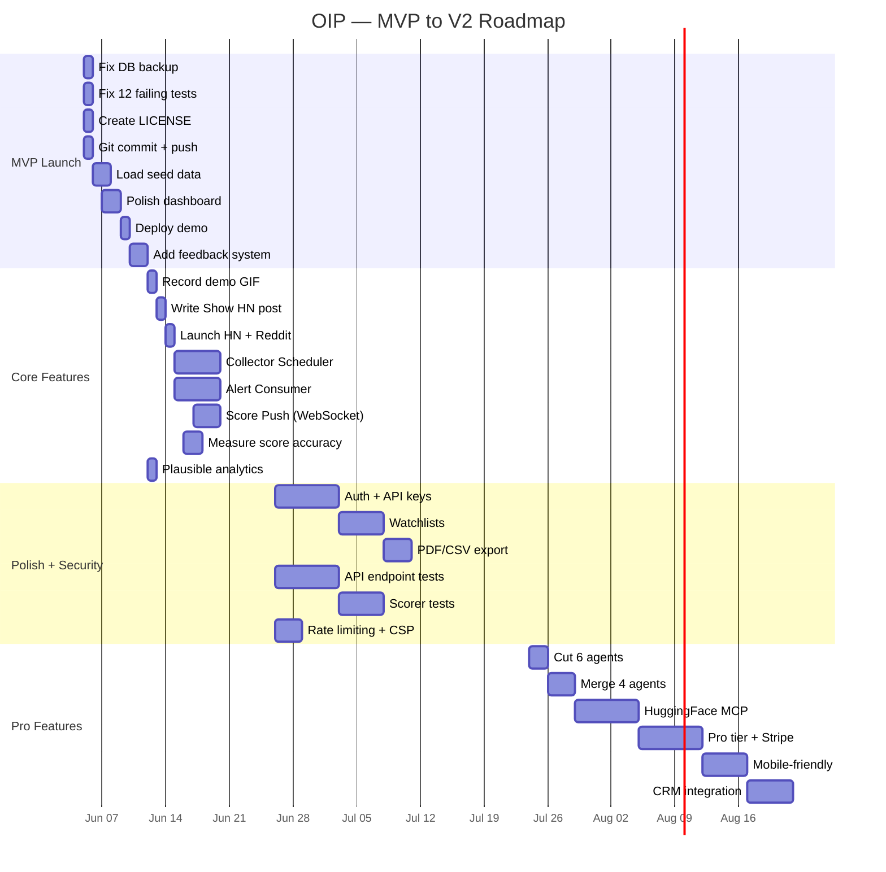

# 📊 Free Progress Monitoring Tools — Comparison & Setup Guide

> **Goal**: Track tasks, deadlines, budget, and quality metrics — free, like Jira — for the Opportunity Intelligence Platform.

---

## Part 1: Free Tool Comparison — The Honest Breakdown

---

### 1.1 Top 10 Free Jira Alternatives

```
┌──────────────────────────────────────────────────────────────────────────────────────────────────────┐
│                                                                                                      │
│  TOOL              TYPE          FREE TIER             BEST FOR            RATING    SELF-HOSTED      │
│  ──────────────────────────────────────────────────────────────────────────────────────────────────   │
│                                                                                                      │
│  ⭐ GitHub         Kanban +      Unlimited projects    Solo dev / small    ★★★★★    No (SaaS)        │
│  Projects          Issues        + issues + milestones teams already on                                        │
│                                  + 2,000 CI min/mo     GitHub                                                │
│                                                                                                      │
│  ⭐ Plane          Jira clone    Unlimited members     Teams wanting        ★★★★☆    YES ✅            │
│                    + sprints     + issues + cycles     full Jira feature                                    │
│                                  + Gantt charts        set, self-hosted                                      │
│                                                                                                      │
│  ⭐ Linear         Issue track   Unlimited members     Developer teams      ★★★★☆    No (SaaS)        │
│                    + projects    + issues + projects   who want speed                                        │
│                                  + 250 issues/file     + beautiful UI                                       │
│                                                                                                      │
│  Taiga             Agile/Scrum   Unlimited projects    Scrum/kanban         ★★★★☆    YES ✅            │
│                                  + epics + sprints     teams, strict                                        │
│                                  + issue tracking      agile process                                        │
│                                                                                                      │
│  OpenProject       Full PM       Unlimited users       Enterprise project   ★★★★☆    YES ✅            │
│                    + Gantt       + tasks + Gantt       mgmt, need                                           │
│                                  + time tracking       Gantt charts                                         │
│                                                                                                      │
│  Redmine           Classic PM    Unlimited everything  Technical teams      ★★★☆☆    YES ✅            │
│                                  + plugins + wiki      who want stable,                                     │
│                                  + time tracking       battle-tested tool                                   │
│                                                                                                      │
│  Trello            Kanban        Unlimited boards      Simple task          ★★★☆☆    No (SaaS)        │
│                                  + 250 Power-Ups       tracking, easy                                       │
│                                  per board             to learn                                             │
│                                                                                                      │
│  Notion            All-in-one    Unlimited pages       Flexible docs +      ★★★☆☆    No (SaaS)        │
│                    workspace     + 1,000 blocks        databases +                                          │
│                                  (generous)            wikis                                                │
│                                                                                                      │
│  GitLab            DevOps +     Unlimited users       Teams wanting        ★★★★☆    YES ✅            │
│  Issues            Issue Track   + issues + milestones CI/CD + issues                                       │
│                                  + merge requests     in one place                                         │
│                                                                                                      │
│  Focalboard        Trello alt    Unlimited everything  Mattermost/          ★★★☆☆    YES ✅            │
│                    + databases   + views + cards       self-hosted                                          │
│                                                         teams                                                │
│                                                                                                      │
└──────────────────────────────────────────────────────────────────────────────────────────────────────┘
```

### 1.2 Feature-by-Feature Comparison

```
┌──────────────────────────────────────────────────────────────────────────────────────────────────────┐
│                                                                                                      │
│  FEATURE                    GitHub    Plane    Linear   Taiga    OpenProj   Trello   Notion          │
│  ────────────────────────────────────────────────────────────────────────────────────────────────    │
│                                                                                                      │
│  TASK TRACKING                                                                               │
│  Create tasks/issues          ✅        ✅        ✅       ✅       ✅        ✅       ✅              │
│  Assign to people             ✅        ✅        ✅       ✅       ✅        ✅       ✅              │
│  Set priority                 ✅        ✅        ✅       ✅       ✅        ✅       ✅              │
│  Set status (todo/doing/done) ✅        ✅        ✅       ✅       ✅        ✅       ✅              │
│  Subtasks/checklists          ✅        ✅        ✅       ✅       ✅        ✅       ✅              │
│  Labels/tags                  ✅        ✅        ✅       ✅       ✅        ✅       ✅              │
│                                                                                                      │
│  DEADLINES                                                                                   │
│  Due dates on tasks           ✅        ✅        ✅       ✅       ✅        ✅       ✅              │
│  Sprint/iteration planning    ✅        ✅        ✅       ✅       ✅        ❌       ❌              │
│  Gantt charts                 ❌        ✅        ❌       ❌       ✅        ❌       ❌              │
│  Timeline view                ✅        ✅        ✅       ❌       ✅        ❌       ✅              │
│  Overdue alerts               ✅        ✅        ✅       ✅       ✅        ✅       ❌              │
│                                                                                                      │
│  BUDGET TRACKING                                                                             │
│  Time tracking                ❌        ✅        ❌       ✅       ✅        ❌       ❌              │
│  Budget fields                ❌        ✅        ❌       ❌       ✅        ❌       ✅              │
│  Cost per task                ❌        ✅        ❌       ❌       ✅        ❌       ✅              │
│  Revenue tracking             ❌        ❌        ❌       ❌       ❌        ❌       ✅              │
│  Custom formulas              ❌        ❌        ❌       ❌       ❌        ❌       ✅              │
│                                                                                                      │
│  QUALITY METRICS                                                                             │
│  Bug tracking                 ✅        ✅        ✅       ✅       ✅        ✅       ✅              │
│  Test status linking          ✅        ❌        ❌       ❌       ❌        ❌       ❌              │
│  Code quality integration     ✅        ❌        ❌       ❌       ❌        ❌       ❌              │
│  Custom dashboards            ❌        ✅        ✅       ❌       ✅        ✅       ✅              │
│  Charts/graphs                ❌        ✅        ✅       ✅       ✅        ❌       ✅              │
│                                                                                                      │
│  COLLABORATION                                                                               │
│  Comments/discussion          ✅        ✅        ✅       ✅       ✅        ✅       ✅              │
│  File attachments             ✅        ✅        ✅       ✅       ✅        ✅       ✅              │
│  @ mentions                   ✅        ✅        ✅       ❌       ✅        ✅       ✅              │
│  Notifications                ✅        ✅        ✅       ✅       ✅        ✅       ✅              │
│                                                                                                      │
│  INTEGRATIONS                                                                                │
│  GitHub integration           ✅(built) ✅        ✅       ❌       ❌        ❌       ❌              │
│  Slack/Discord                ❌        ✅        ✅       ✅       ❌        ✅       ❌              │
│  API access                   ✅        ✅        ✅       ✅       ✅        ✅       ✅              │
│  Webhooks                     ✅        ✅        ✅       ✅       ✅        ✅       ✅              │
│                                                                                                      │
│  DEPLOYMENT                                                                                  │
│  Cloud (SaaS)                 ✅        ✅        ✅       ✅       ❌        ✅       ✅              │
│  Self-hosted                  ❌        ✅        ❌       ✅       ✅        ❌       ❌              │
│  Docker deploy                ❌        ✅        ❌       ✅       ✅        ❌       ❌              │
│                                                                                                      │
│  LEARNING CURVE                                                                              │
│  Time to set up               10 min    30 min    15 min   30 min   1 hr     5 min    20 min         │
│  Time to learn                30 min    1 hr      30 min   1 hr     2 hr     15 min   1 hr          │
│                                                                                                      │
└──────────────────────────────────────────────────────────────────────────────────────────────────────┘
```

### 1.3 The Winner for This Project

```
┌──────────────────────────────────────────────────────────────────────┐
│                                                                      │
│  🏆 RECOMMENDATION FOR OIP:                                         │
│                                                                      │
│  RANK 1: ⭐ GitHub Projects (START HERE — 0 extra setup)            │
│  ─────────────────────────────────────────────                       │
│  WHY: Already using GitHub. Zero friction. Free forever.             │
│  BEST FOR: Task tracking, sprint planning, issue management         │
│  WEAKNESS: No budget tracking, no Gantt charts                      │
│                                                                      │
│  RANK 2: ⭐ Plane (ADD WHEN TEAM GROWS — self-hosted Jira clone)    │
│  ─────────────────────────────────────────────                       │
│  WHY: Open source. Self-hosted. Full Jira feature set.              │
│  BEST FOR: Sprints, Gantt, budget, time tracking, enterprise       │
│  WEAKNESS: More setup, needs a server to run                         │
│                                                                      │
│  RANK 3: Linear (IF YOU WANT SPEED — beautiful, fast)                │
│  ─────────────────────────────────────────────                       │
│  WHY: Beautiful UI. Fast keyboard shortcuts. Developer-loved.       │
│  BEST FOR: Developer teams who hate Jira's complexity               │
│  WEAKNESS: No self-hosting, no budget tracking                       │
│                                                                      │
│  STRATEGY:                                                           │
│  • NOW (solo dev):   Use GitHub Projects (already there)            │
│  • MONTH 2 (launch): Add Plane self-hosted (sprint tracking)        │
│  • MONTH 6 (team):   Full Plane setup with budget + Gantt           │
│                                                                      │
│  BUT FOR BUDGET + QUALITY METRICS → build a custom dashboard        │
│  that pulls from GitHub + test results + financial data.             │
│  (That's what Parts 2-5 of this document provide.)                  │
│                                                                      │
└──────────────────────────────────────────────────────────────────────┘
```

---

## Part 2: Setup GitHub Projects (The Free Jira — 10 Minutes)

---

### 2.1 Step-by-Step Setup

```
┌──────────────────────────────────────────────────────────────────────┐
│                                                                      │
│  STEP 1: GO TO YOUR REPO                                            │
│  ─────────────────────────                                          │
│  https://github.com/gokul-koduri/start                              │
│                                                                      │
│  STEP 2: CLICK "Projects" TAB → "New Project"                      │
│  ─────────────────────────────────────────────                       │
│  Name: "OIP — MVP Sprint"                                          │
│  Template: "Board" (Kanban) or "Team planning"                     │
│                                                                      │
│  STEP 3: ADD THESE COLUMNS                                          │
│  ──────────────────                                                 │
│  📋 Backlog  →  🔄 In Progress  →  👀 In Review  →  ✅ Done      │
│                                                                      │
│  STEP 4: ADD THESE CUSTOM FIELDS                                    │
│  ─────────────────────────                                          │
│  • Priority:    P0 (Critical) / P1 (High) / P2 (Med) / P3 (Low)   │
│  • Category:    Feature / Bug / Docs / Infra / Test                 │
│  • Sprint:      MVP-Week1 / MVP-Week2 / V1-Week3 / ...             │
│  • Effort:      S (2hr) / M (4hr) / L (1 day) / XL (2+ days)      │
│  • Deadline:    (date field)                                         │
│  • Source:      Plan / Feedback / Bug / User Request                │
│                                                                      │
│  STEP 5: ADD THESE VIEWS                                            │
│  ──────────────────                                                 │
│  • Board view (Kanban) — daily status                               │
│  • Table view (spreadsheet) — all tasks + deadlines + status        │
│  • Roadmap view (timeline) — deadlines on a calendar                │
│  • By Priority view (grouped by P0/P1/P2/P3)                       │
│  • By Sprint view (grouped by week)                                 │
│                                                                      │
│  STEP 6: LINK TO GITHUB ISSUES                                      │
│  ─────────────────────────                                          │
│  Every task = a GitHub Issue. Closing the issue = task done.        │
│  Commits reference issues: "feat: add scoring (#42)"               │
│                                                                      │
│  TIME TO SETUP: 10 minutes                                          │
│  COST: $0 FOREVER                                                   │
│                                                                      │
└──────────────────────────────────────────────────────────────────────┘
```

### 2.2 Pre-Built Task List — Import These Issues

```
Paste these as GitHub Issues. Each one becomes a trackable task.
```

```markdown
<!-- P0 — CRITICAL (Must do before launch) -->

- [ ] **P0: Fix database backup** — `scripts/backup_db.sh` + cron + S3 upload. R1 risk mitigation. Effort: S. Deadline: Day 1.
- [ ] **P0: Fix 12 failing tests** — `test_semantic_search.py` has 12 failures. 0 failing before commit gate. Effort: M. Deadline: Day 1.
- [ ] **P0: Create LICENSE file** — MIT license. No license = nobody can legally use it. Effort: S. Deadline: Day 1.
- [ ] **P0: Git commit + push 45 untracked files** — `git add -A && git commit -m "feat: add all working files" && git push`. Effort: S. Deadline: Day 1.
- [ ] **P0: Load seed data** — Run 5 collectors, score 50+ entities, verify in dashboard. Effort: M. Deadline: Day 3.
- [ ] **P0: Polish dashboard** — Fix broken HTML, add demo data, test all 11 pages. Effort: L. Deadline: Day 4.
- [ ] **P0: Deploy demo** — Docker Compose on VPS ($5/mo DigitalOcean). Effort: M. Deadline: Day 5.
- [ ] **P0: Add feedback system** — 4 DB tables + 5 API endpoints + thumbs up/down widget. See FEEDBACK_STRATEGY.md. Effort: L. Deadline: Day 5.

<!-- P1 — HIGH (Must do in Week 2) -->

- [ ] **P1: Record demo GIF** — 30-second walkthrough of Score + Chat + Failure Patterns. Effort: S. Deadline: Day 8.
- [ ] **P1: Write "Show HN" post** — Hacker News launch post. See GTM_STRATEGY.md. Effort: M. Deadline: Day 8.
- [ ] **P1: Launch on HN + Reddit** — Post Show HN, r/startups, r/SideProject. Effort: S. Deadline: Day 9.
- [ ] **P1: Build Collector Scheduler** — 24/7 continuous data collection. Critical gap. Effort: XL. Deadline: Day 14.
- [ ] **P1: Build Alert Consumer** — Kafka → Slack/Email notifications. Critical gap. Effort: XL. Deadline: Day 14.
- [ ] **P1: Build Score Push** — Kafka → WebSocket real-time scores. Critical gap. Effort: L. Deadline: Day 14.
- [ ] **P1: Measure score accuracy** — Score 20 known startups. Must be ≥ 50% accuracy. Effort: M. Deadline: Day 10.
- [ ] **P1: Add Plausible analytics** — Privacy-first analytics on dashboard. Effort: S. Deadline: Day 7.

<!-- P2 — SHOULD HAVE (Month 2) -->

- [ ] **P2: Auth system + API keys** — User registration, login, API key management. Effort: XL. Deadline: Week 4.
- [ ] **P2: Watchlists** — Users can track specific startups. Effort: L. Deadline: Week 5.
- [ ] **P2: PDF/CSV export** — Export scores and analysis. Effort: M. Deadline: Week 5.
- [ ] **P2: Write 68 API endpoint tests** — api_server.py has 0 tests. Effort: XL. Deadline: Week 4.
- [ ] **P2: Write 15 scorer tests** — Scoring accuracy tests. Effort: L. Deadline: Week 4.
- [ ] **P2: Rate limiting + CSP headers** — Security hardening before public launch. Effort: M. Deadline: Week 3.

<!-- P3 — NICE TO HAVE (Month 3+) -->

- [ ] **P3: Cut 6 agents** — Remove LLMPortfolioAgent, LLMPricingAgent, LLMBenchmarkAgent, LLMCostOptimizerAgent, SpanAgent, ProjectMonitorAgent. Effort: S. Deadline: Week 6.
- [ ] **P3: Merge 4 agents** — ReportAgent+ReportGeneratorAgent, InternetResearchAgent+AIAnalystAgent, IntentClassifierAgent→keywords. Effort: M. Deadline: Week 6.
- [ ] **P3: HuggingFace MCP integration** — Dynamic model selection. See SOLUTION_DESIGN.md Part 6. Effort: XL. Deadline: Week 8.
- [ ] **P3: Pro tier + Stripe** — Paid features at $49-99/mo. Effort: XL. Deadline: Week 8.
- [ ] **P3: Mobile-friendly dashboard** — Responsive design. Effort: L. Deadline: Week 10.
- [ ] **P3: CRM integration** — Salesforce/HubSpot connector. Effort: XL. Deadline: Week 12.
```

### 2.3 Create Milestones (GitHub)

```
┌──────────────────────────────────────────────────────────────────────┐
│                                                                      │
│  GITHUB MILESTONES (Settings → Milestones):                          │
│                                                                      │
│  ┌─────────────────────────────────────────────────────────────┐     │
│  │  MVP Launch           Due: June 12, 2026    (7 days)       │     │
│  │  Issues: #1-#8 (all P0 tasks)                               │     │
│  │  Success: Demo live + feedback collecting                    │     │
│  ├─────────────────────────────────────────────────────────────┤     │
│  │  V1 — Core Features   Due: June 26, 2026   (14 days)       │     │
│  │  Issues: #9-#16 (all P1 tasks)                              │     │
│  │  Success: 3 critical gaps built + accuracy measured          │     │
│  ├─────────────────────────────────────────────────────────────┤     │
│  │  V1.5 — Polish        Due: July 24, 2026   (28 days)       │     │
│  │  Issues: #17-#22 (all P2 tasks)                             │     │
│  │  Success: Auth + watchlists + tests + security               │     │
│  ├─────────────────────────────────────────────────────────────┤     │
│  │  V2 — Pro Features    Due: August 21, 2026  (28 days)       │     │
│  │  Issues: #23-#28 (all P3 tasks)                             │     │
│  │  Success: Revenue + advanced features + team growth          │     │
│  └─────────────────────────────────────────────────────────────┘     │
│                                                                      │
│  Track progress: Milestone page shows % complete automatically.     │
│                                                                      │
└──────────────────────────────────────────────────────────────────────┘
```

---

## Part 3: Self-Hosted Plane (Free Jira Clone — Full Feature Set)

---

### 3.1 What Plane Gives You (That GitHub Doesn't)

```
┌──────────────────────────────────────────────────────────────────────┐
│                                                                      │
│  GitHub Projects LACKS:                                              │
│  ❌ Sprint/iteration planning (no proper sprints)                   │
│  ❌ Gantt charts (no timeline visualization)                        │
│  ❌ Time tracking (no hours logged per task)                         │
│  ❌ Budget tracking (no cost/revenue fields)                         │
│  ❌ Custom dashboards with charts                                    │
│  ❌ Module/epic hierarchy                                            │
│                                                                      │
│  Plane ADDS (all free, self-hosted):                                 │
│  ✅ Sprints with start/end dates (Cycles)                           │
│  ✅ Gantt charts (timeline view)                                     │
│  ✅ Time tracking (log hours per issue)                              │
│  ✅ Modules (group issues by feature area)                           │
│  ✅ Epics (large features broken into issues)                        │
│  ✅ Custom properties (add any field)                                │
│  ✅ Analytics dashboards (velocity, burndown)                        │
│  ✅ GitHub integration (sync issues ↔ Plane)                        │
│  ✅ API + webhooks                                                   │
│  ✅ Dark mode 😎                                                     │
│                                                                      │
│  PLANE IS LITERALLY FREE JIRA.                                       │
│  Open source. Self-hosted. No user limits. No feature limits.       │
│                                                                      │
│  Website: https://github.com/makeplane/plane                        │
│  Stars: 30,000+ GitHub stars                                        │
│                                                                      │
└──────────────────────────────────────────────────────────────────────┘
```

### 3.2 Deploy Plane with Docker (30 Minutes)

```bash
# ─── DEPLOY PLANE (SELF-HOSTED JIRA ALTERNATIVE) ───────────────────
# Time: 30 minutes
# Cost: $0 (runs on same server as OIP)
# Requirements: Docker + Docker Compose + 2GB RAM

# STEP 1: Clone Plane
git clone https://github.com/makeplane/plane.git ~/plane
cd ~/plane

# STEP 2: Copy environment template
cp .env.example .env

# STEP 3: Edit .env — set these values:
#   WEB_URL=http://your-server-ip:3000
#   CORS_ALLOWED_ORIGINS=http://your-server-ip:3000
#   POSTGRES_PASSWORD=<pick-a-strong-password>
#   REDIS_URL=redis://plane-redis:6379/
#   MINIO_ROOT_PASSWORD=<pick-a-strong-password>

# STEP 4: Start Plane
docker compose -f docker-compose.yml up -d

# STEP 5: Wait 2 minutes, then open:
#   http://your-server-ip:3000
#   Create your admin account

# STEP 6: Create your project:
#   Project name: "Opportunity Intelligence Platform"
#   Identifier: "OIP"

# STEP 7: Create Cycles (sprints):
#   Cycle 1: "MVP Launch" — June 5-12
#   Cycle 2: "Core Features" — June 12-26
#   Cycle 3: "Polish" — June 26 - July 24

# STEP 8: Create Modules (feature areas):
#   Module: "Data Collection" — all collector tasks
#   Module: "Scoring" — scoring accuracy + validation
#   Module: "Dashboard" — frontend + UX
#   Module: "Infrastructure" — backup, deploy, monitoring
#   Module: "Feedback" — feedback collection + analysis
#   Module: "Testing" — test fixes + new tests

# DONE! You now have a full Jira clone running for free.
```

### 3.3 Plane Project Structure for OIP

```
┌──────────────────────────────────────────────────────────────────────┐
│                                                                      │
│  PLANE PROJECT: "OIP — Opportunity Intelligence Platform"           │
│                                                                      │
│  ┌────────────────────────────────────────────────────────────────┐  │
│  │  CYCLES (SPRINTS):                                             │  │
│  │                                                                │  │
│  │  Cycle 1: "MVP Launch"          Jun 5 → Jun 12  (7 days)     │  │
│  │    8 issues, all P0                                             │  │
│  │    Target: Demo live + feedback collecting                      │  │
│  │                                                                │  │
│  │  Cycle 2: "Core Features"       Jun 12 → Jun 26 (14 days)    │  │
│  │    8 issues, all P1                                             │  │
│  │    Target: 3 critical gaps built + accuracy measured            │  │
│  │                                                                │  │
│  │  Cycle 3: "Polish + Security"   Jun 26 → Jul 24 (28 days)    │  │
│  │    6 issues, all P2                                             │  │
│  │    Target: Auth + tests + security + watchlists                 │  │
│  │                                                                │  │
│  │  Cycle 4: "Pro Features"        Jul 24 → Aug 21 (28 days)    │  │
│  │    6 issues, all P3                                             │  │
│  │    Target: Revenue + advanced features                          │  │
│  │                                                                │  │
│  ├────────────────────────────────────────────────────────────────┤  │
│  │  MODULES (FEATURE AREAS):                                      │  │
│  │                                                                │  │
│  │  📊 Data Collection   — collectors, schedulers, scrapers      │  │
│  │  🎯 Scoring          — accuracy, weights, validation          │  │
│  │  🖥️ Dashboard         — frontend, UX, pages, widgets          │  │
│  │  🔧 Infrastructure   — backup, deploy, Docker, CI/CD          │  │
│  │  📝 Feedback          — collection, analysis, agents           │  │
│  │  🧪 Testing           — unit, integration, E2E, perf           │  │
│  │  🔒 Security          — auth, API keys, rate limiting          │  │
│  │  💰 Monetization      — Pro tier, Stripe, billing              │  │
│  │                                                                │  │
│  ├────────────────────────────────────────────────────────────────┤  │
│  │  STATES (KANBAN COLUMNS):                                      │  │
│  │                                                                │  │
│  │  📋 Backlog → 🔄 In Progress → 👀 In Review → ✅ Done       │  │
│  │                                                                │  │
│  ├────────────────────────────────────────────────────────────────┤  │
│  │  PRIORITIES:                                                   │  │
│  │                                                                │  │
│  │  🔴 URGENT     — P0 (must fix NOW)                            │  │
│  │  🟠 HIGH       — P1 (this sprint)                             │  │
│  │  🟡 MEDIUM     — P2 (next sprint)                             │  │
│  │  🟢 LOW        — P3 (backlog)                                 │  │
│  │  🔵 NONE       — no priority set yet                          │  │
│  │                                                                │  │
│  ├────────────────────────────────────────────────────────────────┤  │
│  │  LABELS:                                                       │  │
│  │                                                                │  │
│  │  bug, feature, docs, infra, test, security, feedback,         │  │
│  │  agent, collector, scoring, dashboard, api, database           │  │
│  │                                                                │  │
│  └────────────────────────────────────────────────────────────────┘  │
│                                                                      │
└──────────────────────────────────────────────────────────────────────┘
```

### 3.4 Plane Analytics (What GitHub Can't Do)

```
┌──────────────────────────────────────────────────────────────────────┐
│                                                                      │
│  PLANE ANALYTICS DASHBOARD (built-in):                               │
│                                                                      │
│  ┌────────────────────────────────────────────────────────────────┐  │
│  │                                                                │  │
│  │  VELOCITY CHART                                                │  │
│  │  Issues completed per cycle:                                   │  │
│  │  Cycle 1: ████████░░  8/10 (80%)                              │  │
│  │  Cycle 2: ██████░░░░  6/8  (75%)                              │  │
│  │  Cycle 3: █████████░  9/10 (90%)                              │  │
│  │                                                                │  │
│  │  BURNDOWN CHART                                                │  │
│  │  Remaining issues over time:                                   │  │
│  │  Day 1:  ████████████████████  10 issues                      │  │
│  │  Day 3:  ██████████████░░░░░░   7 issues                      │  │
│  │  Day 5:  ████████░░░░░░░░░░░░   4 issues                      │  │
│  │  Day 7:  ██░░░░░░░░░░░░░░░░░░   1 issue                       │  │
│  │                                                                │  │
│  │  DISTRIBUTION                                                  │  │
│  │  By priority:  🔴 P0: 8  🟠 P1: 8  🟡 P2: 6  🟢 P3: 6     │  │
│  │  By module:    📊 Data: 5  🎯 Score: 3  🖥️ Dash: 4  ...    │  │
│  │  By state:     📋 Back: 6  🔄 WIP: 3  👀 Rev: 2  ✅ Done: 17│  │
│  │                                                                │  │
│  │  TIME TRACKING                                                 │  │
│  │  Total hours logged: 87.5h                                    │  │
│  │  By module:                                                    │  │
│  │    Infrastructure:  22h  (25%)                                │  │
│  │    Data Collection: 18h  (21%)                                │  │
│  │    Dashboard:       15h  (17%)                                │  │
│  │    Scoring:         12h  (14%)                                │  │
│  │    Testing:         10h  (11%)                                │  │
│  │    Feedback:         8h   (9%)                                │  │
│  │    Security:         2.5h (3%)                                │  │
│  │                                                                │  │
│  └────────────────────────────────────────────────────────────────┘  │
│                                                                      │
│  These charts update automatically as you move issues.               │
│  No manual spreadsheet needed.                                       │
│                                                                      │
└──────────────────────────────────────────────────────────────────────┘
```

---

## Part 4: Budget Tracking (GitHub + Plane Can't Do This Well)

---

### 4.1 Why Budget Needs a Custom Solution

```
┌──────────────────────────────────────────────────────────────────────┐
│                                                                      │
│  THE PROBLEM:                                                        │
│  GitHub Projects has NO budget fields.                               │
│  Plane has time tracking but NO budget tracking.                     │
│  Jira has budget plugins, but Jira costs $8-16/user/month.          │
│                                                                      │
│  THE SOLUTION:                                                       │
│  A simple budget tracker built into our existing dashboard.          │
│  Uses our own API + database. Costs $0.                              │
│  Self-hosted. Always available.                                      │
│                                                                      │
│  What we track:                                                      │
│  1. Infrastructure costs (server, domains, services)                │
│  2. API costs (OpenAI, data providers — future)                     │
│  3. Tool costs (SaaS subscriptions — if any)                        │
│  4. Revenue (Pro tier, Enterprise — future)                         │
│  5. Burn rate (monthly spend)                                       │
│  6. Runway (months until money runs out)                            │
│                                                                      │
└──────────────────────────────────────────────────────────────────────┘
```

### 4.2 Budget Database + API

```python
# ─── ADD TO db/schema.py ─────────────────────────────────────────

"""
Budget tracking table — track every dollar spent and earned.
"""

CREATE_TABLE_BUDGET = """
CREATE TABLE IF NOT EXISTS budget_tracking (
    id              INT AUTO_INCREMENT PRIMARY KEY,
    category        VARCHAR(50) NOT NULL,    -- infra, api, tool, salary, marketing
    item            VARCHAR(200) NOT NULL,    -- "DigitalOcean VPS", "OpenAI API"
    amount_usd      DECIMAL(10,2) NOT NULL,  -- cost (negative) or revenue (positive)
    frequency       VARCHAR(20) DEFAULT 'monthly',  -- one-time, monthly, annual
    url             VARCHAR(500) DEFAULT NULL,       -- link to service
    notes           TEXT DEFAULT NULL,
    active          BOOLEAN DEFAULT TRUE,
    created_at      TIMESTAMP DEFAULT CURRENT_TIMESTAMP,
    updated_at      TIMESTAMP DEFAULT CURRENT_TIMESTAMP ON UPDATE CURRENT_TIMESTAMP,
    INDEX idx_category (category),
    INDEX idx_active (active)
) ENGINE=InnoDB DEFAULT CHARSET=utf8mb4;
"""

# ─── ADD TO api_server.py ────────────────────────────────────────

@app.get("/api/budget/summary")
def budget_summary():
    """Budget dashboard — costs, revenue, burn rate, runway."""
    conn = get_connection()
    try:
        with conn.cursor() as cursor:
            # Monthly costs (active items)
            cursor.execute("""
                SELECT category, SUM(amount_usd) as total
                FROM budget_tracking
                WHERE amount_usd < 0 AND active = TRUE AND frequency = 'monthly'
                GROUP BY category
                ORDER BY total ASC
            """)
            monthly_costs = cursor.fetchall()

            # One-time costs
            cursor.execute("""
                SELECT category, SUM(amount_usd) as total
                FROM budget_tracking
                WHERE frequency = 'one-time' AND amount_usd < 0
                GROUP BY category
            """)
            one_time = cursor.fetchall()

            # Revenue (positive amounts)
            cursor.execute("""
                SELECT category, SUM(amount_usd) as total
                FROM budget_tracking
                WHERE amount_usd > 0 AND active = TRUE
                GROUP BY category
            """)
            revenue = cursor.fetchall()

            # Total monthly burn
            cursor.execute("""
                SELECT COALESCE(SUM(amount_usd), 0) as total
                FROM budget_tracking
                WHERE active = TRUE AND frequency = 'monthly'
            """)
            monthly_net = cursor.fetchone()["total"]

            return {
                "monthly_costs": monthly_costs,
                "one_time_costs": one_time,
                "revenue": revenue,
                "monthly_burn": abs(min(monthly_net, 0)),
                "monthly_revenue": max(monthly_net, 0),
                "monthly_net": monthly_net,
                "annual_projection": monthly_net * 12,
            }
    finally:
        conn.close()


@app.post("/api/budget/item")
def add_budget_item(request_body: dict):
    """Add a budget item (cost or revenue)."""
    conn = get_connection()
    try:
        with conn.cursor() as cursor:
            cursor.execute(
                "INSERT INTO budget_tracking "
                "(category, item, amount_usd, frequency, url, notes) "
                "VALUES (%s, %s, %s, %s, %s, %s)",
                (
                    request_body["category"],
                    request_body["item"],
                    request_body["amount_usd"],
                    request_body.get("frequency", "monthly"),
                    request_body.get("url"),
                    request_body.get("notes"),
                )
            )
        conn.commit()
        return {"status": "added", "id": cursor.lastrowid}
    finally:
        conn.close()
```

### 4.3 Seed Budget Data (Current Real Costs)

```sql
-- INSERT INTO budget_tracking (category, item, amount_usd, frequency, notes)

-- CURRENT COSTS ($0 — everything local/self-hosted)
INSERT INTO budget_tracking VALUES
(1, 'infra', 'Local development machine', -0.00, 'one-time', NULL,
 'Already owned — MacBook', TRUE, NOW(), NOW()),
(2, 'infra', 'Docker Compose (local)', -0.00, 'monthly', NULL,
 'All 11 services run locally', TRUE, NOW(), NOW()),
(3, 'infra', 'MySQL 8.0 (local)', -0.00, 'monthly', NULL,
 'Self-hosted on local machine', TRUE, NOW(), NOW()),
(4, 'infra', 'Ollama + llama3:8b (local)', -0.00, 'monthly', NULL,
 'Runs on local GPU/CPU', TRUE, NOW(), NOW()),
(5, 'api', 'OpenAI API', -0.00, 'monthly', NULL,
 'Not used — using Ollama locally', TRUE, NOW(), NOW()),
(6, 'tool', 'GitHub (free tier)', -0.00, 'monthly',
 'https://github.com', 'Unlimited public repos', TRUE, NOW(), NOW()),
(7, 'tool', 'Docker Hub (free tier)', -0.00, 'monthly',
 'https://hub.docker.com', 'Unlimited public images', TRUE, NOW(), NOW());

-- PLANNED COSTS (after launch)
-- (8, 'infra', 'DigitalOcean VPS (demo)', -5.00, 'monthly', ...)
-- (9, 'infra', 'Domain name', -12.00, 'annual', ...)
-- (10, 'tool', 'Plausible Analytics (self-hosted)', -0.00, 'monthly', ...)
-- (11, 'infra', 'S3 backups', -0.50, 'monthly', ...)

-- CURRENT TOTAL: $0/month (everything is free/self-hosted)
-- AFTER LAUNCH: ~$6-10/month (VPS + domain + S3)
```

---

## Part 5: Quality Metrics Dashboard (All-in-One)

---

### 5.1 The Master Progress Dashboard

```
┌──────────────────────────────────────────────────────────────────────┐
│                                                                      │
│  📊 OIP PROGRESS DASHBOARD                                          │
│  http://localhost:8000/api/progress-detailed                         │
│                                                                      │
│  ┌────────────────────────────────────────────────────────────────┐  │
│  │                                                                │  │
│  │  TASKS COMPLETED                                               │  │
│  │  ─────────────────                                             │  │
│  │  Total issues:        28                                       │  │
│  │  Completed:           12 (43%)                                 │  │
│  │  In progress:          3                                       │  │
│  │  Backlog:             13                                       │  │
│  │                                                                │  │
│  │  ████████████████████░░░░░░░░░░░░  43%                        │  │
│  │                                                                │  │
│  │  By Priority:                                                  │  │
│  │  P0 (Critical):  ████████████░░  6/8 (75%) ← behind          │  │
│  │  P1 (High):      ████░░░░░░░░░░  2/8 (25%) ← on track       │  │
│  │  P2 (Medium):    ██░░░░░░░░░░░░  1/6 (17%) ← on track       │  │
│  │  P3 (Low):       █░░░░░░░░░░░░░  0/6 (0%)  ← future         │  │
│  │                                                                │  │
│  ├────────────────────────────────────────────────────────────────┤  │
│  │                                                                │  │
│  │  DEADLINES                                                     │  │
│  │  ─────────────────                                             │  │
│  │  Milestone          Due Date    Days Left  Progress   Status   │  │
│  │  ──────────────────────────────────────────────────────────    │  │
│  │  MVP Launch         Jun 12       7         43%       ⚠️ RISK  │  │
│  │  Core Features      Jun 26      21         0%       🔵 PLAN  │  │
│  │  Polish + Security  Jul 24      49         0%       🔵 PLAN  │  │
│  │  Pro Features       Aug 21      77         0%       🔵 PLAN  │  │
│  │                                                                │  │
│  │  ⚠️ MVP Launch at risk: 6/8 P0 tasks done, 2 days behind.    │  │
│  │                                                                │  │
│  ├────────────────────────────────────────────────────────────────┤  │
│  │                                                                │  │
│  │  BUDGET                                                        │  │
│  │  ─────────────────                                             │  │
│  │  Monthly burn:       $0/mo    (self-hosted)                   │  │
│  │  One-time costs:     $0       (local machine)                  │  │
│  │  Monthly revenue:    $0/mo    (pre-revenue)                   │  │
│  │  Total investment:   $0       (time only)                      │  │
│  │  Runway:             ∞        (no burn)                        │  │
│  │                                                                │  │
│  │  After launch:       ~$6-10/mo (VPS + domain + S3)            │  │
│  │  Break-even:         1 Pro subscriber ($49/mo)                │  │
│  │                                                                │  │
│  ├────────────────────────────────────────────────────────────────┤  │
│  │                                                                │  │
│  │  QUALITY METRICS                                               │  │
│  │  ─────────────────                                             │  │
│  │  Test pass rate:     98.3%    (687/699)    Target: 100%       │  │
│  │  Failing tests:      12       (semantic)    Target: 0         │  │
│  │  Test suite time:    1.4s                    Target: <5s       │  │
│  │  Test coverage:      ~15-20%                Target: 80%+      │  │
│  │  Agents untested:    52/60                  Target: 0         │  │
│  │  API endpoint tests: 0/34                   Target: 34/34     │  │
│  │  Score accuracy:     UNMEASURED             Target: ≥50%      │  │
│  │  Score user rating:  N/A (no feedback yet)  Target: ≥4.0/5    │  │
│  │                                                                │  │
│  │  Code quality:                                                 │  │
│  │  Python files:       185                                      │  │
│  │  Linting:            NOT CONFIGURED            Target: 0 warn  │  │
│  │  Type checking:      NOT CONFIGURED            Target: 0 err   │  │
│  │  Security scan:      NOT RUN                   Target: 0 crit  │  │
│  │                                                                │  │
│  │  Data quality:                                                 │  │
│  │  Entities scored:    0+                       Target: 50+      │  │
│  │  Failed startups:    (in DB)                  Target: 100+     │  │
│  │  Raw signals:        (in DB)                  Target: 10,000+  │  │
│  │  Collectors active:  0/26 (24/7)              Target: 5+       │  │
│  │                                                                │  │
│  └────────────────────────────────────────────────────────────────┘  │
│                                                                      │
└──────────────────────────────────────────────────────────────────────┘
```

### 5.2 The `/api/progress-detailed` Endpoint

```python
# ─── ADD TO api_server.py ────────────────────────────────────────

@app.get("/api/progress-detailed")
def progress_detailed():
    """Master progress dashboard — tasks, deadlines, budget, quality."""
    conn = get_connection()
    try:
        with conn.cursor() as cursor:
            # === DATA QUALITY ===
            cursor.execute("SELECT COUNT(*) as c FROM failed_startups")
            failed_startups = cursor.fetchone()["c"]
            cursor.execute("SELECT COUNT(*) as c FROM opportunity_scores")
            scored_entities = cursor.fetchone()["c"]
            cursor.execute("SELECT COUNT(*) as c FROM raw_signals")
            raw_signals = cursor.fetchone()["c"]

            # === FEEDBACK / ENGAGEMENT ===
            cursor.execute("""
                SELECT COUNT(*) as c FROM query_log
                WHERE created_at > DATE_SUB(NOW(), INTERVAL 24 HOUR)
            """)
            queries_today = cursor.fetchone()["c"]

            cursor.execute("""
                SELECT AVG(rating) as avg FROM score_feedback
                WHERE created_at > DATE_SUB(NOW(), INTERVAL 30 DAY)
            """)
            score_rating = cursor.fetchone()["avg"]

            # === BUDGET ===
            cursor.execute("""
                SELECT COALESCE(SUM(amount_usd), 0) as total
                FROM budget_tracking
                WHERE active = TRUE AND frequency = 'monthly'
            """)
            monthly_net = float(cursor.fetchone()["total"])

            # === QUALITY: Test results (from file system) ===
            import subprocess
            try:
                result = subprocess.run(
                    ["python", "-m", "pytest", "tests/", "-q", "--tb=no"],
                    capture_output=True, text=True, timeout=30
                )
                test_output = result.stdout.splitlines()[-1] if result.stdout else ""
                # Parse "12 failed, 687 passed in 1.39s"
                import re
                failed_match = re.search(r'(\d+) failed', test_output)
                passed_match = re.search(r'(\d+) passed', test_output)
                time_match = re.search(r'([\d.]+)s', test_output)
                tests_failed = int(failed_match.group(1)) if failed_match else 0
                tests_passed = int(passed_match.group(1)) if passed_match else 0
                tests_time = float(time_match.group(1)) if time_match else 0
            except Exception:
                tests_failed, tests_passed, tests_time = -1, -1, 0

            return {
                # Tasks (from GitHub — manual update or GitHub API)
                "tasks": {
                    "source": "GitHub Projects",
                    "url": "https://github.com/gokul-koduri/start/projects",
                    "total": 28,
                    "completed": 0,
                    "in_progress": 0,
                    "backlog": 28,
                },
                # Deadlines
                "deadlines": [
                    {
                        "milestone": "MVP Launch",
                        "due": "2026-06-12",
                        "days_left": 7,
                        "progress_pct": 0,
                    },
                    {
                        "milestone": "Core Features",
                        "due": "2026-06-26",
                        "days_left": 21,
                        "progress_pct": 0,
                    },
                    {
                        "milestone": "Polish + Security",
                        "due": "2026-07-24",
                        "days_left": 49,
                        "progress_pct": 0,
                    },
                    {
                        "milestone": "Pro Features",
                        "due": "2026-08-21",
                        "days_left": 77,
                        "progress_pct": 0,
                    },
                ],
                # Budget
                "budget": {
                    "monthly_burn_usd": abs(min(monthly_net, 0)),
                    "monthly_revenue_usd": max(monthly_net, 0),
                    "monthly_net_usd": monthly_net,
                    "total_investment_usd": 0,
                    "break_even": "1 Pro subscriber ($49/mo)",
                },
                # Quality
                "quality": {
                    "tests": {
                        "total": tests_passed + tests_failed,
                        "passed": tests_passed,
                        "failed": tests_failed,
                        "pass_rate": round(
                            tests_passed / max(tests_passed + tests_failed, 1) * 100, 1
                        ),
                        "suite_time_sec": tests_time,
                        "failing_file": "test_semantic_search.py" if tests_failed > 0 else None,
                    },
                    "coverage": {
                        "measured": False,
                        "estimated_pct": 15,
                        "target_pct": 80,
                    },
                    "score_accuracy": {
                        "measured": False,
                        "target_pct": 50,
                    },
                    "score_user_rating": {
                        "avg": round(score_rating, 1) if score_rating else None,
                        "target": 4.0,
                        "total_feedback": 0,
                    },
                },
                # Data
                "data": {
                    "failed_startups": failed_startups,
                    "scored_entities": scored_entities,
                    "raw_signals": raw_signals,
                    "collectors_total": 26,
                    "collectors_active_247": 0,
                },
                # Development
                "development": {
                    "phases_complete": 5,
                    "phases_total": 6,
                    "agents": 55,
                    "endpoints": 34,
                    "docker_services": 11,
                    "db_tables": 76,
                    "python_files": 185,
                    "commits": 40,
                    "contributors": 1,
                },
                "version": "0.1.0-dev",
                "last_updated": datetime.now().isoformat(),
            }
    finally:
        conn.close()
```

### 5.3 Streamlit Progress Dashboard Page

```python
# ─── ADD TO site/ or dashboard/ as progress_monitor.py ───────────
# Or add as a page in existing Streamlit dashboard

import streamlit as st
import requests

st.set_page_config(page_title="📊 Progress Monitor", page_icon="📊", layout="wide")

st.title("📊 Progress Monitor")
st.caption("Tasks • Deadlines • Budget • Quality — all in one place")

# Fetch data from API
try:
    data = requests.get("http://localhost:8000/api/progress-detailed", timeout=5).json()
except Exception:
    st.error("⚠️ API not running. Start with: `python api_server.py`")
    st.stop()

# ─── TASKS ────────────────────────────────────────────────────────
st.header("📋 Tasks")
tasks = data.get("tasks", {})

col1, col2, col3, col4 = st.columns(4)
col1.metric("Total Tasks", tasks.get("total", 0))
col2.metric("Completed", tasks.get("completed", 0))
col3.metric("In Progress", tasks.get("in_progress", 0))
col4.metric("Backlog", tasks.get("backlog", 0))

progress = tasks.get("completed", 0) / max(tasks.get("total", 1), 1)
st.progress(progress, text=f"{progress*100:.0f}% complete")

# ─── DEADLINES ───────────────────────────────────────────────────
st.header("📅 Deadlines")
for milestone in data.get("deadlines", []):
    days = milestone.get("days_left", 0)
    if days < 0:
        status = "🔴 OVERDUE"
    elif days <= 3:
        status = "🟠 AT RISK"
    elif days <= 7:
        status = "🟡 DUE SOON"
    else:
        status = "🟢 ON TRACK"

    st.write(
        f"**{milestone['milestone']}** — Due: {milestone['due']} — "
        f"{days} days left — {status}"
    )
    st.progress(milestone.get("progress_pct", 0) / 100)

# ─── BUDGET ──────────────────────────────────────────────────────
st.header("💰 Budget")
budget = data.get("budget", {})

col1, col2, col3 = st.columns(3)
col1.metric("Monthly Burn", f"${budget.get('monthly_burn_usd', 0):.0f}")
col2.metric("Monthly Revenue", f"${budget.get('monthly_revenue_usd', 0):.0f}")
net = budget.get("monthly_net_usd", 0)
col3.metric("Monthly Net", f"${net:.0f}", delta=f"${net:.0f}/mo")

if net < 0:
    st.info(f"💸 Burn rate: ${abs(net):.0f}/mo | Break-even: {budget.get('break_even', 'N/A')}")
else:
    st.success(f"✅ Profitable! Net ${net:.0f}/mo")

# ─── QUALITY METRICS ─────────────────────────────────────────────
st.header("🧪 Quality Metrics")
quality = data.get("quality", {})
tests = quality.get("tests", {})

col1, col2, col3, col4 = st.columns(4)
col1.metric("Tests Total", tests.get("total", 0))
col2.metric("Pass Rate", f"{tests.get('pass_rate', 0)}%")
col3.metric("Failing", tests.get("failed", 0))
col4.metric("Suite Time", f"{tests.get('suite_time_sec', 0)}s")

if tests.get("failed", 0) > 0:
    st.warning(f"⚠️ {tests['failed']} tests failing in {tests.get('failing_file', 'unknown')}")

# Score accuracy
score = quality.get("score_user_rating", {})
if score.get("avg"):
    st.metric("Score Rating", f"{score['avg']}/5", delta=f"Target: {score['target']}/5")
else:
    st.info("📊 Score rating: No feedback collected yet")

# Coverage
cov = quality.get("coverage", {})
if cov.get("measured"):
    st.progress(cov.get("estimated_pct", 0) / 100,
                text=f"Coverage: {cov.get('estimated_pct', 0)}% (target: {cov.get('target_pct', 80)}%)")
else:
    st.info(f"📈 Test coverage: ~{cov.get('estimated_pct', 15)}% (estimated, not measured)")

# ─── DATA QUALITY ────────────────────────────────────────────────
st.header("📊 Data Quality")
data_q = data.get("data", {})

col1, col2, col3 = st.columns(3)
col1.metric("Scored Entities", data_q.get("scored_entities", 0))
col2.metric("Failed Startups", data_q.get("failed_startups", 0))
col3.metric("Raw Signals", data_q.get("raw_signals", 0))

# ─── DEVELOPMENT ─────────────────────────────────────────────────
st.header("🔧 Development Stats")
dev = data.get("development", {})

cols = st.columns(5)
metrics = [
    ("Agents", dev.get("agents", 0)),
    ("Endpoints", dev.get("endpoints", 0)),
    ("DB Tables", dev.get("db_tables", 0)),
    ("Docker Services", dev.get("docker_services", 0)),
    ("Python Files", dev.get("python_files", 0)),
]
for i, (label, value) in enumerate(metrics):
    cols[i].metric(label, value)

st.caption(f"Version: {data.get('version', 'unknown')} | "
           f"Last updated: {data.get('last_updated', 'unknown')}")
```

---

## Part 6: Quick-Start — What to Do Right Now (5 Minutes)

---

```
┌──────────────────────────────────────────────────────────────────────┐
│                                                                      │
│  OPTION A: GITHUB PROJECTS (0 minutes extra setup — use NOW)        │
│  ──────────────────────────────────────────────────────              │
│                                                                      │
│  1. Go to https://github.com/gokul-koduri/start/projects           │
│  2. Click "New Project" → "Board" template                          │
│  3. Name it "OIP — MVP Sprint"                                     │
│  4. Add the 28 issues from Part 2.2 (copy-paste each one)          │
│  5. Add 4 milestones from Part 2.3                                 │
│  6. Done. Start tracking.                                           │
│                                                                      │
│  TIME: 5 minutes to set up, 2 minutes per day to update             │
│  COST: $0                                                           │
│  TRACKS: ✅ Tasks  ✅ Deadlines  ❌ Budget  ❌ Quality              │
│                                                                      │
│  WHEN TO USE: Right now. Today. Before writing any more code.       │
│                                                                      │
│                                                                      │
│  OPTION B: PLANE (30 minutes setup — full Jira replacement)         │
│  ──────────────────────────────────────────────────────              │
│                                                                      │
│  1. Run: git clone https://github.com/makeplane/plane.git ~/plane  │
│  2. Run: cd ~/plane && cp .env.example .env                        │
│  3. Edit .env (set passwords)                                       │
│  4. Run: docker compose up -d                                       │
│  5. Open http://localhost:3000 → create account                     │
│  6. Create project "OIP" with cycles + modules from Part 3.3       │
│                                                                      │
│  TIME: 30 minutes to set up, 5 minutes per day to update            │
│  COST: $0 (self-hosted, runs on your machine)                       │
│  TRACKS: ✅ Tasks  ✅ Deadlines  ✅ Time  ✅ Sprints  ✅ Velocity  │
│                                                                      │
│  WHEN TO USE: When you want full Jira features (sprints, Gantt,    │
│  analytics). Or when the team grows beyond solo dev.                │
│                                                                      │
│                                                                      │
│  OPTION C: CUSTOM DASHBOARD (2-3 hours — uses existing codebase)    │
│  ──────────────────────────────────────────────────────              │
│                                                                      │
│  1. Add budget_tracking table to db/schema.py                       │
│  2. Add /api/progress-detailed endpoint to api_server.py           │
│  3. Add /api/budget/summary endpoint to api_server.py              │
│  4. Add progress_monitor.py Streamlit page                          │
│  5. Open http://localhost:8501 → "📊 Progress Monitor" page        │
│                                                                      │
│  TIME: 2-3 hours to build                                           │
│  COST: $0                                                           │
│  TRACKS: ✅ Tasks  ✅ Deadlines  ✅ Budget  ✅ Quality  ✅ Data    │
│                                                                      │
│  WHEN TO USE: When you want everything in one dashboard,            │
│  integrated with your actual codebase.                              │
│                                                                      │
│                                                                      │
│  RECOMMENDED PATH:                                                   │
│  ┌───────────────────────────────────────────────────────────────┐   │
│  │                                                               │   │
│  │  TODAY:    Option A (GitHub Projects) — 5 min, start now     │   │
│  │  WEEK 2:   Option C (Custom Dashboard) — for budget+quality  │   │
│  │  MONTH 2:  Option B (Plane) — when team grows                │   │
│  │                                                               │   │
│  │  Layer them. GitHub for tasks, custom API for budget/quality, │   │
│  │  Plane when you need enterprise features.                     │   │
│  │                                                               │   │
│  └───────────────────────────────────────────────────────────────┘   │
│                                                                      │
└──────────────────────────────────────────────────────────────────────┘
```

---

## Part 7: Other Free Tools Worth Knowing

---

```
┌──────────────────────────────────────────────────────────────────────┐
│                                                                      │
│  FOR SPECIFIC NEEDS:                                                 │
│                                                                      │
│  📊 GANTT CHARTS                                                     │
│  • Frappe Gantt (open source, JS library)                           │
│  • PlantUML (text-based diagrams, generates Gantt)                  │
│  • mermaid.js (GitHub native — write Gantt in markdown)             │
│                                                                      │
│  ⏱️ TIME TRACKING                                                    │
│  • Clockify (free, unlimited users)                                 │
│  • Toggl (free tier, 5 users)                                       │
│  • Kimai (open source, self-hosted)                                 │
│  • ActivityWatch (open source, automatic tracking)                  │
│                                                                      │
│  🐛 BUG TRACKING                                                     │
│  • GitHub Issues (already using — free, unlimited)                  │
│  • Sentry (free tier: 5K errors/month)                              │
│  • GlitchTip (open source Sentry clone)                             │
│                                                                      │
│  📈 ANALYTICS                                                        │
│  • Plausible (open source, privacy-first, self-hosted)              │
│  • Umami (open source, self-hosted, simple)                         │
│  • PostHog (open source, product analytics, self-hosted)            │
│                                                                      │
│  📝 DOCUMENTATION                                                    │
│  • GitHub Wiki (built-in, free)                                     │
│  • Docusaurus (open source, static site)                            │
│  • MkDocs (open source, markdown-based)                             │
│                                                                      │
│  🔄 CI/CD                                                            │
│  • GitHub Actions (free: 2,000 min/month)                           │
│  • Currently configured for this project ✅                         │
│                                                                      │
│  📊 DASHBOARDS                                                       │
│  • Grafana (open source, self-hosted)                               │
│  • Metabase (open source, self-hosted)                              │
│  • Streamlit (already using ✅)                                     │
│                                                                      │
│  💬 TEAM COMMUNICATION                                               │
│  • Discord (free, unlimited)                                        │
│  • Slack (free tier: 90 days history)                               │
│  • Mattermost (open source, self-hosted)                            │
│                                                                      │
│  🎨 DESIGN / WIREFRAMES                                              │
│  • Excalidraw (open source, free)                                   │
│  • Penpot (open source Figma alternative)                           │
│  • Draw.io (free, integrates with GitHub)                           │
│                                                                      │
└──────────────────────────────────────────────────────────────────────┘
```

---

## Part 8: Mermaid Gantt Chart (Works in GitHub RIGHT NOW)

---

Paste this directly into any GitHub issue, PR, or markdown file:



*(Paste this into a GitHub issue or README.md and it renders as a live Gantt chart automatically.)*

---

## Summary: The Full Stack for $0

```
┌──────────────────────────────────────────────────────────────────────┐
│                                                                      │
│  YOUR FREE PROJECT MONITORING STACK:                                 │
│                                                                      │
│  ┌──────────────────────────────────────────────────────────────┐    │
│  │                                                              │    │
│  │  TASK TRACKING       GitHub Projects          $0, 5 min    │    │
│  │  SPRINT PLANNING     GitHub Milestones         $0, 2 min    │    │
│  │  GANTT CHARTS        Mermaid.js (in GitHub)    $0, 0 min    │    │
│  │  BUDGET TRACKING     Custom API + DB           $0, 2 hrs    │    │
│  │  QUALITY METRICS     Custom API + Streamlit    $0, 2 hrs    │    │
│  │  TIME TRACKING       Clockify (free tier)      $0, 5 min    │    │
│  │  ANALYTICS           Plausible (self-hosted)    $0, 30 min   │    │
│  │  CI/CD               GitHub Actions (free)      $0, 15 min   │    │
│  │  BUG TRACKING        GitHub Issues              $0, 0 min    │    │
│  │  ERROR TRACKING      GlitchTip (self-hosted)    $0, 30 min   │    │
│  │  TEAM CHAT           Discord (free)             $0, 5 min    │    │
│  │                                                              │    │
│  │  TOTAL COST: $0/month                                         │    │
│  │  TOTAL SETUP: ~5 hours (one time)                            │    │
│  │                                                              │    │
│  │  UPGRADE PATH (when team grows):                              │    │
│  │  GitHub Projects → Plane (self-hosted Jira, $0)              │    │
│  │  Custom budget → Plane + custom API                          │    │
│  │  Discord → Mattermost (self-hosted Slack, $0)                │    │
│  │                                                              │    │
│  └──────────────────────────────────────────────────────────────┘    │
│                                                                      │
│  JIRA COST FOR COMPARISON:                                           │
│  Jira Software: $8.15/user/month (Standard) or $16/user/mo (Premium)│
│  1 user = $8-16/mo    5 users = $40-80/mo    10 users = $80-160/mo  │
│                                                                      │
│  YOU PAY: $0 forever. With better integration into your codebase.  │
│                                                                      │
└──────────────────────────────────────────────────────────────────────┘
```

---

*Last updated: June 5, 2026*
