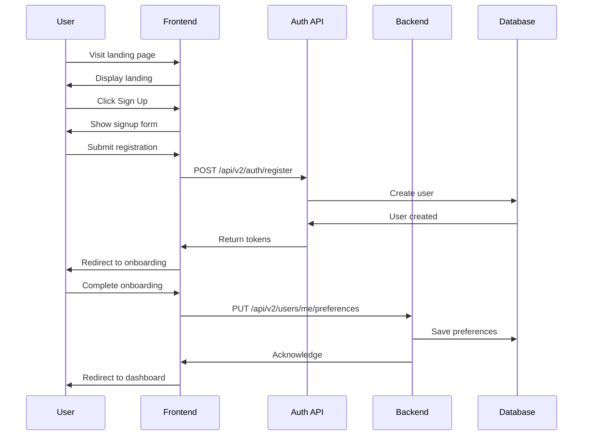
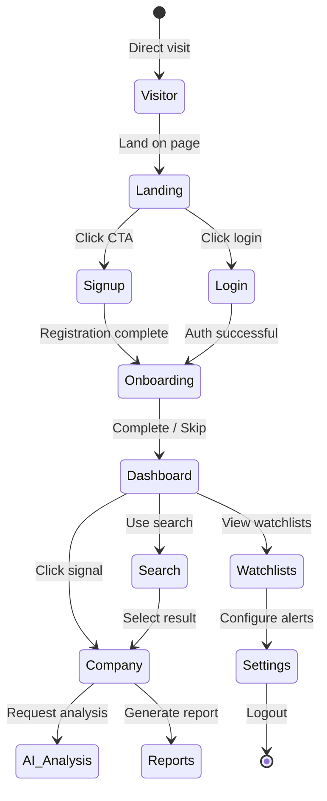
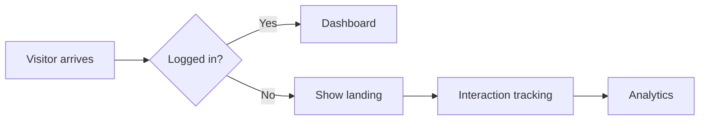
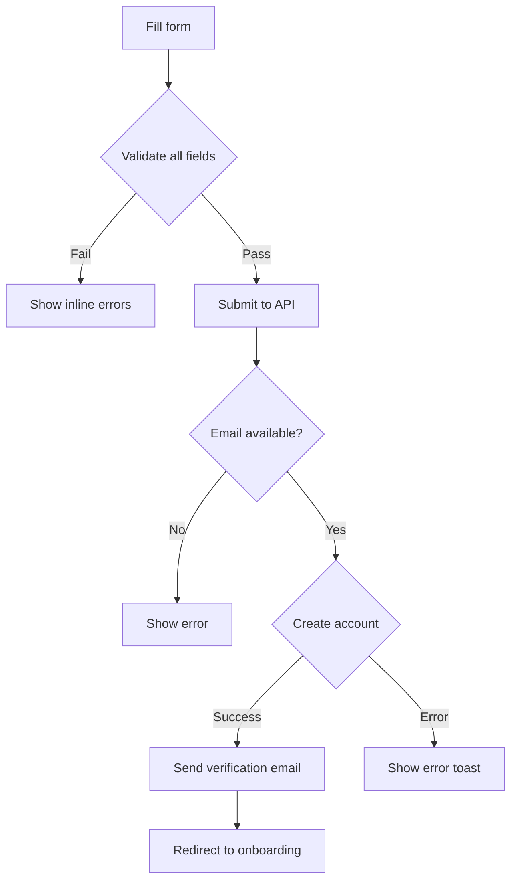
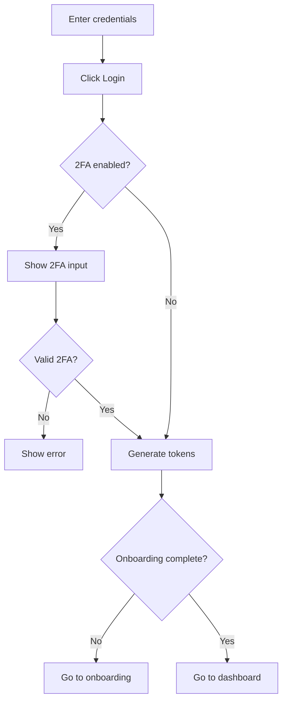
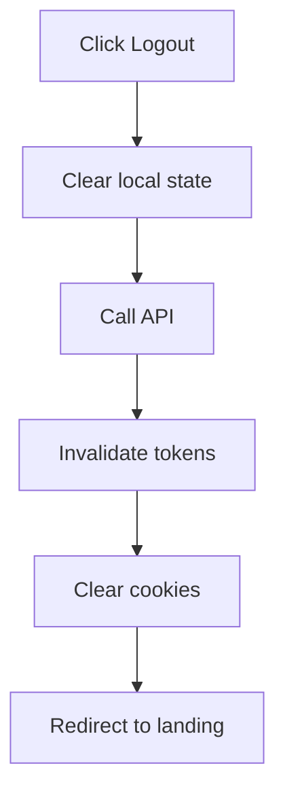
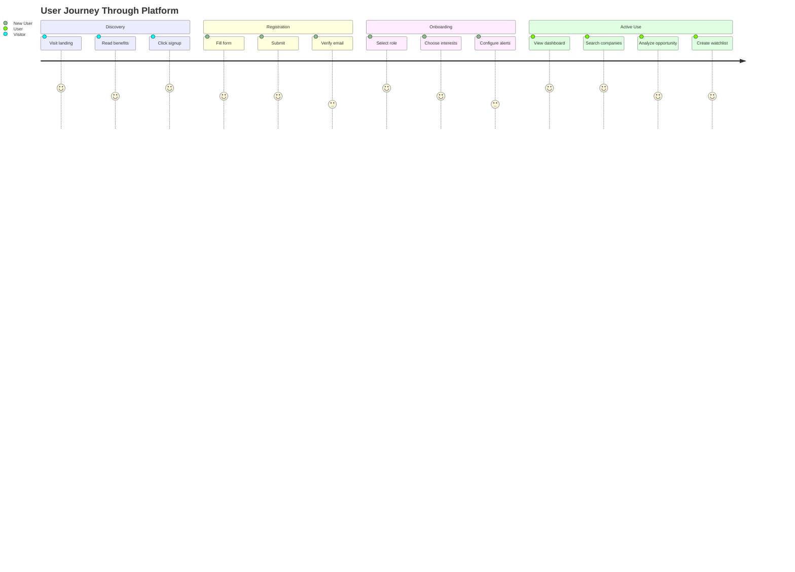

# User Journey — Opportunity Intelligence Platform

> Complete 13-stage user flow from visitor discovery to platform logout, with entry/exit conditions, edge cases, and interaction details.

---

## Table of Contents

1. [Journey Overview](#journey-overview)
2. [Stage Diagrams](#stage-diagrams)
3. [Stage Details](#stage-details)
4. [Edge Cases](#edge-cases)
5. [Mermaid Diagrams](#mermaid-diagrams)
6. [Cross-References](#cross-references)

---

## Journey Overview

### 13-Stage Journey

```
┌─────────┐    ┌──────────┐    ┌────────┐
│Visitor  │───▶│ Landing  │───▶│ Signup │
└─────────┘    └──────────┘    └────┬───┘
                                   │
         ┌─────────────────────────┘
         ▼
┌───────────────┐    ┌────────────┐    ┌───────────┐
│ Login         │───▶│ Onboarding │───▶│ Dashboard │
└───────────────┘    └────────────┘    └─────┬─────┘
                                             │
                              ┌──────────────┴───────────────┐
                              │                              │
                              ▼                              ▼
                       ┌───────────┐                  ┌──────────┐
                       │  Search   │                  │ Company  │
                       └─────┬─────┘                  └────┬─────┘
                             │                            │
                             │         ┌───────────────────┘
                             ▼         ▼
                      ┌────────────┐  ┌─────────────┐
                      │AI Analysis │  │   Reports    │
                      └─────┬──────┘  └──────┬──────┘
                            │                 │
                            └────────┬────────┘
                                     ▼
                              ┌─────────────┐
                              │Watchlists & │
                              │  Alerts     │
                              └──────┬──────┘
                                     ▼
                              ┌───────────┐    ┌────────┐
                              │ Settings  │───▶│ Logout │
                              └───────────┘    └────────┘
```

### Stage Summary

| # | Stage | Route | Key Action |
|---|-------|-------|------------|
| 1 | Visitor | `/` | Discovers platform via marketing |
| 2 | Landing | `/` | Views hero and benefits |
| 3 | Signup | `/auth/signup` | Creates account |
| 4 | Login | `/auth/login` | Authenticates |
| 5 | Onboarding | `/onboarding` | Configures preferences |
| 6 | Dashboard | `/dashboard` | Views personalized home |
| 7 | Search | `/search` | Discovers companies |
| 8 | Company | `/company/[id]` | Views company details |
| 9 | AI Analysis | `/company/[id]/analysis` | Generates AI insights |
| 10 | Reports | `/reports` | Creates exports |
| 11 | Watchlists | `/watchlists` | Manages tracked companies |
| 12 | Settings | `/settings` | Configures account |
| 13 | Logout | - | Ends session |

---

## Stage Diagrams

### Sequence Diagram



### State Machine



---

## Stage Details

### Stage 1: Visitor

**Definition:** First-time user arriving at the platform.

**Entry Conditions:**
- Direct link, search result, or referral

**Key Behaviors:**
- Browses landing page content
- Evaluates value proposition
- Reads documentation/pricing

**Exit Conditions:**
| Exit | Destination | Trigger |
|------|-------------|---------|
| Sign up | `/auth/signup` | Click "Get Started" |
| Login | `/auth/login` | Click "Log in" |
| Leave | External | Browser close |

**Edge Cases:**
- Already logged in (redirect to `/dashboard`)
- Blocked region (show geo-restriction message)
- Bot detection (CAPTCHA challenge)

---

### Stage 2: Landing

**Definition:** Public marketing page showcasing platform value.

**Route:** `/`

**Key Elements:**
- Hero section with CTA
- Benefits grid (3-4 columns)
- Feature tabs with screenshots
- Pricing tiers
- Testimonials carousel
- FAQ accordion
- Footer with links

**Interactive Components:**
| Component | Behavior |
|-----------|----------|
| Hero CTA | Primary button scrolls to pricing or opens signup |
| Feature Tabs | Click toggles screenshot + description |
| Pricing Card | Hover highlights features |
| Testimonial | Auto-rotates every 5s, clickable links |
| FAQ | Accordion expand/collapse |
| Nav Login | Opens login modal |

**Data Flow:**


**Edge Cases:**
- Network error loading assets: Show skeleton + retry button
- Slow connection: Progressive image loading
- Already authenticated: Auto-redirect to dashboard

---

### Stage 3: Signup

**Route:** `/auth/signup`

**Form Fields:**
| Field | Type | Validation | Required |
|-------|------|------------|----------|
| Full Name | text | 2-100 chars | Yes |
| Email | email | Valid email format | Yes |
| Password | password | 8+ chars, mixed case, number | Yes |
| Company | text | 2-200 chars | No |
| Role | select | Predefined options | No |
| Terms | checkbox | Must accept | Yes |

**Password Rules Display:**
- Minimum 8 characters
- At least one uppercase letter
- At least one lowercase letter
- At least one number
- At least one special character

**Flow:**


**API Endpoint:** `POST /api/v2/auth/register`

**Success Response:**
```json
{
  "data": {
    "user_id": "uuid",
    "email": "user@example.com",
    "access_token": "jwt",
    "refresh_token": "jwt"
  }
}
```

**Edge Cases:**
| Case | Handling |
|------|----------|
| Email exists | "Email already registered. Try logging in." |
| Password weak | Inline validation, progressive hints |
| Rate limit | Show cooldown timer |
| Server error | Generic "Try again" with retry |

---

### Stage 4: Login

**Route:** `/auth/login`

**Form Fields:**
| Field | Type | Validation | Required |
|-------|------|------------|----------|
| Email | email | Valid format | Yes |
| Password | password | 1+ chars | Yes |
| Remember Me | checkbox | - | No |

**Alternative Methods:**
- Social: Google OAuth
- Social: GitHub OAuth
- Magic Link (email)

**Flow:**


**API Endpoint:** `POST /api/v2/auth/login`

**Edge Cases:**
| Case | Handling |
|------|----------|
| Wrong password | "Invalid email or password" (no enumeration) |
| Account locked | Show unlock instructions |
| Unverified email | Resend verification, limit 3/day |
| Suspended account | Show suspension notice with support |

---

### Stage 5: Onboarding

**Route:** `/onboarding`

**Multi-Step Wizard (4 steps):**

**Step 1: Role Selection**
| Option | Description |
|--------|-------------|
| Investor | Track deals, analyze opportunities |
| Founder | Competitive research, investor discovery |
| Accelerator | Monitor cohort, track progress |
| Researcher | Market analysis, data export |
| Other | Custom use case |

**Step 2: Interests**
- Sectors (multi-select chips): AI, SaaS, Fintech, HealthTech, etc.
- Investment Stage: Pre-seed, Seed, Series A, B+
- Geography: Regions/Countries

**Step 3: Alerts Setup**
- Alert frequency: Real-time, Daily digest, Weekly
- Notification channels: Email, In-app

**Step 4: Import Data (Optional)**
- Import from CSV
- Paste company list

**Progress Indicator:**
```
[●]────[●]────[○]────[○]
Role    Interests Alerts  Import
```

**Skip Logic:**
- Steps 3-4 optional (can skip)
- Progress persists across sessions
- "Skip for now" appears on each step

**API Endpoint:** `PUT /api/v2/users/me/preferences`

**Edge Cases:**
| Case | Handling |
|------|----------|
| Network error | Save locally, retry silently |
| Timeout | Persist progress, show banner |
| All skipped | Default preferences applied |

---

### Stage 6: Dashboard

**Route:** `/dashboard`

See [06-dashboard.md](./06-dashboard.md) for complete specification.

**Quick Navigation:**
- Search bar → `/search`
- Signal click → Company profile
- Widget click → Respective feature

---

### Stage 7: Search

**Route:** `/search`

See [07-search.md](./07-search.md) for complete specification.

**Exit via:**
- Result click → Company profile
- Back → Dashboard

---

### Stage 8: Company Profile

**Route:** `/company/[id]`

See [08-company-profile.md](./08-company-profile.md) for complete specification.

**Exit via:**
- AI Analysis tab → AI Analysis view
- Generate Report → Reports
- Add to Watchlist → Confirmation toast

---

### Stage 9: AI Analysis

**Route:** `/company/[id]/analysis`

See [09-ai-analysis.md](./09-ai-analysis.md) for complete specification.

**Exit via:**
- Back button → Company profile
- Close → Company profile

---

### Stage 10: Reports

**Route:** `/reports`

See [10-reports.md](./10-reports.md) for complete specification.

**Exit via:**
- Back → Dashboard
- Report click → View report

---

### Stage 11: Watchlists & Alerts

**Route:** `/watchlists`

See [11-watchlists-alerts.md](./11-watchlists-alerts.md) for complete specification.

**Exit via:**
- Alert setup → Continue editing
- Company click → Company profile

---

### Stage 12: Settings

**Route:** `/settings`

See [13-settings.md](./13-settings.md) for complete specification.

**Categories:**
- Profile
- Organization
- Security
- API Keys
- Billing
- Theme
- Notifications
- Privacy

---

### Stage 13: Logout

**Trigger:** Click "Log out" from user menu

**Flow:**


**API Endpoint:** `POST /api/v2/auth/logout`

**Actions:**
1. Clear JWT from memory
2. Delete refresh token cookie
3. Clear localStorage (non-persistent data)
4. Redirect to `/`

---

## Edge Cases

### Session Management

| Scenario | Behavior |
|----------|----------|
| Token expired mid-session | Silent refresh, retry request |
| Refresh token expired | Redirect to login |
| Multiple tabs open | Share session via BroadcastChannel |
| Inactive (30 min) | Show re-auth modal |
| Network lost | Queue actions, sync on reconnect |

### Navigation

| Scenario | Behavior |
|----------|----------|
| Back button | Use browser history |
| Direct URL to protected | Auth check, redirect if needed |
| Deep link expired | Show "link expired" with recovery |
| Bookmark protected page | Auth check, redirect if needed |

### Error Recovery

| Scenario | Behavior |
|----------|----------|
| API timeout | Show retry button in component |
| 401 received | Clear session, redirect to login |
| 403 received | Show "access denied" toast |
| 500 received | Show error with retry |
| Offline mode | Show cached data with banner |

---

## Mermaid Diagrams

### Complete User Journey



---

## Cross-References

| Go To | From |
|-------|------|
| [06-dashboard.md](./06-dashboard.md) | Main entry point after login |
| [07-search.md](./07-search.md) | Primary discovery method |
| [04-authentication.md](./04-authentication.md) | Auth implementation |
| [05-onboarding.md](./05-onboarding.md) | Onboarding detailed specs |
| [17-rest-api-mapping.md](./17-rest-api-mapping.md) | Backend API reference |

---

## Version

| Version | Date | Changes |
|---------|------|---------|
| 1.0.0 | July 2, 2026 | Initial user journey |

---

*Part of the Opportunity Intelligence Platform PRD*