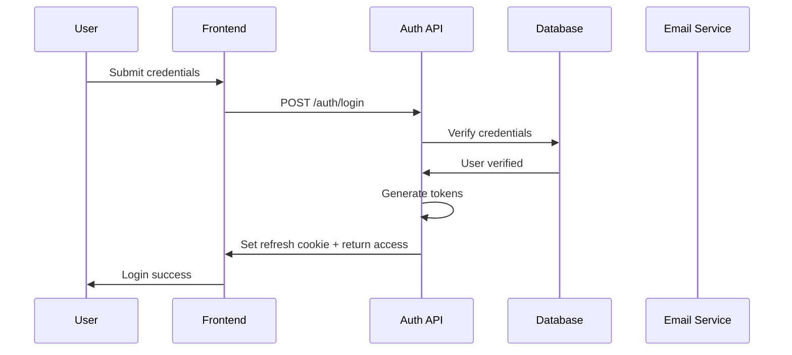
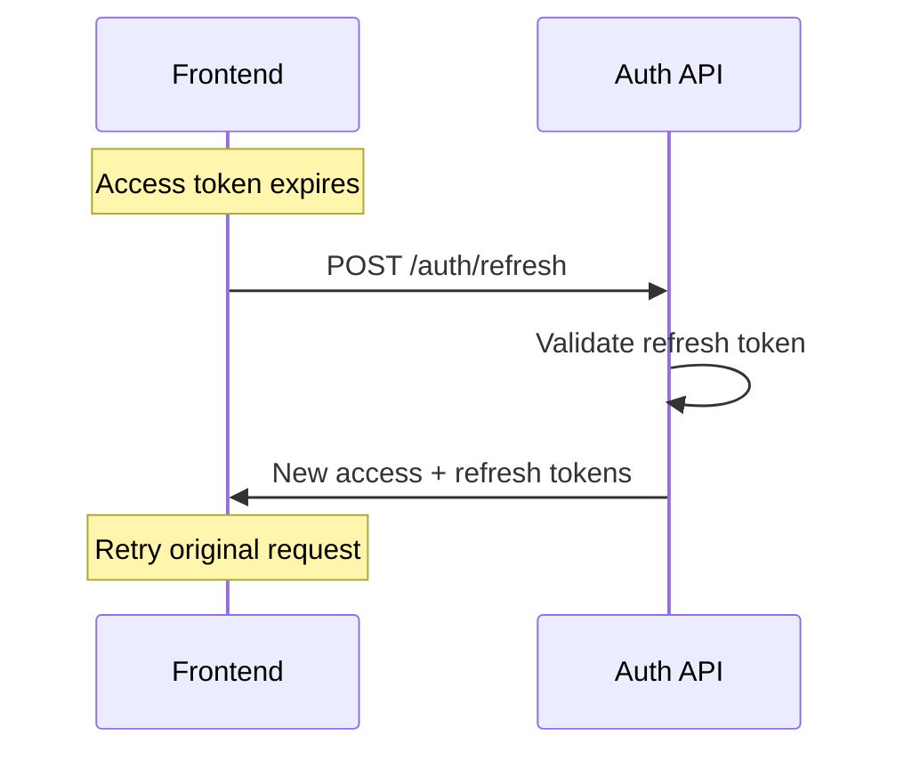

# Authentication — Opportunity Intelligence Platform

> Authentication specification including signup, login, password management, MFA, and JWT token flows.

---

## Table of Contents

1. [Auth Overview](#auth-overview)
2. [Sign Up Flow](#sign-up-flow)
3. [Login Flow](#login-flow)
4. [Social Authentication](#social-authentication)
5. [Password Management](#password-management)
6. [Email Verification](#email-verification)
7. [Multi-Factor Authentication](#multi-factor-authentication)
8. [Token Management](#token-management)
9. [API Endpoints](#api-endpoints)

---

## Auth Overview

### Authentication Methods

| Method | Description | Status |
|--------|-------------|--------|
| Email + Password | Traditional credentials | Required |
| Google OAuth | Social login | Available |
| GitHub OAuth | Social login | Available |
| Magic Link | Passwordless email | Future |
| SSO/SAML | Enterprise SSO | Enterprise only |

### Token Architecture

| Token | Lifetime | Storage | Purpose |
|-------|----------|---------|---------|
| Access Token | 15 minutes | Memory | API authorization |
| Refresh Token | 7 days | HTTPOnly Cookie | Token renewal |
| CSRF Token | Session | Cookie | CSRF protection |

### Auth Flow Diagram



---

## Sign Up Flow

### Route

`/auth/signup`

### Sign Up Form

```
┌─────────────────────────────────────────────────────────────────────┐
│                                                                       │
│     Create your account                                               │
│                                                                       │
│     ┌───────────────────────────────────────────────────────────┐   │
│     │  Full Name                                                │   │
│     │  [                                         ]               │   │
│     └───────────────────────────────────────────────────────────┘   │
│     ┌───────────────────────────────────────────────────────────┐   │
│     │  Work Email                                               │   │
│     │  [                                         ]               │   │
│     └───────────────────────────────────────────────────────────┘   │
│     ┌───────────────────────────────────────────────────────────┐   │
│     │  Password                                                │   │
│     │  [                                         ]               │   │
│     │  Must be 8+ characters with uppercase, number, symbol    │   │
│     └───────────────────────────────────────────────────────────┘   │
│                                                                       │
│     □ I agree to the [Terms of Service] and [Privacy Policy]        │
│                                                                       │
│         [Create Account]                                              │
│                                                                       │
│     ─────────────────────────────────────────────────────────────   │
│                                                                       │
│     Already have an account? [Log in]                                 │
│                                                                       │
└─────────────────────────────────────────────────────────────────────┘
```

### Validation Rules

| Field | Rules | Error Messages |
|-------|-------|----------------|
| Name | 2-100 chars, no special chars | "Please enter your name" |
| Email | Valid format, not disposable | "Please enter a valid work email" |
| Password | 8+ chars, 1 upper, 1 lower, 1 number, 1 symbol | "Password doesn't meet requirements" |
| Terms | Must be checked | "You must accept the terms" |

### Password Requirements Visual

```
┌────────────────────────────────────────────────────────────────┐
│  Password requirements:                                         │
│  ☐ 8+ characters                    ✓ Met                     │
│  ☐ At least one uppercase letter     ✓ Met                     │
│  ☐ At least one lowercase letter     ✓ Met                     │
│  ☐ At least one number               ○ Not met                │
│  ☐ At least one special character     ○ Not met                │
└────────────────────────────────────────────────────────────────┘
```

### Sign Up States

| State | UI |
|-------|-----|
| Default | Form ready |
| Validating | Inline validation on blur |
| Submitting | Button loading spinner |
| Success | Redirect to email verification or onboarding |
| Error | Error message below field |

### Sign Up API

**Request:** `POST /api/v2/auth/register`

```json
{
  "name": "Jane Smith",
  "email": "jane@company.com",
  "password": "SecurePass123!",
  "terms_accepted": true
}
```

---

## Login Flow

### Route

`/auth/login`

### Login Form

```
┌─────────────────────────────────────────────────────────────────────┐
│                                                                       │
│     Welcome back                                                       │
│                                                                       │
│     ┌───────────────────────────────────────────────────────────┐   │
│     │  Email                                                     │   │
│     │  [                                         ]               │   │
│     └───────────────────────────────────────────────────────────┘   │
│     ┌───────────────────────────────────────────────────────────┐   │
│     │  Password                                          [👁]   │   │
│     │  [                                         ]               │   │
│     └───────────────────────────────────────────────────────────┘   │
│                                                                       │
│     □ Remember me                   [Forgot password?]             │
│                                                                       │
│         [Log in]                                                      │
│                                                                       │
│     ─────────────────────────────────────────────────────────────   │
│     Or continue with                                                  │
│     ┌──────────────────┐  ┌──────────────────┐                     │
│     │  Continue with   │  │  Continue with   │                     │
│     │  Google          │  │  GitHub          │                     │
│     └──────────────────┘  └──────────────────┘                     │
│                                                                       │
│     ─────────────────────────────────────────────────────────────   │
│                                                                       │
│     Don't have an account? [Sign up]                                  │
│                                                                       │
└─────────────────────────────────────────────────────────────────────┘
```

### Login States

| State | UI |
|-------|-----|
| Default | Form ready |
| Invalid credentials | "Invalid email or password" |
| Account locked | "Account temporarily locked. Try again in X minutes" |
| Unverified email | "Please verify your email first" or auto-send verification |
| Suspended | "Account suspended. Contact support" |

### Forgot Password Link

Clicking redirects to `/auth/forgot-password`

### Login API

**Request:** `POST /api/v2/auth/login`

```json
{
  "email": "jane@company.com",
  "password": "SecurePass123!",
  "remember_me": true
}
```

**Response:**
```json
{
  "data": {
    "user_id": "uuid",
    "name": "Jane Smith",
    "email": "jane@company.com",
    "email_verified": false,
    "subscription_tier": "free",
    "onboarding_complete": false,
    "requires_mfa": false
  },
  "tokens": {
    "access_token": "eyJhbG...",
    "token_type": "Bearer",
    "expires_in": 900
  }
}
```

---

## Social Authentication

### Google OAuth

**Flow:**
```
1. Click "Continue with Google"
2. Redirect to Google consent page
3. User grants permission
4. Redirect back with auth code
5. Exchange code for tokens
6. Create/link user account
```

### GitHub OAuth

**Flow:**
```
1. Click "Continue with GitHub"
2. Redirect to GitHub authorization
3. User approves
4. Redirect back with code
5. Exchange code for tokens
6. Handle GitHub email visibility
```

### Social Button States

| State | Visual |
|-------|--------|
| Default | Icon + text |
| Hover | Highlight |
| Loading | Spinner, disabled |
| Error | Error toast |

---

## Password Management

### Forgot Password Flow

```
┌─────────────────────────────────────────────────────────────────────┐
│     Reset your password                                              │
│                                                                       │
│     Enter your email and we'll send you a link to reset              │
│     your password.                                                   │
│                                                                       │
│     ┌───────────────────────────────────────────────────────────┐   │
│     │  Email                                                     │   │
│     │  [                                         ]               │   │
│     └───────────────────────────────────────────────────────────┘   │
│                                                                       │
│         [Send reset link]                                             │
│                                                                       │
│     Back to [Log in]                                                  │
│                                                                       │
└─────────────────────────────────────────────────────────────────────┘
```

**API:** `POST /api/v2/auth/forgot-password`

**Response:** Always "Email sent" (prevents email enumeration)

### Reset Password Flow

**Route:** `/auth/reset-password?token=xxx`

```
┌─────────────────────────────────────────────────────────────────────┐
│     Set new password                                                 │
│                                                                       │
│     ┌───────────────────────────────────────────────────────────┐   │
│     │  New Password                                              │   │
│     │  [                                         ]               │   │
│     └───────────────────────────────────────────────────────────┘   │
│     ┌───────────────────────────────────────────────────────────┐   │
│     │  Confirm Password                                         │   │
│     │  [                                         ]               │   │
│     └───────────────────────────────────────────────────────────┘   │
│                                                                       │
│         [Update password]                                             │
│                                                                       │
└─────────────────────────────────────────────────────────────────────┘
```

**Token Validation:**
- Token must be valid and not expired
- Token is single-use
- 1-hour expiration

**API:** `POST /api/v2/auth/reset-password`

---

## Email Verification

### Verification Flow

```
1. User signs up
2. System sends verification email
3. User clicks link in email
4. Token validated, email marked verified
5. User redirected to app
```

### Verification Email

```
┌────────────────────────────────────────────────────────────────┐
│  Subject: Verify your email                                    │
├────────────────────────────────────────────────────────────────┤
│                                                                │
│  Hi Jane,                                                     │
│                                                                │
│  Thanks for signing up! Please verify your email address       │
│  by clicking the button below.                                │
│                                                                │
│  ┌────────────────────────────────────────────────────────┐  │
│  │  Verify Email Address                                  │  │
│  └────────────────────────────────────────────────────────┘  │
│                                                                │
│  Or copy this link:                                            │
│  https://app.example.com/auth/verify-email?token=xxx          │
│                                                                │
│  This link expires in 24 hours.                               │
│                                                                │
└────────────────────────────────────────────────────────────────┘
```

### Post-Signup Flow

| Email Status | Redirect |
|--------------|----------|
| Verified | /dashboard (onboarding complete) or /dashboard (onboarding incomplete) |
| Unverified + Pro | Show banner, resend option |

### Resend Verification

**API:** `POST /api/v2/auth/resend-verification`

**Rate limit:** 3 per day per user

---

## Multi-Factor Authentication

### MFA Setup Flow

```
1. User enables MFA in settings
2. Show QR code for authenticator app
3. User scans with app (Google Auth, etc.)
4. User enters verification code
5. Store TOTP secret, enable MFA
6. Generate backup codes
```

### MFA Login Flow

```
┌─────────────────────────────────────────────────────────────────────┐
│     Two-factor authentication                                       │
│                                                                       │
│     ┌───────────────────────────────────────────────────────────┐   │
│     │  Enter the 6-digit code from your authenticator app       │   │
│     │                                                           │   │
│     │  [ ][ ][ ][ ][ ][ ]                                       │   │
│     │       [       ]                                           │   │
│     └───────────────────────────────────────────────────────────┘   │
│                                                                       │
│     [Didn't receive a code? Use a backup code]                       │
│                                                                       │
│         [Verify]                                                      │
│                                                                       │
└─────────────────────────────────────────────────────────────────────┘
```

### MFA Code Input

| Input | Behavior |
|-------|----------|
| Auto-submit | On 6th digit entered |
| Backspace | Navigate to previous digit |
| Paste | Parse and fill all fields |
| Auto-focus | First empty field |

---

## Token Management

### Access Token

| Property | Value |
|----------|-------|
| Type | JWT |
| Lifetime | 15 minutes |
| Storage | Memory only |
| Header | `Authorization: Bearer <token>` |
| Claims | user_id, email, role, exp, iat |

### Refresh Token

| Property | Value |
|----------|-------|
| Type | Opaque random string |
| Lifetime | 7 days |
| Storage | HTTPOnly cookie |
| Rotation | Yes (single use) |
| Storage | Secure, SameSite=Strict |

### Token Refresh Flow



### Logout

**API:** `POST /api/v2/auth/logout`

**Actions:**
1. Delete refresh token from database
2. Clear refresh cookie
3. Frontend clears access token from memory

### Session Timeout

| Scenario | Behavior |
|----------|----------|
| 15 min inactive | Warning modal: "Session expiring in 5 minutes" |
| 20 min inactive | Force logout, redirect to login |
| Close browser | Access token lost (by design) |
| Refresh token expired | Redirect to login |

---

## API Endpoints

### Auth Endpoints

| Method | Endpoint | Description |
|--------|----------|-------------|
| POST | `/api/v2/auth/register` | Create account |
| POST | `/api/v2/auth/login` | Login |
| POST | `/api/v2/auth/logout` | Logout |
| POST | `/api/v2/auth/refresh` | Refresh tokens |
| POST | `/api/v2/auth/forgot-password` | Request reset |
| POST | `/api/v2/auth/reset-password` | Reset with token |
| GET | `/api/v2/auth/verify-email` | Verify email |
| POST | `/api/v2/auth/resend-verification` | Resend email |

### OAuth Endpoints

| Method | Endpoint | Description |
|--------|----------|-------------|
| GET | `/api/v2/auth/google` | Initiate Google OAuth |
| GET | `/api/v2/auth/google/callback` | Google callback |
| GET | `/api/v2/auth/github` | Initiate GitHub OAuth |
| GET | `/api/v2/auth/github/callback` | GitHub callback |

### MFA Endpoints

| Method | Endpoint | Description |
|--------|----------|-------------|
| POST | `/api/v2/auth/mfa/setup` | Generate MFA secrets |
| POST | `/api/v2/auth/mfa/verify` | Verify setup |
| POST | `/api/v2/auth/mfa/enable` | Enable MFA |
| POST | `/api/v2/auth/mfa/disable` | Disable MFA |
| POST | `/api/v2/auth/mfa/verify-login` | Verify login code |

### Current User

| Method | Endpoint | Description |
|--------|----------|-------------|
| GET | `/api/v2/users/me` | Get current user |
| PUT | `/api/v2/users/me` | Update user |
| DELETE | `/api/v2/users/me` | Delete account |

---

## Security Specifications

### Rate Limiting

| Endpoint | Limit | Window |
|----------|-------|--------|
| `/auth/login` | 5 attempts | 15 minutes |
| `/auth/register` | 3 attempts | 1 hour |
| `/auth/forgot-password` | 3 attempts | 1 hour |
| `/auth/reset-password` | 5 attempts | 15 minutes |

### Account Lockout

| Condition | Action |
|-----------|--------|
| 5 failed logins | Lock for 15 minutes |
| 10 failed logins | Lock for 1 hour |
| Suspected breach | Admin lock |

### CSRF Protection

- CSRF token in `X-CSRF-Token` header
- Token required for all state-changing requests
- Double-submit cookie pattern for forms

---

## Cross-References

| Document | Topic |
|----------|-------|
| [05-onboarding.md](./05-onboarding.md) | Post-auth onboarding |
| [22-security.md](./22-security.md) | Security details |
| [17-rest-api-mapping.md](./17-rest-api-mapping.md) | API reference |
| [18-state-management.md](./18-state-management.md) | Token state |

---

## Version

| Version | Date | Changes |
|---------|------|---------|
| 1.0.0 | July 2, 2026 | Initial auth spec |

---

*Part of the Opportunity Intelligence Platform PRD*