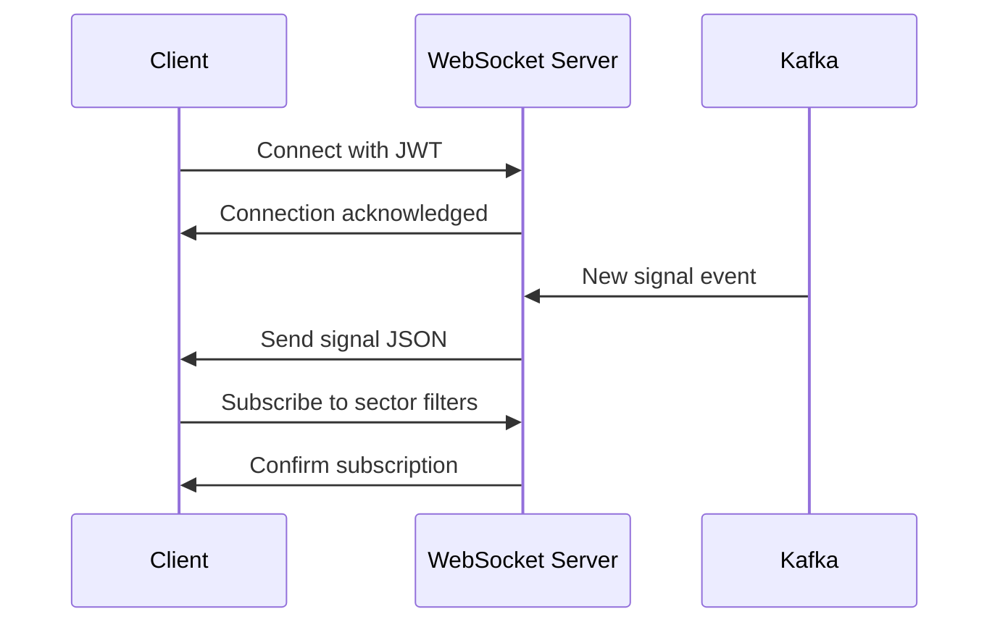

# Dashboard — Opportunity Intelligence Platform

> Main dashboard specifications including widget grid, KPIs, live signal feed, sector heatmap, and real-time data flow.

---

## Table of Contents

1. [Dashboard Overview](#dashboard-overview)
2. [Layout Specifications](#layout-specifications)
3. [Widget Specifications](#widget-specifications)
4. [Live Signal Feed](#live-signal-feed)
5. [Sector Heatmap](#sector-heatmap)
6. [Real-Time Data](#real-time-data)
7. [Data Sources](#data-sources)
8. [States & Behaviors](#states--behaviors)

---

## Dashboard Overview

### Purpose

The dashboard serves as the personalized home page after login, providing:
- At-a-glance key metrics and KPIs
- Real-time market signals and activity
- Quick navigation to recent/frequent actions
- Sector-level market overview

### User Entry Points

| Source | Action |
|--------|--------|
| Login | Redirect after successful auth |
| Onboarding | Completion redirects here |
| Logo click | From any page |
| Breadcrumb | Click "Dashboard" |

### Route

`/dashboard`

---

## Layout Specifications

### Grid System

**Breakpoints:**

| Breakpoint | Min Width | Columns | Gutter |
|------------|-----------|---------|--------|
| Desktop XL | 1440px+ | 12 | 24px |
| Desktop | 1024-1439px | 12 | 20px |
| Tablet | 768-1023px | 8 | 16px |
| Mobile | <768px | 4 | 12px |

### Default Grid Layout (Desktop XL)

```
┌──────────────────────────────────────────────────────────────────┐
│  Header: Search + User Menu                                       │
├─────────────────────────────┬────────────────────────────────────┤
│  KPI Row (4 widgets)        │                                    │
│  [KPI1] [KPI2] [KPI3] [KPI4]│                                    │
├─────────────────────────────┴────────────────────────────────────┤
│  Main Content Grid                                                │
│  ┌─────────────────┐ ┌─────────────────┐ ┌───────────────────────┐ │
│  │ Live Signals    │ │ Sector Map      │ │ Recent Activity      │ │
│  │ (3x4)           │ │ (4x5)           │ │ (3x4)                │ │
│  │                 │ │                 │ │                       │ │
│  │                 │ │                 │ │                       │ │
│  │                 │ │                 │ │                       │ │
│  └─────────────────┘ └─────────────────┘ └───────────────────────┘ │
│  ┌─────────────────┐ ┌────────────────────────────────────────────┤
│  │ Quick Actions   │ │ Market Trends (Full Width)                 │
│  │ (3x2)           │ │                                            │
│  └─────────────────┘ └────────────────────────────────────────────┤
└──────────────────────────────────────────────────────────────────┘
│  Footer                                                          │
└──────────────────────────────────────────────────────────────────┘
```

### Widget Spans

| Widget Name | Desktop XL | Desktop | Tablet | Mobile |
|-------------|------------|---------|--------|--------|
| KPI (1-4) | 3 cols | 3 cols | 4 cols | 4 cols |
| Live Signals | 3 cols | 3 cols | 4 cols | 4 cols |
| Sector Heatmap | 4 cols | 4 cols | 8 cols | 4 cols |
| Recent Activity | 3 cols | 3 cols | 4 cols | 4 cols |
| Quick Actions | 2 cols | 2 cols | 4 cols | 4 cols |
| Market Trends | 12 cols | 12 cols | 8 cols | 4 cols |

---

## Widget Specifications

### KPI Widgets

**Four widgets in top row:**

#### KPI 1: Portfolio Value (if applicable)
```
┌─────────────────────────────────┐
│ 📈 Portfolio Value             │
│                                 │
│   $127.5M                      │  ← Large number
│   ▲ +12.3% from last month    │  ← Change indicator
│                                 │
│   Tracked: 45 companies        │  ← Sub-metric
└─────────────────────────────────┘
```

**Data Points:**
- Value (formatted currency)
- Percentage change (▲/▼)
- Time period (This Month)
- Sub-metric (company count)

#### KPI 2: Watchlist
```
┌─────────────────────────────────┐
│ 👁 Watchlist                   │
│                                 │
│   23                           │  ← Count
│   ▲ +3 this week              │  ← Change
│                                 │
│   2 alerts triggered          │  ← Sub-metric
└─────────────────────────────────┘
```

#### KPI 3: New Signals
```
┌─────────────────────────────────┐
│ ⚡ Signals                     │
│                                 │
│   127                          │  ← Count
│   Today                        │  ← Time period
│                                 │
│   4 high priority             │  ← Sub-metric
└─────────────────────────────────┘
```

#### KPI 4: AI Analyses Run
```
┌─────────────────────────────────┐
│ 🤖 AI Analyses                 │
│                                 │
│   34                           │  ← Count
│   This month                   │  ← Time period
│                                 │
│   Avg. score: 72               │  ← Sub-metric
└─────────────────────────────────┘
```

**KPI Widget Properties:**
| Property | Value |
|----------|-------|
| Height | 120px |
| Padding | 16px |
| Border radius | 12px |
| Background | `--color-bg-secondary` |
| Border | 1px `--color-border` |
| Typography | See [20-design-system.md](./20-design-system.md) |

#### KPI Interactions

| Interaction | Behavior |
|-------------|----------|
| Hover | Subtle lift (translateY -2px), border glow |
| Click | Navigate to relevant section |
| Refresh icon | Manually refresh data |

### Live Signal Feed

**Widget: Live Signals**

```
┌─────────────────────────────────────────────┐
│ 🔴 Live Signals              [Filter] [⚙]  │
├─────────────────────────────────────────────┤
│ ┌─────────────────────────────────────────┐ │
│ │ 🟢 Series A — NovaTech                 │ │
│ │     $12M raised from Sequoia            │ │
│ │     AI • San Francisco • 2m ago        │ │
│ │     [View Company] [Add to Watchlist]  │ │
│ └─────────────────────────────────────────┘ │
│ ┌─────────────────────────────────────────┐ │
│ │ 🟡 News — CloudFlow                    │ │
│ │     Launched new enterprise product    │ │
│ │     SaaS • New York • 5m ago           │ │
│ │     [Read More] [Track]               │ │
│ └─────────────────────────────────────────┘ │
│ ┌─────────────────────────────────────────┐ │
│ │ 🔴 Founder — Sarah Chen                │ │
│ │     Joined Google as VP Engineering     │ │
│ │     Founders • Seattle • 12m ago       │ │
│ │     [View Profile]                    │ │
│ └─────────────────────────────────────────┘ │
│ ...                                        │
│                                             │
│ [Load More] or Infinite Scroll             │
└─────────────────────────────────────────────┘
```

**Signal Types:**

| Type | Icon | Color | Description |
|------|------|-------|-------------|
| Funding | 🟢 | Success green | Investment rounds, raises |
| News | 🟡 | Warning amber | Notable news, launches |
| Founder | 🔴 | Accent blue | Team changes, exits |
| Milestone | 🟣 | Purple | Achievements, partnerships |
| Patent | 🟠 | Orange | IP filings, trademarks |

**Signal Card Structure:**
```typescript
interface Signal {
  id: string;
  type: 'funding' | 'news' | 'founder' | 'milestone' | 'patent';
  title: string;
  description: string;
  company: {
    id: string;
    name: string;
    logo_url?: string;
  };
  sector: string;
  geography: string;
  timestamp: ISO8601;
  priority: 'high' | 'medium' | 'low';
  matched_interests: boolean;
}
```

**Filter Options:**
- Signal type (multi-select)
- Sector (from user interests)
- Geography
- Priority
- Time range (Today, This Week, This Month)

**Update Mechanism:** SSE/WebSocket subscription to `/ws/live/signals`

---

### Sector Heatmap

**Widget: Market Overview**

```
┌─────────────────────────────────────────────────────────────┐
│  Market Overview                                    [↻]    │
├─────────────────────────────────────────────────────────────┤
│                                                             │
│   AI ML     ████████████████████████████   156 signals     │
│   Fintech   ██████████████████████       89 signals      │
│   SaaS      ████████████████████████████  134 signals     │
│   Health    ██████████████                 67 signals      │
│   Crypto    ████████████                  45 signals      │
│   Other     ██████████████████████████████198 signals     │
│                                                             │
│   [Legend: Low ░░░░░ High]                                  │
│                                                             │
│   Click sector → Go to filtered search                     │
└─────────────────────────────────────────────────────────────┘
```

**Heatmap Properties:**
| Property | Value |
|----------|-------|
| Chart type | Horizontal bar / Treemap |
| Color scale | `--color-bg-tertiary` to `--color-accent` |
| Max signals shown | Top 6 sectors |
| Hover | Tooltip with sector details |
| Click | Navigate to `/search?sector=X` |

**Data Structure:**
```typescript
interface SectorData {
  name: string;
  signal_count: number;
  trend: 'up' | 'down' | 'stable';
  avg_score: number;
}
```

---

### Recent Activity

**Widget: Your Activity**

```
┌─────────────────────────────────────────────┐
│ 📊 Recent Activity                 [All]    │
├─────────────────────────────────────────────┤
│ ┌─────────────────────────────────────────┐ │
│ │ 🔍 Searched: "AI startups in SF"        │ │
│ │    Today at 2:34 PM                     │ │
│ └─────────────────────────────────────────┘ │
│ ┌─────────────────────────────────────────┐ │
│ │ 🤖 Ran AI Analysis: TechFlow Inc        │ │
│ │    Today at 1:15 PM • Score: 78        │ │
│ └─────────────────────────────────────────┘ │
│ ┌─────────────────────────────────────────┐ │
│ │ 👁 Added to Watchlist: Nova Systems     │ │
│ │    Yesterday at 4:22 PM                │ │
│ └─────────────────────────────────────────┘ │
│ ...                                        │
└─────────────────────────────────────────────┘
```

**Activity Types:**
- Search queries
- AI analyses run
- Watchlist changes
- Report generations
- Alert triggers

**Time Display:** Relative ("2m ago", "Yesterday", "Jul 1")

---

### Quick Actions

**Widget: Quick Actions**

```
┌─────────────────────────────────┐
│ ⚡ Quick Actions               │
├─────────────────────────────────┤
│ [🔍 Search Companies    ]       │
│ [🤖 Run AI Analysis    ]       │
│ [📋 Create Report      ]       │
│ [👁 Manage Watchlists  ]       │
└─────────────────────────────────┘
```

**Buttons:** Secondary style, full width, stacked

---

### Market Trends

**Widget: Market Trends (Full Width)**

```
┌────────────────────────────────────────────────────────────────┐
│  Market Trends                                    [7D] [30D]  │
├────────────────────────────────────────────────────────────────┤
│                                                                 │
│  Funding Activity     │  Sector Distribution    │  Top Deals  │
│  [Line Chart]        │  [Donut Chart]          │  [List]     │
│                                                                 │
└────────────────────────────────────────────────────────────────┘
```

**Sub-widgets:**
1. **Funding Activity**: Line chart showing daily funding amounts (7d/30d toggle)
2. **Sector Distribution**: Donut chart of signal types
3. **Top Deals**: Table of largest recent raises

---

## Live Signal Feed

### WebSocket Connection

**Endpoint:** `/ws/live`

**Connection Flow:**


**Message Format:**
```json
{
  "type": "signal",
  "data": {
    "id": "signal-uuid",
    "signal_type": "funding",
    "company": { "id": "...", "name": "..." },
    "priority": "high"
  },
  "timestamp": "ISO8601"
}
```

### Fallback: SSE

If WebSocket fails, fall back to Server-Sent Events.

**Endpoint:** `GET /api/v2/stream/signals`

```
event: signal
data: {"id": "...", ...}

event: heartbeat
data: {"timestamp": "..."}
```

---

## Real-Time Data

### Update Frequencies

| Widget | Update Method | Frequency |
|--------|--------------|------------|
| Live Signals | WebSocket | Instant |
| Sector Heatmap | SSE | 30 seconds |
| Market Trends | SSE | 60 seconds |
| KPIs | REST polling | 5 minutes |
| Recent Activity | SSE | 30 seconds |

### Refresh Strategy

```typescript
const REFRESH_INTERVALS = {
  signals: 'realtime',    // WebSocket
  heatmap: 30_000,       // 30s
  trends: 60_000,        // 1min
  kpis: 300_000,         // 5min
  activity: 30_000,      // 30s
};
```

---

## Data Sources

### API Endpoints

| Widget | Endpoint | Method |
|--------|----------|--------|
| KPIs | `/api/v2/dashboard/kpis` | GET |
| Signals | `/api/v2/signals?limit=10` | GET |
| Sector Data | `/api/v2/market/sectors` | GET |
| Activity | `/api/v2/users/me/activity` | GET |
| Trends | `/api/v2/market/trends` | GET |

### Caching Strategy

| Data | Cache | TTL |
|------|-------|-----|
| KPIs | Redis | 5 min |
| Signals | None (live) | - |
| Sector | Redis | 1 min |
| Trends | Redis | 5 min |

---

## States & Behaviors

### Loading State

```
┌─────────────────────────────────────────────┐
│                                             │
│   ████████████  ████████████  ████████    │
│   ████████████  ████████████  ████████    │
│                                             │
│   ████████████████████████████████          │
│   ████████████████████████████████          │
│                                             │
│   Skeleton cards with pulse animation        │
│                                             │
└─────────────────────────────────────────────┘
```

### Error State

```
┌─────────────────────────────────────────────┐
│  ⚠️ Failed to load dashboard                │
│                                             │
│  [Retry]                [Contact Support]  │
└─────────────────────────────────────────────┘
```

### Empty State (New User)

```
┌─────────────────────────────────────────────┐
│  Welcome to the platform!                   │
│                                             │
│  Start by:                                  │
│  • Setting up your interests                 │
│  • Adding companies to your watchlist        │
│  • Running your first AI analysis           │
│                                             │
│  [Complete Setup]                           │
└─────────────────────────────────────────────┘
```

---

## Responsive Behavior

### Tablet (768-1023px)

```
┌──────────────────────────────────────────────────────┐
│  Header: Search                                         │
├──────────────────────────────────────────────────────┤
│  [KPI1]  [KPI2]  [KPI3]  [KPI4]                       │
├──────────────────────────────────────────────────────┤
│  [Live Signals]      │    [Sector Heatmap]             │
│  (4 cols)            │    (4 cols)                     │
├──────────────────────────────────────────────────────┤
│  [Recent Activity]   │    [Quick Actions]             │
│  (4 cols)            │    (4 cols)                     │
├──────────────────────────────────────────────────────┤
│  [Market Trends - Full Width]                        │
└──────────────────────────────────────────────────────┘
```

### Mobile (<768px)

```
┌────────────────────────────┐
│  [Search]     [User Menu]  │
├────────────────────────────┤
│  [Portfolio Value KPI]    │
│  [Watchlist KPI]          │
│  [Signals KPI]            │
│  [AI Analyses KPI]        │
├────────────────────────────┤
│  [Live Signals]           │
│  (Full width card)        │
├────────────────────────────┤
│  [Sector Heatmap]         │
│  (Scrollable)             │
├────────────────────────────┤
│  [Recent Activity]        │
├────────────────────────────┤
│  [Quick Actions]         │
├────────────────────────────┤
│  [Market Trends Tab 1]    │
│  [Market Trends Tab 2]    │
└────────────────────────────┘
```

---

## Interactions

### Widget Refresh

| Element | Action | Result |
|---------|--------|--------|
| Widget refresh icon | Click | Re-fetch data, show spinner briefly |
| Page refresh | Click browser refresh | Full page reload with loading state |

### Navigation

| Widget Area | Click | Destination |
|-------------|-------|-------------|
| KPI value | Click | Relevant section |
| Signal company | Click | `/company/[id]` |
| Sector bar | Click | `/search?sector=X` |
| Activity item | Click | Relevant detail page |

### Filters

| Filter Type | Behavior |
|-------------|----------|
| Signal type | Multi-select, persist to localStorage |
| Time range | Button group, toggle active |
| Sector | Click bar in heatmap |

---

## Performance Requirements

| Metric | Target |
|--------|--------|
| Initial paint | < 1.5s |
| Interactive | < 3s |
| WebSocket connect | < 500ms |
| Signal latency | < 100ms |

---

## Cross-References

| Document | Topic |
|----------|-------|
| [01-user-journey.md](./01-user-journey.md) | User flow context |
| [18-state-management.md](./18-state-management.md) | State handling |
| [17-rest-api-mapping.md](./17-rest-api-mapping.md) | API endpoints |
| [20-design-system.md](./20-design-system.md) | Design tokens |

---

## Version

| Version | Date | Changes |
|---------|------|---------|
| 1.0.0 | July 2, 2026 | Initial dashboard spec |

---

*Part of the Opportunity Intelligence Platform PRD*