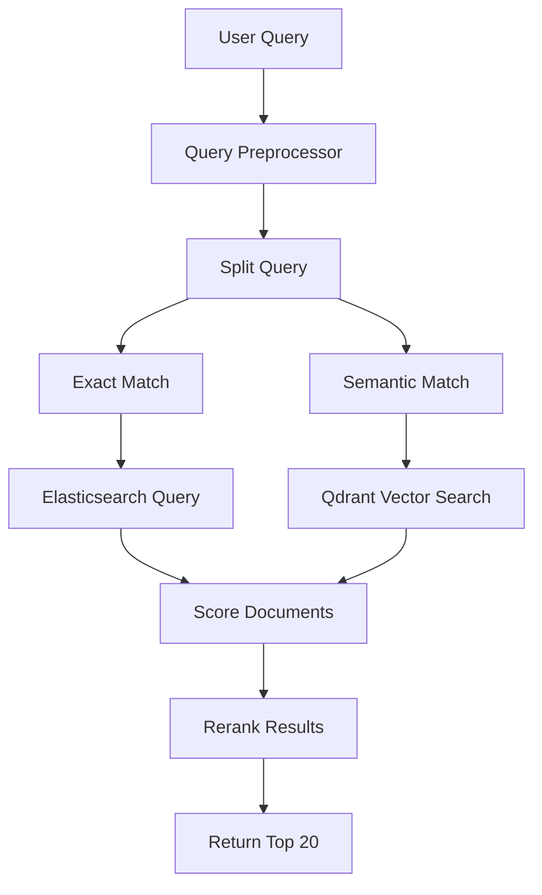

# Search — Opportunity Intelligence Platform

> Company search specification with semantic search (Elasticsearch + Qdrant hybrid), autocomplete, filters, and infinite scroll.

---

## Table of Contents

1. [Search Overview](#search-overview)
2. [Search Interface](#search-interface)
3. [Autocomplete](#autocomplete)
4. [Search Filters](#search-filters)
5. [Results Grid](#results-grid)
6. [Semantic Search](#semantic-search)
7. [Saved Searches](#saved-searches)
8. [API Endpoints](#api-endpoints)
9. [Performance Targets](#performance-targets)

---

## Search Overview

### Purpose

The search feature enables discovery of companies across a database of 10M+ startups using:
- Full-text keyword search
- Semantic/vector search for meaning-based matching
- Structured filters for precise filtering
- Natural language queries

### Route

`/search`

### Query Parameters

| Parameter | Type | Description | Example |
|-----------|------|-------------|---------|
| `q` | string | Search query | `?q=AI startups` |
| `sector` | string | Filter by sector | `?sector=ai-ml` |
| `country` | string | Filter by country | `?country=US` |
| `stage` | string[] | Funding stage | `?stage=seed,series-a` |
| `score_min` | number | Min opportunity score | `?score_min=70` |
| `score_max` | number | Max opportunity score | `?score_max=100` |
| `status` | string | Company status | `?status=active` |
| `sort` | string | Sort field | `?sort=score` |
| `order` | string | Sort direction | `?order=desc` |
| `page` | number | Page number | `?page=1` |
| `limit` | number | Results per page | `?limit=20` |

---

## Search Interface

### Layout (Desktop)

```
┌─────────────────────────────────────────────────────────────────┐
│  [🔍 Search companies...                                      ]
│                                                                  │
│  ┌─────────────┬─────────────┬─────────────┬───────────────┐   │
│  │ Sector ▼   │ Country ▼   │ Stage ▼     │ Score Range ▼ │   │
│  └─────────────┴─────────────┴─────────────┴───────────────┘   │
│  [Active filters: AI ×, San Francisco ×]           [Clear all]  │
├─────────────────────────────────────────────────────────────────┤
│  1,234 results • Sorted by: Relevance ▼        [📋] [⚙]       │
├─────────────────────────────────────────────────────────────────┤
│                                                                  │
│  ┌──────────────────────────────────────────────────────────┐   │
│  │ [Logo] NovaTech AI                ⚡ 82        [👁]      │   │
│  │           AI/ML • San Francisco • Series A • $12M         │   │
│  │           AI-powered customer analytics platform         │   │
│  │           Founded 2021 • 45 employees                    │   │
│  └──────────────────────────────────────────────────────────┘   │
│                                                                  │
│  ┌──────────────────────────────────────────────────────────┐   │
│  │ [Logo] CloudFlow Systems             ⚡ 78        [👁]      │   │
│  │           SaaS • New York • Series B • $45M              │   │
│  │           Enterprise workflow automation                 │   │
│  │           Founded 2019 • 200 employees                   │   │
│  └──────────────────────────────────────────────────────────┘   │
│                                                                  │
│  ... infinite scroll continues ...                             │
│                                                                  │
└─────────────────────────────────────────────────────────────────┘
```

### Search Bar

| Property | Specification |
|----------|---------------|
| Height | 48px |
| Placeholder | "Search companies, founders, investors..." |
| Icon | Left-aligned search icon |
| Clear button | Right-aligned, visible when text present |
| Border radius | 8px |
| Background | `--color-bg-tertiary` |
| Focus border | `--color-accent` |

**Keyboard Shortcuts:**
| Key | Action |
|-----|--------|
| `/` | Focus search bar (global) |
| `Escape` | Clear and blur |
| `Enter` | Submit search |

---

## Autocomplete

### Trigger

- **Delay:** 200ms after typing stops
- **Minimum characters:** 2
- **Maximum results:** 5 suggestions

### Autocomplete Dropdown

```
┌─────────────────────────────────────────────────┐
│ 🔍 ai startups                                  │
├─────────────────────────────────────────────────┤
│  Companies                                       │
│  ┌───────────────────────────────────────────┐  │
│  │ 🏢 AI Dynamics Inc                        │  │
│  │    AI/ML • San Francisco                  │  │
│  └───────────────────────────────────────────┘  │
│  ┌───────────────────────────────────────────┐  │
│  │ 🏢 Smart AI Solutions                     │  │
│  │    AI/ML • New York                       │  │
│  └───────────────────────────────────────────┘  │
├─────────────────────────────────────────────────┤
│  Sectors                                        │
│  ┌───────────────────────────────────────────┐  │
│  │ 🤖 AI & Machine Learning                  │  │
│  └───────────────────────────────────────────┘  │
├─────────────────────────────────────────────────┤
│  Investors                                       │
│  ┌───────────────────────────────────────────┐  │
│  │ 👤 Andreessen Horowitz (invested in      │  │
│  │    12 AI companies)                       │  │
│  └───────────────────────────────────────────┘  │
├─────────────────────────────────────────────────┤
│  🔍 Search for "ai startups" in full results   │  │
└─────────────────────────────────────────────────┘
```

### Suggestion Types

| Type | Icon | Description |
|------|------|-------------|
| Company | 🏢 | Company name, sector, location |
| Sector | 🤖 | Sector name, company count |
| Investor | 👤 | Investor name, portfolio size |
| Location | 📍 | City/region name |
| Action | 🔍 | "Search for X" full-text action |

### Autocomplete API

**Endpoint:** `GET /api/v2/search/autocomplete`

**Request:**
```
GET /api/v2/search/autocomplete?q=ai&limit=5
```

**Response:**
```json
{
  "data": {
    "companies": [
      { "id": "...", "name": "AI Dynamics", "sector": "AI/ML", "location": "SF" }
    ],
    "sectors": [
      { "slug": "ai-ml", "name": "AI & Machine Learning", "count": 15420 }
    ],
    "investors": [],
    "locations": [
      { "name": "San Francisco, CA", "country": "US" }
    ]
  }
}
```

**Performance:**
- Response time: < 100ms
- Debounce: 200ms
- Cache recent queries: 5 minutes

---

## Search Filters

### Filter Bar

| Filter | Type | Options |
|--------|------|---------|
| Sector | Dropdown (multi-select) | AI/ML, SaaS, Fintech, Health, etc. |
| Country | Dropdown (search) | All countries |
| Stage | Dropdown (multi-select) | Pre-seed, Seed, Series A/B/C+ |
| Score | Range slider | 0-100 |
| Status | Dropdown | Active, Acquired, Closed, IPO |
| Founded | Year range | 2000-2026 |
| Employees | Range select | 1-10, 11-50, 51-200, 200+ |

### Filter UI

**Active Filters (Pills):**
```
┌─────────────────────────────────────────────────────────────┐
│ Active: [AI/ML ×] [San Francisco ×] [Seed ×]   [Clear all] │
└─────────────────────────────────────────────────────────────┘
```

**Filter Dropdown:**
```
┌────────────────────────────────────────────────┐
│ Sector                                   [▼]  │
├────────────────────────────────────────────────┤
│ [✓] AI & Machine Learning (15,420)           │
│ [✓] SaaS (28,930)                            │
│ [ ] Fintech (12,340)                         │
│ [ ] HealthTech (18,230)                      │
│ ...                                          │
├────────────────────────────────────────────────┤
│                    [Cancel]  [Apply (2)]     │
└────────────────────────────────────────────────┘
```

### Score Range Filter

```
┌────────────────────────────────────────────────┐
│  Opportunity Score                            │
│  0 ═══════════●══════════●═══════════ 100     │
│                 45          82                 │
│                                                │
│  Min: [45    ]  Max: [82    ]  or use slider │
└──────────────────────────────────────────────┘
```

---

## Results Grid

### Company Card

```
┌──────────────────────────────────────────────────────┐
│ [Logo]  Company Name                    [♡] [⚡ XX] │
│                                                       │
│         Sector • Location • Stage • $Funding         │
│         Short description (2 lines max)               │
│         Founded YYYY • XX employees                  │
│                                                       │
│         [View Profile]                               │
└──────────────────────────────────────────────────────┘
```

**Card Properties:**
| Property | Value |
|----------|-------|
| Width | 100% (grid item) |
| Height | ~160px (varies) |
| Padding | 16px |
| Border radius | 12px |
| Background | `--color-bg-secondary` |
| Border | 1px `--color-border` |

### Card States

| State | Visual Change |
|-------|---------------|
| Default | Standard styling |
| Hover | Border glow, slight translateY(-2px) |
| Loading | Skeleton placeholder |
| Error | Error icon, retry button |

### Card Actions

| Action | Icon | Behavior |
|--------|------|----------|
| View Profile | - | Navigate to `/company/[id]` |
| Add to Watchlist | ♡/♥ | Toggle watchlist state |
| Quick Score | ⚡XX | Show score tooltip |

### Results Header

```
┌────────────────────────────────────────────────────────┐
│  1,234 results found • 0.234s                [Grid▼]│
│  Sorted by: [Relevance ▼]                            │
│                                                         │
│  [Grid View]  [List View]                            │
└────────────────────────────────────────────────────────┘
```

### View Toggle

**Grid View (default):**
```
┌─────────┐ ┌─────────┐ ┌─────────┐ ┌─────────┐
│ Company │ │ Company │ │ Company │ │ Company │
│    1    │ │    2    │ │    3    │ │    4    │
└─────────┘ └─────────┘ └─────────┘ └─────────┘
```

Columns: 4 (Desktop), 3 (Tablet), 1 (Mobile)

**List View:**
```
┌─────────────────────────────────────────────────┐
│ [Logo] Company 1  | SF | AI | Seed |  ⚡78 | ♥ │
├─────────────────────────────────────────────────┤
│ [Logo] Company 2  | NY | SaaS | A | ⚡82 | ♥ │
├─────────────────────────────────────────────────┤
│ [Logo] Company 3  | TX | Fintech | B | ⚡75 |  │
└─────────────────────────────────────────────────┘
```

---

## Semantic Search

### Architecture



### Search Strategy

1. **Exact Match (Elasticsearch)**
   - Company name
   - Founder names
   - Investor names
   - Sector keywords
   - Description text

2. **Semantic Match (Qdrant)**
   - Query vector from embedding model
   - Company description vectors
   - Industry/sector vectors

3. **Hybrid Scoring**
   ```
   final_score = 0.6 * elasticsearch_score + 0.4 * vector_score
   ```

4. **Reranking**
   - Apply business rules (user preferences, recency)
   - Boost watched companies
   - Penalize duplicates/similar names

### Query Types

| Query Type | Example | Processing |
|------------|---------|------------|
| Keyword | "AI startups SF" | Exact + semantic |
| Natural Language | "What AI companies are in San Francisco?" | Semantic with context |
| Competitor | "Similar to Stripe" | Semantic similarity |
| Investor | "Companies funded by Sequoia" | Structured lookup |
| Sector | "fintech companies" | Semantic + filter |

### Query Preprocessing

```python
def preprocess_query(query: str) -> dict:
    return {
        "original": query,
        "tokens": tokenize(query),
        "entities": extract_entities(query),  # ["AI", "SF"]
        "intent": classify_intent(query),      # "search", "compare"
        "filters": extract_filters(query),     # {sector: "AI/ML"}
    }
```

---

## Saved Searches

### Save Search

**Trigger:** Click "Save" icon in results header

**Modal:**
```
┌──────────────────────────────────────┐
│  Save Search                          │
├──────────────────────────────────────┤
│                                      │
│  Name: [My AI Startups       ]       │
│                                      │
│  Create alert for this search:       │
│  [✓] Notify me of new matches       │
│      Frequency: [Daily ▼]            │
│                                      │
│  [Cancel]            [Save Search]   │
└──────────────────────────────────────┘
```

### Saved Search Management

**Route:** `/search/saved`

```
┌─────────────────────────────────────────────────────────┐
│  Saved Searches                                         │
├─────────────────────────────────────────────────────────┤
│  ┌───────────────────────────────────────────────────┐ │
│  │ 🤖 AI Startups in SF                   [Run][✏][🗑]│ │
│  │     Created Jan 15 • 12 new results today          │ │
│  └───────────────────────────────────────────────────┘ │
│  ┌───────────────────────────────────────────────────┐ │
│  │ 📊 Fintech Series A                    [Run][✏][🗑]│ │
│  │     Created Jan 10 • 3 new results this week       │ │
│  └───────────────────────────────────────────────────┘ │
└─────────────────────────────────────────────────────────┘
```

### Search History

**Location:** Dropdown below search bar when focused

```
┌─────────────────────────────────────────────────┐
│  Recent Searches                                 │
├─────────────────────────────────────────────────┤
│  🔍 AI startups in SF             2 hours ago  │
│  🔍 Series A fintech companies    Yesterday     │
│  🔍 Similar to Stripe             2 days ago   │
│  ...                                             │
│  ────────────────────────────────────────────── │
│  Clear history                                   │
└─────────────────────────────────────────────────┘
```

---

## API Endpoints

### Search Companies

**Endpoint:** `GET /api/v2/search/companies`

**Full Request Example:**
```
GET /api/v2/search/companies?q=AI+startups&sector=ai-ml&country=US&stage=seed&score_min=70&sort=score&order=desc&page=1&limit=20
```

**Response:**
```json
{
  "data": {
    "companies": [
      {
        "id": "uuid",
        "name": "AI Dynamics",
        "logo_url": "https://...",
        "sector": {
          "slug": "ai-ml",
          "name": "AI & Machine Learning"
        },
        "location": {
          "city": "San Francisco",
          "country": "US"
        },
        "stage": "seed",
        "last_funding": {
          "amount": 5000000,
          "date": "2024-01-15"
        },
        "opportunity_score": 82,
        "founded_year": 2022,
        "employee_count": 25,
        "description": "AI-powered customer analytics..."
      }
    ],
    "facets": {
      "sectors": [
        { "slug": "ai-ml", "name": "AI/ML", "count": 15420 }
      ],
      "stages": [
        { "value": "seed", "count": 8230 }
      ]
    }
  },
  "meta": {
    "total": 1234,
    "page": 1,
    "per_page": 20,
    "total_pages": 62,
    "query_time_ms": 234
  }
}
```

### Get Saved Searches

**Endpoint:** `GET /api/v2/search/saved`

### Save Search

**Endpoint:** `POST /api/v2/search/saved`

**Request:**
```json
{
  "name": "My AI Startups",
  "query": "AI startups",
  "filters": {
    "sector": ["ai-ml"],
    "country": "US",
    "stage": ["seed"]
  },
  "alert_enabled": true,
  "alert_frequency": "daily"
}
```

---

## Performance Targets

| Metric | Target | SLA |
|--------|--------|-----|
| Search response (P95) | < 500ms | 99% |
| Autocomplete response | < 100ms | 99% |
| Initial page load | < 1.5s | - |
| Infinite scroll append | < 300ms | - |
| Facet updates | < 200ms | - |

### Optimizations

1. **Query caching:** Cache frequent queries for 5 minutes
2. **Index optimization:** Fuzzy matching, ngram indexes
3. **Connection pooling:** Reuse Elasticsearch/Qdrant connections
4. **Result caching:** Redis cache with query hash key

---

## States

### Empty State (No Results)

```
┌─────────────────────────────────────────────────────────┐
│                                                           │
│  😕 No companies match your search                       │
│                                                           │
│  Suggestions:                                             │
│  • Try different keywords                                │
│  • Broaden your filters                                  │
│  • Check spelling                                        │
│                                                           │
│  [Clear Filters]              [Contact Support]          │
│                                                           │
└─────────────────────────────────────────────────────────┘
```

### Loading State

```
┌─────────────────────────────────────────────────────────┐
│  [Loading spinner] Searching...                         │
├─────────────────────────────────────────────────────────┤
│  ░░░░░░░░░░░░░░  ← Skeleton cards (4-8)                │
│  ░░░░░░░░░░░░░░                                      │
│  ░░░░░░░░░░░░░░                                      │
│  ░░░░░░░░░░░░░░                                      │
└─────────────────────────────────────────────────────────┘
```

---

## Cross-References

| Document | Topic |
|----------|-------|
| [08-company-profile.md](./08-company-profile.md) | Company detail page |
| [17-rest-api-mapping.md](./17-rest-api-mapping.md) | API reference |
| [16-backend-flows.md](./16-backend-flows.md) | Backend processing |

---

## Version

| Version | Date | Changes |
|---------|------|---------|
| 1.0.0 | July 2, 2026 | Initial search spec |

---

*Part of the Opportunity Intelligence Platform PRD*