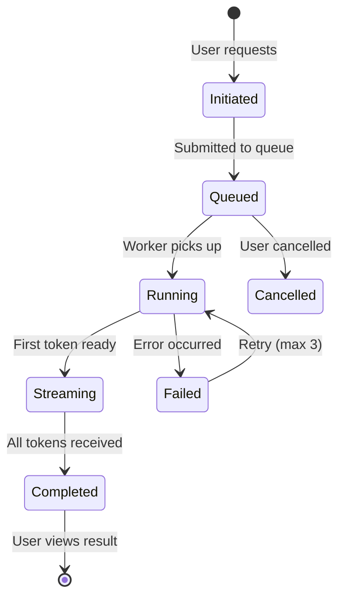
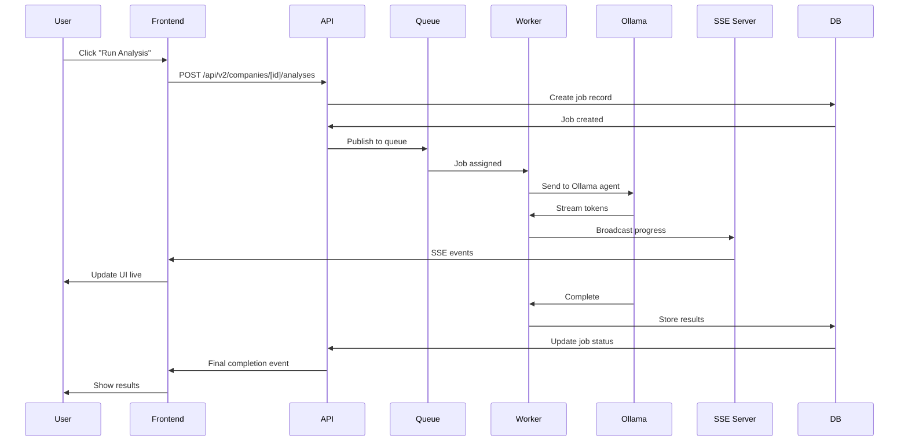

# AI Analysis — Opportunity Intelligence Platform

> Async AI workflow specification with job states, streaming progress, UI states, and error handling.

---

## Table of Contents

1. [Analysis Overview](#analysis-overview)
2. [Job States](#job-states)
3. [UI States](#ui-states)
4. [Analysis Types](#analysis-types)
5. [Data Flow](#data-flow)
6. [Output Structure](#output-structure)
7. [Streaming Implementation](#streaming-implementation)
8. [Error Handling](#error-handling)
9. [API Endpoints](#api-endpoints)

---

## Analysis Overview

### Purpose

The AI Analysis feature generates comprehensive company analysis using 40+ specialized agents, providing:
- Opportunity scoring with explainable factors
- Risk assessment
- Investment thesis generation
- Competitive positioning
- Recommendations

### Route

`/company/[id]` → Click "AI Analysis" tab or "Run AI Analysis" button

### Entry Points

| Source | Action |
|--------|--------|
| Company profile | Click "AI Analysis" tab or button |
| Dashboard | Quick action "Run AI Analysis" |
| Watchlist | Context menu on company |

---

## Job States

### State Machine



### State Definitions

| State | Description | User Status |
|-------|-------------|-------------|
| `initiated` | Request received | "Starting..." |
| `queued` | Waiting for worker | "In queue (#N)" |
| `running` | Processing | "Analyzing..." |
| `streaming` | Sending results | "Generating..." |
| `completed` | Finished | Show results |
| `failed` | Error occurred | Show error |
| `cancelled` | User cancelled | "Cancelled" |

### State Transitions

```
Initiated
    ↓
Queued (position: N)
    ↓
Running (progress: 0-100%)
    ↓
Streaming (progress: 0-100%, tokens arriving)
    ↓
Completed
```

---

## UI States

### 1. Initial State (No Analysis)

```
┌─────────────────────────────────────────────────────────────────────┐
│                                                                         │
│  🤖 AI Analysis                                                        │
│                                                                         │
│  ┌─────────────────────────────────────────────────────────────────┐  │
│  │                                                                     │  │
│  │     [🤖 Icon]                                                      │  │
│  │                                                                     │  │
│  │     Generate comprehensive AI analysis                            │  │
│  │     including opportunity score, risk factors,                     │  │
│  │     and investment recommendations.                               │  │
│  │                                                                     │  │
│  │     ⏱️ Typically takes 30-120 seconds                              │  │
│  │                                                                     │  │
│  │     [       Run AI Analysis        ]                              │  │
│  │                                                                     │  │
│  └─────────────────────────────────────────────────────────────────┘  │
│                                                                         │
└─────────────────────────────────────────────────────────────────────┘
```

### 2. Queued State

```
┌─────────────────────────────────────────────────────────────────────┐
│                                                                         │
│  🤖 AI Analysis                           Job ID: abc-123            │
│                                                                         │
│  ┌─────────────────────────────────────────────────────────────────┐  │
│  │                                                                     │  │
│  │     ⏳ Your analysis is in the queue                              │  │
│  │                                                                     │  │
│  │     Position: #3                                                   │  │
│  │                                                                     │  │
│  │     Estimated wait: ~2 minutes                                     │  │
│  │                                                                     │  │
│  │     [Cancel]                                                       │  │
│  │                                                                     │  │
│  └─────────────────────────────────────────────────────────────────┘  │
│                                                                         │
└─────────────────────────────────────────────────────────────────────┘
```

### 3. Running State

```
┌─────────────────────────────────────────────────────────────────────┐
│                                                                         │
│  🤖 AI Analysis                           Job ID: abc-123            │
│                                                                         │
│  ┌─────────────────────────────────────────────────────────────────┐  │
│  │                                                                     │  │
│  │     🔄 Analyzing company data...                                  │  │
│  │                                                                     │  │
│  │     ┌─────────────────────────────────────────────────────────┐    │  │
│  │     │ [████████████░░░░░░░░░░░░]  45%                        │    │  │
│  │     └─────────────────────────────────────────────────────────┘    │  │
│  │                                                                     │  │
│  │     Current step: Evaluating market position                      │  │
│  │                                                                     │  │
│  │     Steps:                                                         │  │
│  │     [✓] Gather company data                                       │  │
│  │     [✓] Analyze market                                           │  │
│  │     [●] Evaluate team                                             │  │
│  │     [○] Assess traction                                           │  │
│  │     [○] Generate report                                           │  │
│  │                                                                     │  │
│  │     [Cancel]                                                       │  │
│  │                                                                     │  │
│  └─────────────────────────────────────────────────────────────────┘  │
│                                                                         │
└─────────────────────────────────────────────────────────────────────┘
```

### 4. Streaming State (Real-time)

```
┌─────────────────────────────────────────────────────────────────────┐
│                                                                         │
│  🤖 AI Analysis                           Job ID: abc-123            │
│                                                                         │
│  ┌─────────────────────────────────────────────────────────────────┐  │
│  │                                                                     │  │
│  │     ✨ Generating analysis...                                    │  │
│  │                                                                     │  │
│  │     ┌─────────────────────────────────────────────────────────┐    │  │
│  │     │                                                             │    │  │
│  │     │ NovaTech AI shows strong metrics across key              │    │  │
│  │     │ evaluation dimensions. The company operates in           │    │  │
│  │     │ the rapidly growing AI/ML sector with a                    │    │  │
│  │     │ [tokens being streamed in real-time...]                   │    │  │
│  │     │                                                             │    │  │
│  │     └─────────────────────────────────────────────────────────┘    │  │
│  │                                                                     │  │
│  │     Tokens received: 128 / 512                                    │  │
│  │                                                                     │  │
│  │     [Cancel]                                                       │  │
│  │                                                                     │  │
│  └─────────────────────────────────────────────────────────────────┘  │
│                                                                         │
└─────────────────────────────────────────────────────────────────────┘
```

### 5. Completed State

```
┌─────────────────────────────────────────────────────────────────────┐
│                                                                         │
│  🤖 AI Analysis                          [Regenerate] [Export] [Share]│
│                                                                         │
│  ┌─────────────────────────────────────────────────────────────────┐  │
│  │  📊 Analysis Summary                                    ⚡ 82    │  │
│  │                                                                     │  │
│  │  Generated: July 2, 2026 at 2:34 PM • Took 45 seconds             │  │
│  └─────────────────────────────────────────────────────────────────┘  │
│                                                                         │
│  ┌─────────────────────────────────────────────────────────────────┐  │
│  │  📋 Executive Summary                                             │  │
│  │                                                                     │  │
│  │  NovaTech AI presents a compelling investment opportunity...      │  │
│  └─────────────────────────────────────────────────────────────────┘  │
│                                                                         │
│  ┌─────────────────────────────────────────────────────────────────┐  │
│  │  🏆 Scores                                                        │  │
│  │                                                                     │  │
│  │  ┌──────────────┐  ┌──────────────┐  ┌──────────────┐          │  │
│  │  │ Market    85 │  │ Team      78 │  │ Traction   82 │          │  │
│  │  │ ████████░░░  │  │ ███████░░░░  │  │ ████████░░░  │          │  │
│  │  └──────────────┘  └──────────────┘  └──────────────┘          │  │
│  │                                                                     │  │
│  │  ┌──────────────┐  ┌──────────────┐  ┌──────────────┐          │  │
│  │  │ Competition 68│  │ Product   75 │  │ Finance    72 │          │  │
│  │  │ ██████░░░░░░  │  │ ███████░░░░  │  │ ███████░░░░  │          │  │
│  │  └──────────────┘  └──────────────┘  └──────────────┘          │  │
│  │                                                                     │  │
│  └─────────────────────────────────────────────────────────────────┘  │
│                                                                         │
│  ┌─────────────────────────────────────────────────────────────────┐  │
│  │  👁 Key Findings                                                   │  │
│  │                                                                     │  │
│  │  • Strong AI/ML market with ~40% YoY growth                      │  │
│  │  • Experienced founding team with previous exits                  │  │
│  │  • Impressive 40% MoM growth in key metrics                       │  │
│  │  • Well-capitalized after recent Series A                          │  │
│  └─────────────────────────────────────────────────────────────────┘  │
│                                                                         │
│  ┌─────────────────────────────────────────────────────────────────┐  │
│  │  ⚠️ Risk Factors                                                  │  │
│  │                                                                     │  │
│  │  • Competitive landscape with major players entering               │  │
│  │  • High customer concentration risk                                │  │
│  │  • Key person dependency on CEO                                    │  │
│  └─────────────────────────────────────────────────────────────────┘  │
│                                                                         │
│  ┌─────────────────────────────────────────────────────────────────┐  │
│  │  💡 Recommendations                                               │  │
│  │                                                                     │  │
│  │  1. Schedule call with founding team                             │  │
│  │  2. Deep-dive into customer concentration details                 │  │
│  │  3. Evaluate competitive positioning vs. OpenAI enterprise       │  │
│  └─────────────────────────────────────────────────────────────────┘  │
│                                                                         │
└─────────────────────────────────────────────────────────────────────┘
```

### 6. Failed State

```
┌─────────────────────────────────────────────────────────────────────┐
│                                                                         │
│  🤖 AI Analysis                           Job ID: abc-123            │
│                                                                         │
│  ┌─────────────────────────────────────────────────────────────────┐  │
│  │                                                                     │  │
│  │     ❌ Analysis Failed                                            │  │
│  │                                                                     │  │
│  │     Unable to complete analysis. This can happen if:             │  │
│  │     • Insufficient company data                                   │  │
│  │     • Service temporarily unavailable                             │  │
│  │     • Rate limit exceeded                                         │  │
│  │                                                                     │  │
│  │     [Try Again]                               [Contact Support]   │  │
│  │                                                                     │  │
│  └─────────────────────────────────────────────────────────────────┘  │
│                                                                         │
└─────────────────────────────────────────────────────────────────────┘
```

### 7. Cancelled State

```
┌─────────────────────────────────────────────────────────────────────┐
│                                                                         │
│  🤖 AI Analysis                                                        │
│                                                                         │
│  ┌─────────────────────────────────────────────────────────────────┐  │
│  │                                                                     │  │
│  │     ⚠️ Analysis Cancelled                                         │  │
│  │                                                                     │  │
│  │     The analysis was cancelled.                                  │  │
│  │                                                                     │  │
│  │     [Run New Analysis]                                            │  │
│  │                                                                     │  │
│  └─────────────────────────────────────────────────────────────────┘  │
│                                                                         │
└─────────────────────────────────────────────────────────────────────┘
```

---

## Analysis Types

| Type | Description | Estimated Time |
|------|-------------|---------------|
| `standard` | Full company analysis | 45-90 seconds |
| `quick` | Brief summary | 15-30 seconds |
| `deep-dive` | Comprehensive with comparisons | 2-5 minutes |
| `pitch-deck` | Investor-focused format | 60-120 seconds |

### Analysis Configuration

**Standard Request:**
```json
{
  "company_id": "uuid",
  "analysis_type": "standard",
  "include_recommendations": true,
  "include_risk_assessment": true,
  "include_comparables": true,
  "compare_with": ["company-slug-1", "company-slug-2"]
}
```

---

## Data Flow

### Complete Flow



### WebSocket/SSE Update Events

```json
// Queued
{ "type": "status", "state": "queued", "position": 3 }

// Progress
{ "type": "progress", "progress": 45, "step": "evaluating_market" }

// Streaming token
{ "type": "token", "delta": "company operates in" }

// Complete
{ "type": "complete", "analysis_id": "uuid" }

// Error
{ "type": "error", "code": "ANALYSIS_FAILED", "message": "..." }
```

---

## Output Structure

### Complete Analysis Result

```json
{
  "data": {
    "id": "analysis-uuid",
    "company_id": "company-uuid",
    "job_status": "completed",
    "analysis_type": "standard",
    "generated_at": "2026-07-02T14:34:00Z",
    "processing_time_ms": 45000,
    "result": {
      "summary": "NovaTech AI presents a compelling investment opportunity...",
      "overall_score": 82,
      "scores": {
        "market": { "value": 85, "trend": "up" },
        "team": { "value": 78, "trend": "stable" },
        "traction": { "value": 82, "trend": "up" },
        "competition": { "value": 68, "trend": "down" },
        "product": { "value": 75, "trend": "stable" },
        "finances": { "value": 72, "trend": "up" }
      },
      "key_findings": [
        "Strong AI/ML market with ~40% YoY growth",
        "Experienced founding team with previous exits",
        "Impressive 40% MoM growth in key metrics"
      ],
      "risk_factors": [
        "Competitive landscape with major players entering",
        "High customer concentration risk",
        "Key person dependency on CEO"
      ],
      "recommendations": [
        "Schedule call with founding team",
        "Deep-dive into customer concentration details"
      ]
    },
    "metadata": {
      "agents_used": ["market-analyst", "team-evaluator", "risk-assessor"],
      "data_sources": 5,
      "confidence_score": 0.87
    }
  }
}
```

### Score Components

| Component | Weight | Description |
|-----------|--------|-------------|
| Market | 25% | Market size, growth, trends |
| Team | 20% | Founder experience, track record |
| Traction | 20% | Growth metrics, user engagement |
| Competition | 15% | Moat, defensibility |
| Product | 10% | Product-market fit, differentiation |
| Finances | 10% | Funding, burn rate, unit economics |

---

## Streaming Implementation

### Frontend Implementation

```typescript
// SSE connection
const eventSource = new EventSource(`/api/v2/companies/${id}/analyses/${jobId}/stream`);

eventSource.addEventListener('status', (e) => {
  const data = JSON.parse(e.data);
  updateJobState(data.state);
  updateQueuePosition(data.position);
});

eventSource.addEventListener('progress', (e) => {
  const data = JSON.parse(e.data);
  updateProgressBar(data.progress);
  updateCurrentStep(data.step);
});

eventSource.addEventListener('token', (e) => {
  const data = JSON.parse(e.data);
  appendToSummary(data.delta);
});

eventSource.addEventListener('complete', (e) => {
  eventSource.close();
  showResults(JSON.parse(e.data));
});

eventSource.addEventListener('error', (e) => {
  handleStreamError(e);
});
```

### Reconnection Strategy

| Event | Action |
|-------|--------|
| Connection lost | Reconnect with exponential backoff (1s, 2s, 4s, 8s, max 30s) |
| Job completed during disconnect | Fetch full result via REST |
| Network error | Show "Reconnecting..." state |

---

## Error Handling

### Error Types

| Error Code | Description | User Message | Action |
|------------|-------------|--------------|--------|
| `INSUFFICIENT_DATA` | Not enough company data | "More data needed" | Show what's missing |
| `SERVICE_UNAVAILABLE` | Ollama/agent down | "Service temporarily unavailable" | Retry button |
| `RATE_LIMIT` | Too many requests | "Rate limit exceeded" | Show cooldown |
| `TIMEOUT` | Analysis taking too long | "Taking longer than expected" | Offer cancel/continue |
| `INVALID_COMPANY` | Company not valid | "Analysis not available" | Redirect |

### Retry Strategy

```typescript
const RETRY_CONFIG = {
  maxRetries: 3,
  baseDelay: 2000,
  maxDelay: 30000,
  backoffMultiplier: 2,
};
```

**Retry Flow:**
```
Attempt 1 → Fail → Wait 2s → Attempt 2
Attempt 2 → Fail → Wait 4s → Attempt 3
Attempt 3 → Fail → Wait 8s → Show error with "Try Again"
```

---

## API Endpoints

### Start Analysis

**Endpoint:** `POST /api/v2/companies/{id}/analyses`

**Request:**
```json
{
  "analysis_type": "standard"
}
```

**Response (202 Accepted):**
```json
{
  "data": {
    "job_id": "job-uuid",
    "status": "initiated",
    "created_at": "ISO8601"
  }
}
```

### Get Job Status

**Endpoint:** `GET /api/v2/companies/{id}/analyses/{jobId}`

**Response:**
```json
{
  "data": {
    "job_id": "job-uuid",
    "status": "running",
    "progress": 0.45,
    "current_step": "evaluating_market"
  }
}
```

### Stream Progress

**Endpoint:** `GET /api/v2/companies/{id}/analyses/{jobId}/stream`

**Type:** Server-Sent Events

### Get Completed Analysis

**Endpoint:** `GET /api/v2/companies/{id}/analyses/{jobId}`

### Get Latest Analysis

**Endpoint:** `GET /api/v2/companies/{id}/analyses/latest`

### Cancel Analysis

**Endpoint:** `DELETE /api/v2/companies/{id}/analyses/{jobId}`

---

## Performance Targets

| Metric | Target |
|--------|--------|
| Start analysis response | < 200ms |
| Time to first token | < 5 seconds |
| Queue wait (P95) | < 60 seconds |
| Total analysis time (standard) | < 90 seconds |
| Streaming latency | < 500ms |

---

## Cross-References

| Document | Topic |
|----------|-------|
| [08-company-profile.md](./08-company-profile.md) | Company profile context |
| [18-state-management.md](./18-state-management.md) | State handling |
| [17-rest-api-mapping.md](./17-rest-api-mapping.md) | API reference |
| [21-error-handling.md](./21-error-handling.md) | Error patterns |

---

## Version

| Version | Date | Changes |
|---------|------|---------|
| 1.0.0 | July 2, 2026 | Initial AI analysis spec |

---

*Part of the Opportunity Intelligence Platform PRD*