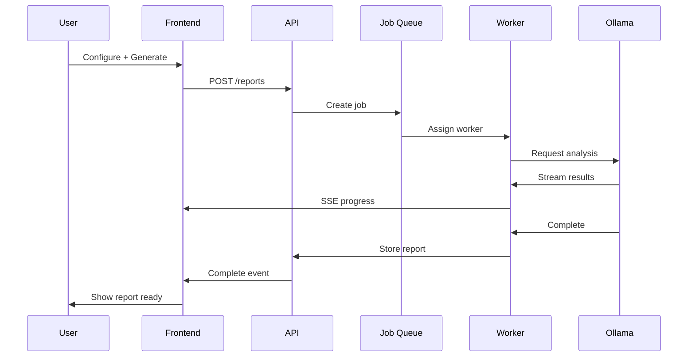

# Reports — Opportunity Intelligence Platform

> Report generation, viewing, exporting, sharing, and versioning specifications.

---

## Table of Contents

1. [Reports Overview](#reports-overview)
2. [Report Types](#report-types)
3. [Generation Flow](#generation-flow)
4. [Report Viewer](#report-viewer)
5. [Export Options](#export-options)
6. [Sharing](#sharing)
7. [Version History](#version-history)
8. [API Endpoints](#api-endpoints)

---

## Reports Overview

### Purpose

The reports feature enables:
- Batch company analysis
- Sector deep-dives
- Custom report creation
- Exportable presentations
- LP-ready materials

### Routes

| Route | Description |
|-------|-------------|
| `/reports` | Reports list |
| `/reports/new` | Create new report |
| `/reports/[id]` | View specific report |

---

## Report Types

### Available Types

| Type | Description | Typical Length |
|------|-------------|----------------|
| `company-analysis` | Single company deep-dive | 3-5 pages |
| `batch-analysis` | Multiple companies | 1 page each |
| `sector-report` | Market overview | 10-15 pages |
| `portfolio-review` | Portfolio company updates | 5-10 pages |
| `deal-memo` | Investment thesis | 2-3 pages |

### Report Configuration

**Create Report Modal:**

```
┌─────────────────────────────────────────────────────────────────────┐
│  Create New Report                                                   │
├─────────────────────────────────────────────────────────────────────┤
│                                                                       │
│  Report Type                                                         │
│  ┌─────────────────────────────────────────────────────────────┐   │
│  │ [Single Company Analysis                    ▼]               │   │
│  └─────────────────────────────────────────────────────────────┘   │
│                                                                       │
│  Company (if applicable)                                           │
│  ┌─────────────────────────────────────────────────────────────┐   │
│  │ [Search for company...                                   ] │   │
│  └─────────────────────────────────────────────────────────────┘   │
│  Selected: NovaTech AI                                             │
│                                                                       │
│  Analysis Depth                                                     │
│  ○ Quick summary                                                    │
│  ● Standard (recommended)                                          │
│  ○ Deep dive                                                        │
│                                                                       │
│  Include:                                                            │
│  [✓] Executive summary    [✓] AI scores    [ ] Risk factors        │
│  [✓] Funding history     [ ] Comparisons  [✓] Recommendations      │
│                                                                       │
│  Report Name (optional)                                            │
│  ┌─────────────────────────────────────────────────────────────┐   │
│  │ [NovaTech AI Analysis - July 2026                       ] │   │
│  └─────────────────────────────────────────────────────────────┘   │
│                                                                       │
│                  [Cancel]              [Generate Report]             │
│                                                                       │
└─────────────────────────────────────────────────────────────────────┘
```

---

## Generation Flow

### Async Generation Flow



### UI States

**Queued:**
```
┌─────────────────────────────────────────────────────────────────────┐
│  📊 Generating Report                                              │
│     Job #123 • Position: 2 in queue                                │
│                                                                       │
│     This usually takes 30-120 seconds.                               │
│                                                                       │
│     [Cancel]                                                         │
└─────────────────────────────────────────────────────────────────────┘
```

**Generating:**
```
┌─────────────────────────────────────────────────────────────────────┐
│  📊 Generating Report                                              │
│     Analyzing company data...  ████████░░░░░░░  45%                │
│                                                                       │
│     Step: Evaluating market position                                │
│     [Cancel]                                                         │
└─────────────────────────────────────────────────────────────────────┘
```

**Complete:**
```
┌─────────────────────────────────────────────────────────────────────┐
│  ✓ Report Ready!                                                     │
│                                                                       │
│  ┌───────────────────────────────────────────────────────────────┐ │
│  │  📄 NovaTech AI Analysis - July 2026                         │ │
│  │  Generated in 47 seconds • 5 pages                          │ │
│  └───────────────────────────────────────────────────────────────┘ │
│                                                                       │
│  [View Report]              [Auto-opening in new tab...]            │
└─────────────────────────────────────────────────────────────────────┘
```

### Time Estimates

| Report Type | Queue | Generation | Total |
|-------------|-------|------------|-------|
| Quick summary | ~0s | 15-30s | 15-30s |
| Standard single | ~5s | 30-60s | 35-65s |
| Deep dive single | ~10s | 60-120s | 70-130s |
| Batch (5 companies) | ~15s | 3-5min | 3-5min |
| Sector report | ~30s | 2-5min | 2.5-5.5min |

---

## Report Viewer

### Layout

```
┌─────────────────────────────────────────────────────────────────────────────┐
│  ← Back to Reports                              [Edit] [Export ▼] [Share] │
├─────────────────────────────────────────────────────────────────────────────┤
│                                                                             │
│  ┌─────────────────────────────────────────────────────────────────────┐   │
│  │                                                                     │   │
│  │  NOVATECH AI - COMPANY ANALYSIS                                     │   │
│  │  Generated: July 2, 2026 at 2:34 PM                                 │   │
│  │                                                                     │   │
│  │  ━━━━━━━━━━━━━━━━━━━━━━━━━━━━━━━━━━━━━━━━━━━━━━━━━━━━━━━━━━━━━━━  │   │
│  │                                                                     │   │
│  │  EXECUTIVE SUMMARY                                                  │   │
│  │  ────────────────────                                               │   │
│  │  NovaTech AI presents a compelling investment opportunity           │   │
│  │  in the rapidly growing AI/ML sector. The company has demonstrated  │   │
│  │  strong metrics including 40% month-over-month growth and recently  │   │
│  │  closed a $12M Series A led by Sequoia Capital.                     │   │
│  │                                                                     │   │
│  │  OPPOUNITY SCORE: 82/100                                           │   │
│  │  └── Market: 85  └── Team: 78  └── Traction: 82                     │   │
│  │                                                                     │   │
│  │  ┣━━━━━━━━━━━━━━━━━━━━━━━━━━━━━━━━━━━━━━━━━━━━━━━━━━━━━━━━━━━━━━━━  │   │
│  │                                                                     │   │
│  │  KEY FINDINGS                                                       │   │
│  │  ─────────────                                                       │   │
│  │  • Strong AI/ML market with ~40% YoY growth                       │   │
│  │  • Experienced founding team with successful exits                  │   │
│  │  • Impressive customer growth and retention metrics                 │   │
│  │                                                                     │   │
│  │  ┣━━━━━━━━━━━━━━━━━━━━━━━━━━━━━━━━━━━━━━━━━━━━━━━━━━━━━━━━━━━━━━━━  │   │
│  │                                                                     │   │
│  │  RISK FACTORS                                                        │   │
│  │  ─────────────                                                       │   │
│  │  • Competitive landscape with major players entering               │   │
│  │  • Some customer concentration risk                                │   │
│  │                                                                     │   │
│  │  ┣━━━━━━━━━━━━━━━━━━━━━━━━━━━━━━━━━━━━━━━━━━━━━━━━━━━━━━━━━━━━━━━━  │   │
│  │                                                                     │   │
│  │  RECOMMENDATIONS                                                     │   │
│  │  ───────────────                                                      │   │
│  │  1. Schedule call with founding team                                │   │
│  │  2. Deep-dive into customer concentration details                   │   │
│  │  3. Evaluate competitive positioning against incumbents             │   │
│  │                                                                     │   │
│  └─────────────────────────────────────────────────────────────────────┘   │
│                                                                             │
│  ┌─────────────────────────────────────────────────────────────────────┐   │
│  │  Sections: [Summary] [Company] [Funding] [Team] [Market] [Risks] │   │
│  └─────────────────────────────────────────────────────────────────────┘   │
│                                                                             │
└─────────────────────────────────────────────────────────────────────────────┘
```

### Viewer Features

| Feature | Description |
|---------|-------------|
| Scroll navigation | Smooth scroll to sections |
| Section tabs | Quick jump to section |
| Zoom | Text size adjustment |
| Print | Optimized print styles |
| Dark/Light mode | Toggle viewing mode |

---

## Export Options

### Export Formats

| Format | Use Case | Included |
|--------|----------|----------|
| PDF | Presentations, sharing | Yes |
| Word (.docx) | Further editing | Pro+ |
| CSV | Data analysis | Yes |
| JSON | API integration | Yes |
| Markdown | Custom formatting | Yes |

### Export Modal

```
┌─────────────────────────────────────────────────────────────────────┐
│  Export Report                                                       │
├─────────────────────────────────────────────────────────────────────┤
│                                                                       │
│  Format                                                              │
│  ○ PDF (recommended)                                                │
│  ○ Microsoft Word                                                   │
│  ○ CSV                                                               │
│  ○ JSON                                                              │
│  ○ Markdown                                                         │
│                                                                       │
│  Options                                                             │
│  ☑ Include charts and visualizations                                 │
│  ☑ Include AI scores                                                │
│  ☑ Include company logos                                            │
│                                                                       │
│  Pages                                                               │
│  ○ Full report                                                      │
│  ● Custom range [ 1 ] - [ 5 ]                                       │
│                                                                       │
│  [Cancel]                                 [Download Report]           │
│                                                                       │
└─────────────────────────────────────────────────────────────────────┘
```

### Export States

| State | UI |
|-------|-----|
| Generating | "Preparing download..." + spinner |
| Processing | "Compressing files..." |
| Ready | Browser download prompt |
| Error | Toast with retry option |

---

## Sharing

### Share Modal

```
┌─────────────────────────────────────────────────────────────────────┐
│  Share Report                                                        │
├─────────────────────────────────────────────────────────────────────┤
│                                                                       │
│  Share Link                                                          │
│  ┌─────────────────────────────────────────┐  [📋 Copy]  [Link]   │
│  │ https://app.example.com/reports/abc123  │                       │
│  └─────────────────────────────────────────┘                       │
│                                                                       │
│  Expiration: [Never ▼]                                              │
│  Access: [Anyone with link ▼]                                        │
│                                                                       │
│  ──────────────────────────────────────────────────────────────     │
│                                                                       │
│  Share via Email                                                     │
│  ┌─────────────────────────────────────┐                            │
│  │ To: email@example.com, ...          │  [Add]                    │
│  └─────────────────────────────────────┘                            │
│  ┌─────────────────────────────────────┐                            │
│  │ Add a message (optional)            │                            │
│  │ [                                 ] │                            │
│  └─────────────────────────────────────┘                            │
│                                                                       │
│  [Cancel]                                 [Send]                     │
│                                                                       │
└─────────────────────────────────────────────────────────────────────┘
```

### Share Permissions

| Permission | Description |
|------------|-------------|
| View | Read-only access |
| Edit | Modify report name |
| Copy | Duplicate report |

---

## Version History

### Version List

```
┌─────────────────────────────────────────────────────────────────────┐
│  Report Versions                                    [Regenerate]    │
├─────────────────────────────────────────────────────────────────────┤
│                                                                       │
│  Current (v3) • July 2, 2026 at 2:34 PM                            │
│  ┌───────────────────────────────────────────────────────────────┐ │
│  │ This version                               Current             │ │
│  └───────────────────────────────────────────────────────────────┘ │
│                                                                       │
│  v2 • July 1, 2026 at 10:15 AM                                      │
│  ┌───────────────────────────────────────────────────────────────┐ │
│  │ Pre-Series A analysis                        [View] [Restore] │ │
│  └───────────────────────────────────────────────────────────────┘ │
│                                                                       │
│  v1 • June 28, 2026 at 3:45 PM                                      │
│  ┌───────────────────────────────────────────────────────────────┐ │
│  │ Initial analysis                                 [View] [Restore] │
│  └───────────────────────────────────────────────────────────────┘ │
│                                                                       │
└─────────────────────────────────────────────────────────────────────┘
```

### Version Comparison

| Action | Behavior |
|--------|----------|
| View old | Read-only view of historical version |
| Restore | Creates new version from old |

---

## API Endpoints

### Reports CRUD

| Method | Endpoint | Description |
|--------|----------|-------------|
| GET | `/api/v2/reports` | List user's reports |
| POST | `/api/v2/reports` | Create new report |
| GET | `/api/v2/reports/{id}` | Get report details |
| PUT | `/api/v2/reports/{id}` | Update report metadata |
| DELETE | `/api/v2/reports/{id}` | Delete report |

### Report Generation

| Method | Endpoint | Description |
|--------|----------|-------------|
| POST | `/api/v2/reports/{id}/generate` | Start generation |
| GET | `/api/v2/reports/{id}/status` | Get generation status |
| GET | `/api/v2/reports/{id}/stream` | SSE for progress |

### Export

| Method | Endpoint | Description |
|--------|----------|-------------|
| GET | `/api/v2/reports/{id}/export?format=pdf` | Export report |
| GET | `/api/v2/reports/{id}/versions` | List versions |
| POST | `/api/v2/reports/{id}/restore/{version}` | Restore version |

### Report Response

```json
{
  "data": {
    "id": "report-uuid",
    "name": "NovaTech AI Analysis",
    "type": "company-analysis",
    "status": "completed",
    "content": {
      "sections": ["summary", "company", "funding", "team", "market"],
      "scores": { "overall": 82, "components": {...} }
    },
    "version": 3,
    "created_at": "ISO8601",
    "updated_at": "ISO8601",
    "expires_at": "ISO8601 (for shared links)"
  }
}
```

---

## Cross-References

| Document | Topic |
|----------|-------|
| [09-ai-analysis.md](./09-ai-analysis.md) | AI analysis flow |
| [08-company-profile.md](./08-company-profile.md) | Company context |
| [17-rest-api-mapping.md](./17-rest-api-mapping.md) | API reference |

---

## Version

| Version | Date | Changes |
|---------|------|---------|
| 1.0.0 | July 2, 2026 | Initial reports spec |

---

*Part of the Opportunity Intelligence Platform PRD*