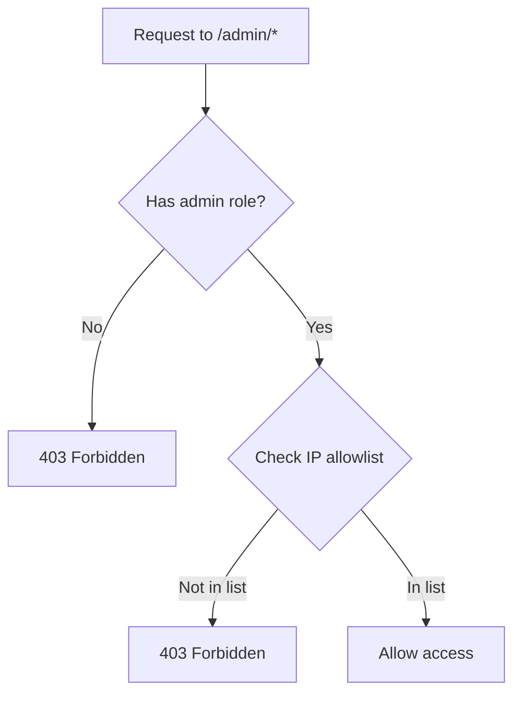

# Admin Portal — Opportunity Intelligence Platform

> Admin-only routes, capabilities, user management, AI health monitoring, and system administration.

---

## Table of Contents

1. [Admin Overview](#admin-overview)
2. [Access Control](#access-control)
3. [Admin Dashboard](#admin-dashboard)
4. [User Management](#user-management)
5. [AI Health Monitor](#ai-health-monitor)
6. [System Health](#system-health)
7. [Job Queue Monitor](#job-queue-monitor)

---

## Admin Overview

### Purpose

Admin portal provides system administrators with:
- User management and moderation
- AI service monitoring
- System health oversight
- Background job monitoring

### Routes

| Route | Description |
|-------|-------------|
| `/admin` | Admin dashboard |
| `/admin/users` | User management |
| `/admin/system` | System health |
| `/admin/ai-health` | AI service status |
| `/admin/jobs` | Background jobs |
| `/admin/flags` | Feature flags |

### Access

- Requires admin role (`role: admin`)
- Email verification required
- IP allowlist configurable

---

## Access Control

### Admin Role Check



---

## Admin Dashboard

### Admin Dashboard Home

```
┌─────────────────────────────────────────────────────────────────────────────┐
│  Admin Dashboard                                    [🔔] [👤 Admin Name]   │
├─────────────────────────────────────────────────────────────────────────────┤
│                                                                             │
│  ┌──────────────────┐ ┌──────────────────┐ ┌──────────────────┐             │
│  │ Total Users      │ │ Active Today    │ │ AI Services     │             │
│  │     2,847        │ │     342         │ │  ✓ 38/40 online │             │
│  │ ▲ 12% this month │ │                 │ │                 │             │
│  └──────────────────┘ └──────────────────┘ └──────────────────┘             │
│                                                                             │
│  ┌────────────────────────────────────────────────────────────────────┐   │
│  │  Platform Health                                                     │   │
│  │                                                                       │   │
│  │  API:   ████████████████░░░░  95% uptime                           │   │
│  │  DB:    ████████████████████  99.9% uptime                          │   │
│  │  Cache: ████████████████░░░░  97% uptime                          │   │
│  │  Queue: ████████████████████  Healthy                              │   │
│  │  AIOll: ████████████████████  95% uptime                           │   │
│  └────────────────────────────────────────────────────────────────────┘   │
│                                                                             │
│  Recent Activity                                                       │
│  ─────────────────────────────────────────────────────────────────────   │
│  • New user signup: john@example.com (2 min ago)                        │
│  • AI analysis completed: CloudFlow (5 min ago)                         │
│  • Export requested: Report #1234 (10 min ago)                          │
│                                                                             │
└─────────────────────────────────────────────────────────────────────────────┘
```

---

## User Management

### User List

```
┌─────────────────────────────────────────────────────────────────────────────┐
│  User Management                                    [Search...] [Export]   │
├─────────────────────────────────────────────────────────────────────────────┤
│  Filters: [All Users ▼] [All Plans ▼] [All Status ▼] [Apply]              │
│                                                                             │
│  ┌──────────────────────────────────────────────────────────────────────┐ │
│  │ Name / Email          │ Plan   │ Status   │ Joined    │ Actions    │ │
│  ├──────────────────────────────────────────────────────────────────────┤ │
│  │ 👤 Jane Smith         │ Pro    │ Active   │ Jan 2024  │ [View][···]│ │
│  │    jane@company.com   │        │          │           │            │ │
│  ├──────────────────────────────────────────────────────────────────────┤ │
│  │ 👤 John Doe           │ Free   │ Active   │ Feb 2024  │ [View][···]│ │
│  │    john@startup.io    │        │          │           │            │ │
│  ├──────────────────────────────────────────────────────────────────────┤ │
│  │ 👤 Alex Chen          │ Enterprise│ Suspended│ Mar 2024 │ [View][···]│ │
│  │    alex@fund.com      │        │          │           │            │ │
│  └──────────────────────────────────────────────────────────────────────┘ │
│                                                                             │
│  Showing 1-20 of 2,847 users                              [◀ 1 2 3 4 5 ▶]   │
└─────────────────────────────────────────────────────────────────────────────┘
```

### User Detail Modal

```
┌─────────────────────────────────────────────────────────────────────┐
│  User Details: Jane Smith                                           │
├─────────────────────────────────────────────────────────────────────┤
│                                                                       │
│  👤 Jane Smith • jane@company.com                                    │
│  Partner at Sequoia Capital                                          │
│                                                                       │
│  ──────────────────────────────────────────────────────────────     │
│  Account                                                             │
│  ──────────────────────────────────────────────────────────────     │
│  Plan: Pro ($99/mo)                                                  │
│  Status: Active                                                      │
│  Joined: January 15, 2024                                            │
│  Last active: 2 hours ago                                           │
│  Email verified: Yes                                                 │
│                                                                       │
│  Usage                                                               │
│  ──────────────────────────────────────────────────────────────     │
│  Analyses this month: 34/100                                         │
│  Reports generated: 12                                                │
│  Watchlists: 5                                                       │
│  Companies tracked: 45                                               │
│                                                                       │
│  Actions                                                             │
│  ──────────────────────────────────────────────────────────────     │
│  [Suspend User]  [Reset Password]  [View Activity]  [Delete]        │
│                                                                       │
│                                              [Close]                 │
└─────────────────────────────────────────────────────────────────────┘
```

---

## AI Health Monitor

### AI Services Status

```
┌─────────────────────────────────────────────────────────────────────────────┐
│  AI Service Health                                [Auto-refresh: 30s ▼]     │
├─────────────────────────────────────────────────────────────────────────────┤
│                                                                             │
│  Overall Status:  ✓ Healthy (38/40 agents online)                          │
│                                                                             │
│  ┌────────────────────────────────────────────────────────────────────┐   │
│  │  AGENT              │ STATUS   │ AVG LATENCY │ REQUESTS/HR │ HEALTH │   │
│  ├────────────────────────────────────────────────────────────────────┤   │
│  │  market-analyst     │ ● Online │ 1.2s        │ 245         │  98%  │   │
│  │  team-evaluator     │ ● Online │ 2.1s        │ 189         │  97%  │   │
│  │  risk-assessor      │ ● Online │ 1.8s        │ 156         │  99%  │   │
│  │  report-generator   │ ● Online │ 45.3s       │ 23          │  95%  │   │
│  │  ...                │ ...      │ ...         │ ...         │  ...  │   │
│  │  image-analyzer     │ ● Offline│ -           │ -           │   0%  │   │
│  └────────────────────────────────────────────────────────────────────┘   │
│                                                                             │
│  Recent Failures                                                      │
│  ─────────────────────────────────────────────────────────────────────   │
│  • market-analyst: 3 failures in last hour (timeout)                    │
│  • team-evaluator: 1 failure (out of memory)                           │
│                                                                             │
│  [Run Diagnostics]  [Restart Service]  [View Logs]                       │
│                                                                             │
└─────────────────────────────────────────────────────────────────────────────┘
```

---

## System Health

### Infrastructure Status

```
┌─────────────────────────────────────────────────────────────────────────────┐
│  System Health                                   [Refresh] 12:34:56 PM     │
├─────────────────────────────────────────────────────────────────────────────┤
│                                                                             │
│  ┌────────────────────────────────────────────────────────────────────┐   │
│  │  ◉ All Systems Operational                                         │   │
│  └────────────────────────────────────────────────────────────────────┘   │
│                                                                             │
│  API Service                                                          │
│  ┌────────────────────────────────────────────────────────────────────┐   │
│  │  Status: ● Healthy      Uptime: 99.95% (30 days)                   │   │
│  │  Requests: 12,456/min   Errors: 0.02%                              │   │
│  │  P95 Latency: 120ms     P99 Latency: 250ms                         │   │
│  └────────────────────────────────────────────────────────────────────┘   │
│                                                                             │
│  Database (MySQL)                                                       │
│  ┌────────────────────────────────────────────────────────────────────┐   │
│  │  Status: ● Healthy      Uptime: 99.99%                             │   │
│  │  Connections: 45/200    Queries/sec: 1,234                         │   │
│  │  Replication lag: 5ms    Backups: Last 2 hours ago                 │   │
│  └────────────────────────────────────────────────────────────────────┘   │
│                                                                             │
│  Cache (Redis)                                                          │
│  ┌────────────────────────────────────────────────────────────────────┐   │
│  │  Status: ● Healthy      Memory: 2.4GB/4GB                          │   │
│  │  Hit rate: 94%         Keys: 1,234,567                             │   │
│  └────────────────────────────────────────────────────────────────────┘   │
│                                                                             │
│  Message Queue (Kafka)                                                  │
│  ┌────────────────────────────────────────────────────────────────────┐   │
│  │  Status: ● Healthy      Lag: 234 messages                         │   │
│  │  Throughput: 5,678/s    Consumers: All healthy                   │   │
│  └────────────────────────────────────────────────────────────────────┘   │
│                                                                             │
└─────────────────────────────────────────────────────────────────────────────┘
```

---

## Job Queue Monitor

### Background Jobs

```
┌─────────────────────────────────────────────────────────────────────────────┐
│  Job Queue                               [Refresh] [View Failed]            │
├─────────────────────────────────────────────────────────────────────────────┤
│                                                                             │
│  Queue Summary:                                                            │
│  Running: 12    Queued: 45    Completed: 1,234    Failed: 3                │
│                                                                             │
│  ┌────────────────────────────────────────────────────────────────────┐   │
│  │  JOB ID       │ TYPE        │ STATUS   │ PROGRESS │ CREATED      │   │
│  ├────────────────────────────────────────────────────────────────────┤   │
│  │  job-abc123   │ ai-analysis │ ● Running │ 67%      │ 2 min ago    │   │
│  │  job-def456   │ report-gen │ ● Queued  │ -        │ 1 min ago    │   │
│  │  job-ghi789   │ data-export │ ● Queued  │ -        │ 3 min ago    │   │
│  │  job-jkl012   │ ai-analysis │ ✓ Done    │ 100%     │ 5 min ago    │   │
│  │  job-mno345   │ report-gen │ ✓ Done    │ 100%     │ 8 min ago    │   │
│  │  job-pqr678   │ ai-analysis │ ○ Failed  │ Error    │ 10 min ago   │   │
│  └────────────────────────────────────────────────────────────────────┘   │
│                                                                             │
│  [Clear Completed]  [Retry Failed]  [Pause Queue]                          │
│                                                                             │
└─────────────────────────────────────────────────────────────────────────────┘
```

---

## Cross-References

| Document | Topic |
|----------|-------|
| [22-security.md](./22-security.md) | RBAC details |
| [23-performance.md](./23-performance.md) | Performance metrics |

---

## Version

| Version | Date | Changes |
|---------|------|---------|
| 1.0.0 | July 2, 2026 | Initial admin spec |

---

*Part of the Opportunity Intelligence Platform PRD*