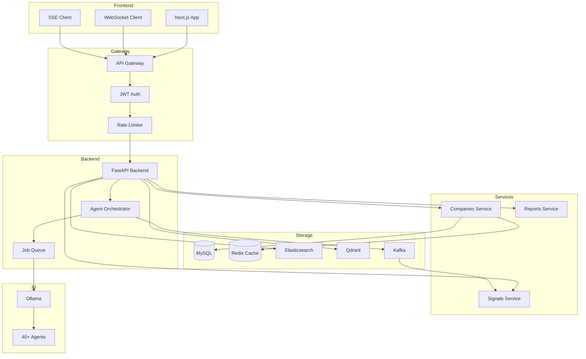
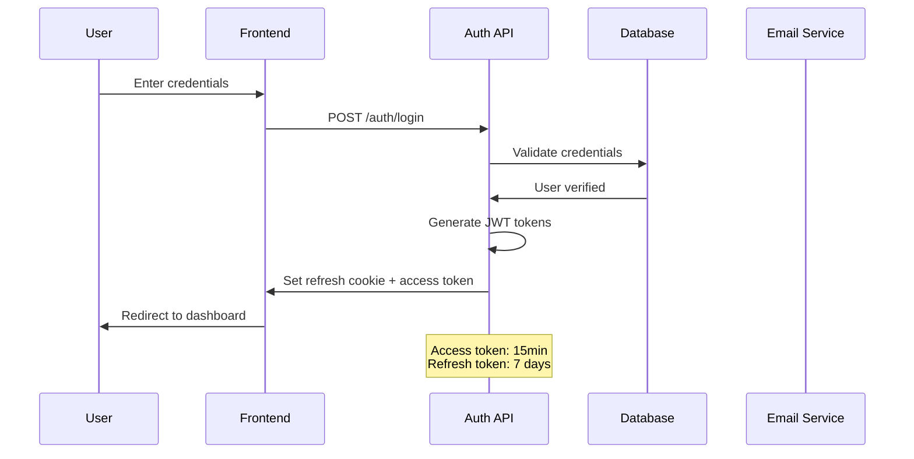
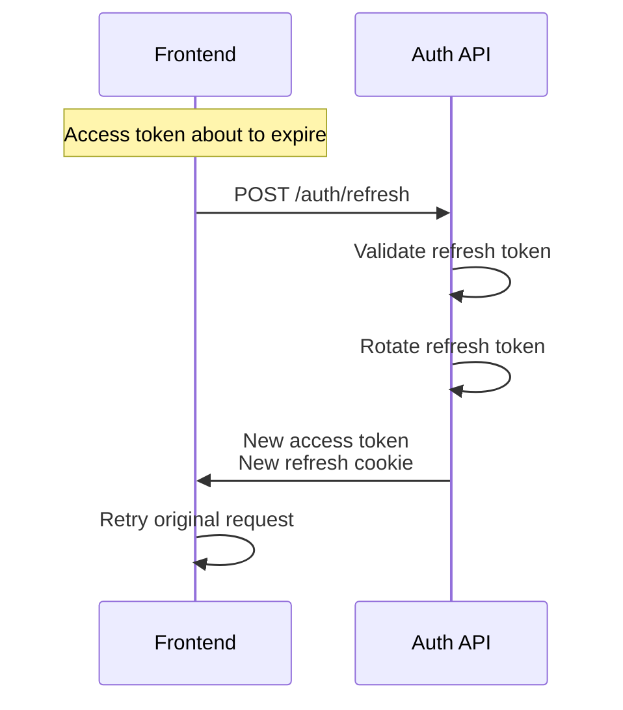
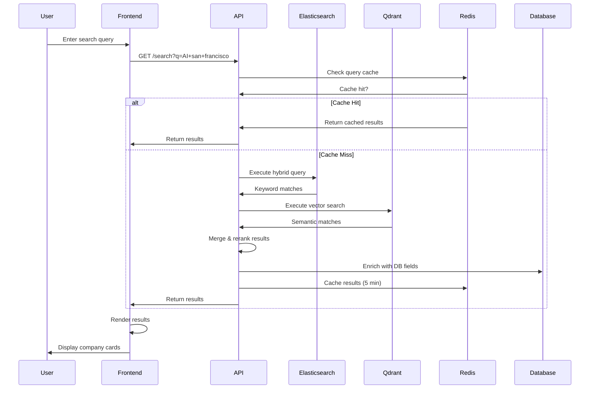
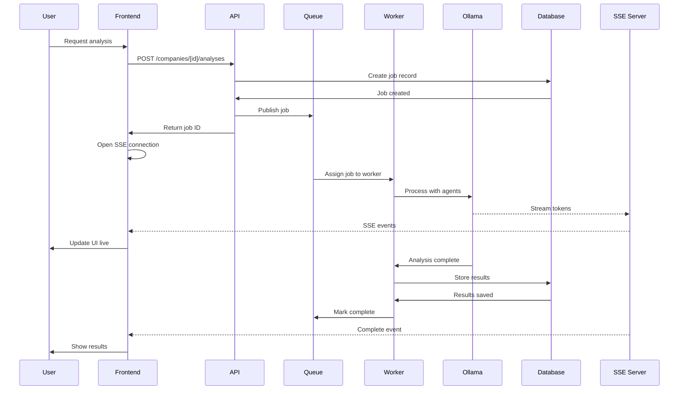
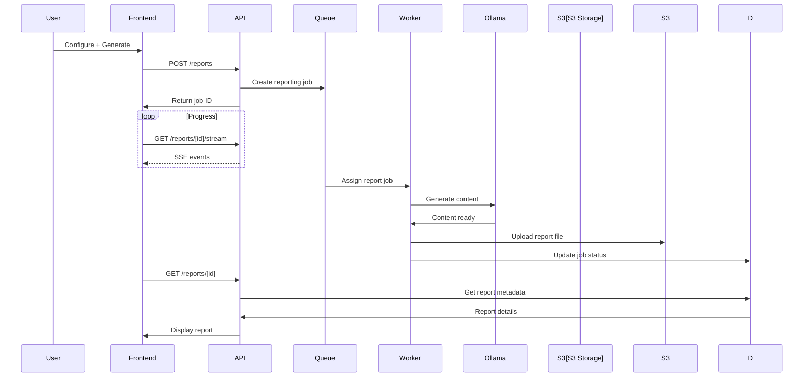
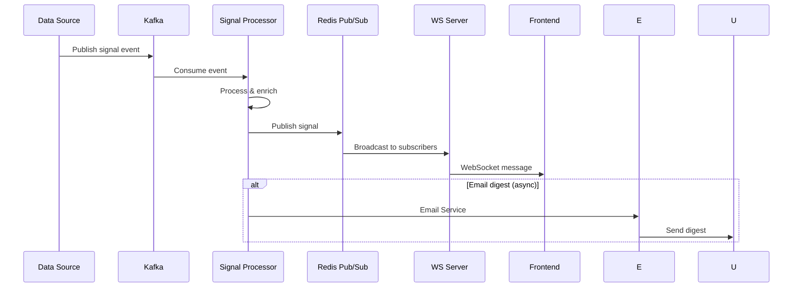
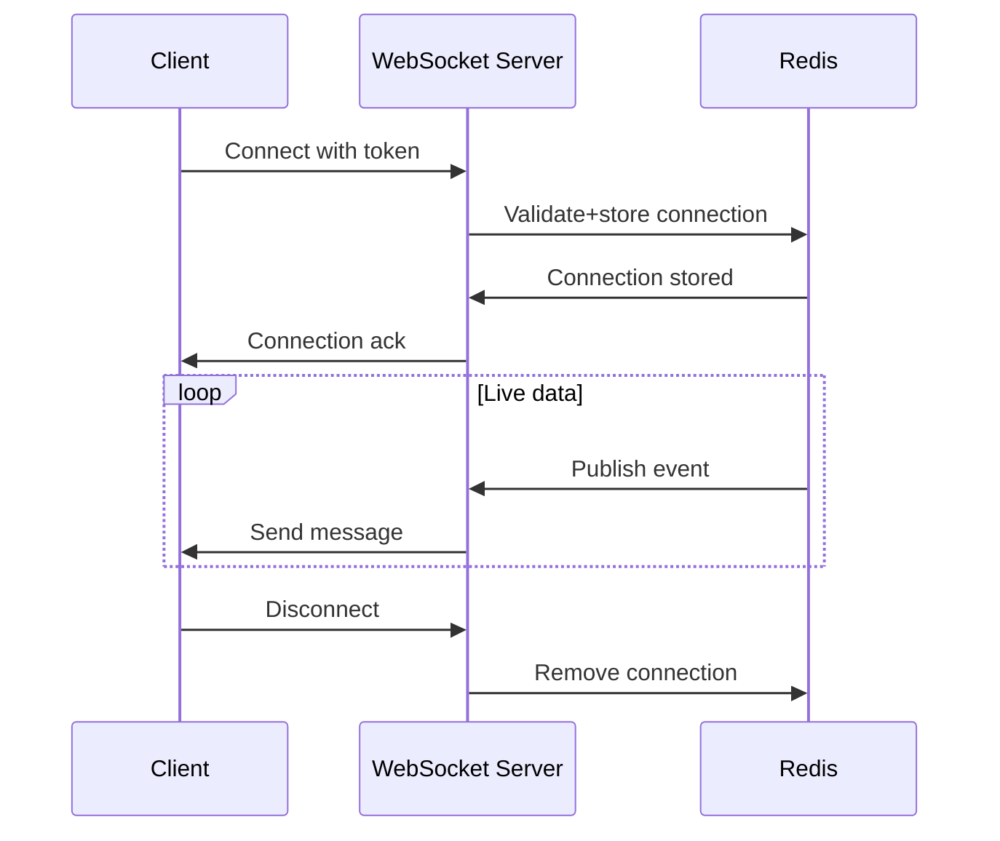
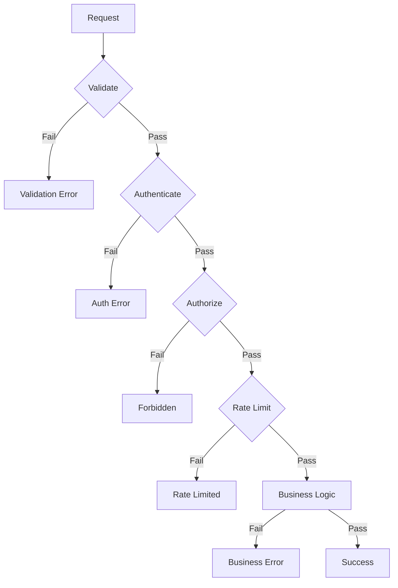

# Backend Flows — Opportunity Intelligence Platform

> System integration diagrams showing request flows from frontend through backend services to database and response.

---

## Table of Contents

1. [Architecture Overview](#architecture-overview)
2. [Core Flows](#core-flows)
3. [Search Flow](#search-flow)
4. [AI Analysis Flow](#ai-analysis-flow)
5. [Real-Time Updates](#real-time-updates)
6. [Data Model](#data-model)

---

## Architecture Overview

### System Components



---

## Core Flows

### Authentication Flow



### Token Refresh Flow



---

## Search Flow

### Company Search



### Search Architecture Details

```
Frontend              API                     Services                    Storage
    │                  │                          │                          │
    │  GET /search?q=  │                          │                          │
    │─────────────────>│                          │                          │
    │                  │                          │                          │
    │                  │  Check Redis cache        │                          │
    │                  │────────────────────────>│                          │
    │                  │<─────────────────────────│                          │
    │                  │                          │                          │
    │                  │                  [Cache miss]                       │
    │                  │                          │                          │
    │                  │  Elasticsearch query     │                          │
    │                  │─────────────────────────>│                          │
    │                  │<─────────────────────────│                          │
    │                  │                          │                          │
    │                  │  Qdrant vector search    │                          │
    │                  │─────────────────────────>│                          │
    │                  │<─────────────────────────│                          │
    │                  │                          │                          │
    │                  │  Merge scores            │                          │
    │                  │────────────────          │                          │
    │                  │  Fetch from DB           │                          │
    │                  │────────────────>│<────────│                          │
    │                  │  Fetch from DB    │      │                          │
    │                  │────────────────>│        │                          │
    │                  │                          │                          │
    │  Response        │                          │                          │
    │<─────────────────│                          │                          │
```

---

## AI Analysis Flow

### Analysis Request Flow



### Report Generation Flow



---

## Real-Time Updates

### Signal Broadcasting



### WebSocket Connection



---

## Data Model

### Key Entities

```
┌─────────────────┐       ┌─────────────────┐
│      User       │       │    Company      │
├─────────────────┤       ├─────────────────┤
│ id              │       │ id              │
│ email           │       │ name            │
│ name            │       │ slug            │
│ role            │       │ sector          │
│ preferences     │       │ stage           │
│ subscription    │       │ location        │
└────────┬────────┘       └────────┬────────┘
         │                         │
         │ 1:N                    │ 1:N
         ▼                         ▼
┌─────────────────┐       ┌─────────────────┐
│   Watchlist     │       │   Analysis      │
├─────────────────┤       ├─────────────────┤
│ id              │       │ id              │
│ user_id         │       │ company_id     │
│ name            │       │ job_id          │
│ alert_settings  │       │ status          │
└────────┬────────┘       │ scores          │
         │                │ content         │
         │                └─────────────────┘
         │ N:N
         ▼
┌─────────────────┐       ┌─────────────────┐
│ WatchlistItem   │       │     Signal      │
├─────────────────┤       ├─────────────────┤
│ watchlist_id    │       │ id              │
│ company_id      │       │ company_id     │
│ added_at        │       │ type            │
└─────────────────┘       │ data           │
                           │ published_at  │
                           └─────────────────┘
```

### API to Service Mapping

| API Layer | Service Layer | Database |
|-----------|---------------|----------|
| AuthController | AuthService | users |
| CompanyController | CompanyService | companies, funding |
| SearchController | SearchService | Elasticsearch |
| AnalysisController | AnalysisService | analyses, jobs |
| WatchlistController | WatchlistService | watchlists |
| SignalController | SignalService | signals |

---

## Error Flow

### Error Handling Pipeline



### Error Response Format

```json
{
  "error": {
    "code": "RATE_LIMIT_EXCEEDED",
    "message": "Too many requests",
    "details": {
      "retry_after": 60
    },
    "request_id": "uuid"
  }
}
```

---

## Cross-References

| Document | Topic |
|----------|-------|
| [07-search.md](./07-search.md) | Search UI flow |
| [09-ai-analysis.md](./09-ai-analysis.md) | Analysis UI flow |
| [17-rest-api-mapping.md](./17-rest-api-mapping.md) | API endpoints |
| [22-security.md](./22-security.md) | Security flows |

---

## Version

| Version | Date | Changes |
|---------|------|---------|
| 1.0.0 | July 2, 2026 | Initial backend flows |

---

*Part of the Opportunity Intelligence Platform PRD*