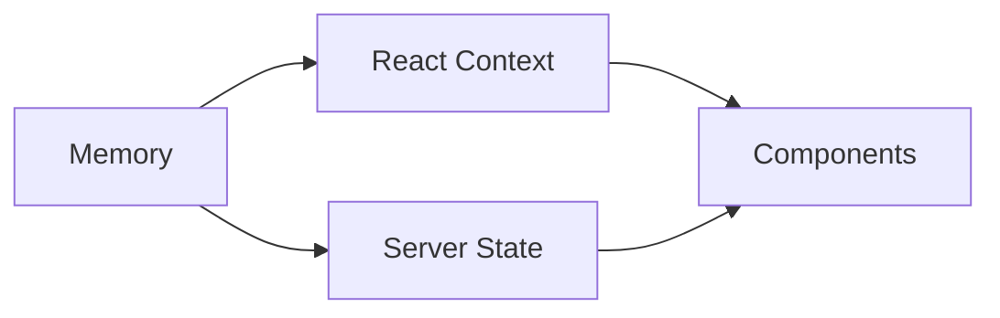

# State Management — Opportunity Intelligence Platform

> Frontend state architecture including auth, user prefs, UI state, cache, and real-time state.

---

## Table of Contents

1. [State Overview](#state-overview)
2. [State Layers](#state-layers)
3. [Auth State](#auth-state)
4. [User Preferences](#user-preferences)
5. [UI State](#ui-state)
6. [Cache Strategy](#cache-strategy)
7. [Real-Time State](#real-time-state)

---

## State Overview

### State Diagram



---

## State Layers

| Layer | Storage | TTL | Scope |
|-------|---------|-----|-------|
| Auth | HTTPOnly Cookie | 7 days | Global |
| User | LocalStorage | 24h | Global |
| UI | React Context | Session | Page |
| Cache | Redis/IndexedDB | Varies | Feature |
| Real-time | WebSocket | Connection | Global |

---

## Auth State

### JWT Handling

- Access token: Memory
- Refresh token: HTTPOnly cookie
- Validation: Client-side check

---

## UI State

### React Context Structure

```typescript
const AppState = {
  user: UserState,
  theme: ThemeState,
  notifications: Notification[],
  sidebar: SidebarState
}
```

---

## Version

| Version | Date | Changes |
|---------|------|---------|
| 1.0.0 | July 2, 2026 | Initial state spec |

---

*Part of the Opportunity Intelligence Platform PRD*