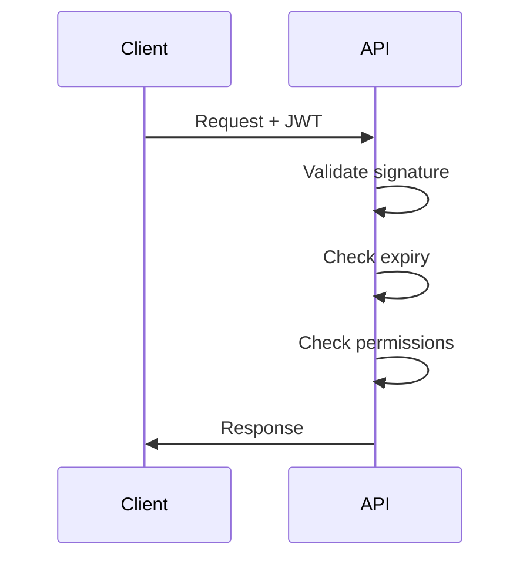

# Security — Opportunity Intelligence Platform

> Authentication, RBAC, CSRF protection, rate limiting, and GDPR compliance.

---

## Table of Contents

1. [Security Overview](#security-overview)
2. [Authentication](#authentication)
3. [Authorization](#authorization)
4. [Data Protection](#data-protection)

---

## Security Overview

### JWT Validation Flow



---

## Authentication

### JWT Structure

```json
{
  "sub": "user-uuid",
  "email": "user@example.com",
  "role": "user",
  "exp": 1234567890,
  "iat": 1234567800
}
```

### Token Lifetimes

| Token | Lifetime | Storage |
|-------|----------|---------|
| Access | 15 minutes | Memory |
| Refresh | 7 days | HTTPOnly cookie |

---

## Authorization

### RBAC Roles

| Role | Permissions |
|------|--------------|
| User | Basic access |
| Analyst | Reports, exports |
| Admin | System management |

---

## Data Protection

### GDPR Compliance

- Data export: 24 hours
- Data deletion: 30 days
- Consent management

---

## Version

| Version | Date | Changes |
|---------|------|---------|
| 1.0.0 | July 2, 2026 | Initial security spec |

---

*Part of the Opportunity Intelligence Platform PRD*