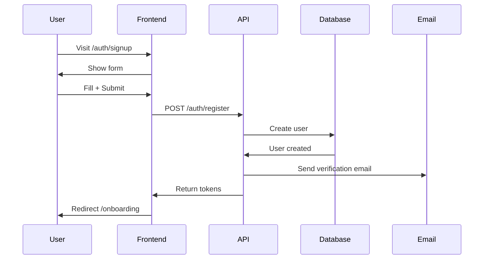
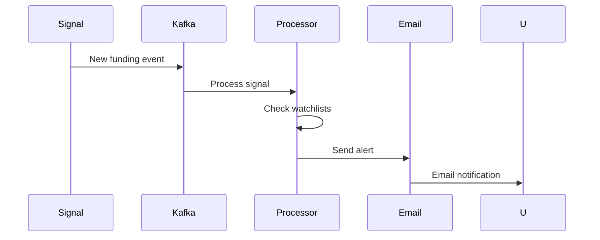

# End-to-End Flows — Opportunity Intelligence Platform

> Complete workflow specifications with all detail.

---

## Table of Contents

1. [Flow 1: User Registration](#flow-1-user-registration)
2. [Flow 2: Company Analysis](#flow-2-company-analysis)
3. [Flow 3: Watchlist Alerts](#flow-3-watchlist-alerts)
4. [Flow 4: Report Generation](#flow-4-report-generation)

---

## Flow 1: User Registration

### Complete Flow

---

## Flow 2: Company Analysis

### Steps

1. User navigates to company
2. User clicks "AI Analysis"
3. Job created and queued
4. SSE streams progress
5. User receives completion notification
6. Results displayed

---

## Flow 3: Watchlist Alerts

### Alert Flow

---

## Flow 4: Report Generation

### Report Flow

1. User configures report
2. Frontend sends to API
3. Job queued
4. Worker processes
5. File stored
6. User downloads

---

## Version

| Version | Date | Changes |
|---------|------|---------|
| 1.0.0 | July 2, 2026 | Initial E2E flows |

---

*Part of the Opportunity Intelligence Platform PRD*